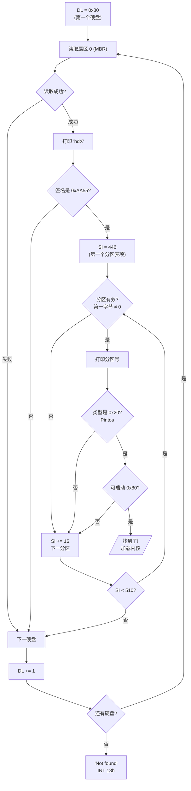

## 概述

这是引导加载程序中最复杂的部分。它的任务是扫描系统中所有硬盘的分区表，找到包含 Pintos 内核的可启动分区。

---

## 原始代码

```
#### Read the partition table on each system hard disk and scan for a
#### partition of type 0x20, which is the type that we use for a
#### Pintos kernel.

	mov $0x80, %dl			# Hard disk 0.
read_mbr:
	sub %ebx, %ebx			# Sector 0.
	mov $0x2000, %ax		# Use 0x20000 for buffer.
	mov %ax, %es
	call read_sector
	jc no_such_drive

	# Print hd[a-z].
	call puts
	.string " hd"
	mov %dl, %al
	add $'a' - 0x80, %al
	call putc

	# Check for MBR signature--if not present, it's not a
	# partitioned hard disk.
	cmpw $0xaa55, %es:510
	jne next_drive

	mov $446, %si			# Offset of partition table entry 1.
	mov $'1', %al
check_partition:
	# Is it an unused partition?
	cmpl $0, %es:(%si)
	je next_partition

	# Print [1-4].
	call putc

	# Is it a Pintos kernel partition?
	cmpb $0x20, %es:4(%si)
	jne next_partition

	# Is it a bootable partition?
	cmpb $0x80, %es:(%si)
	je load_kernel

next_partition:
	# No match for this partition, go on to the next one.
	add $16, %si			# Offset to next partition table entry.
	inc %al
	cmp $510, %si
	jb check_partition

next_drive:
	# No match on this drive, go on to the next one.
	inc %dl
	jnc read_mbr

no_such_drive:
no_boot_partition:
	# Didn't find a Pintos kernel partition anywhere, give up.
	call puts
	.string "\rNot found\r"

	# Notify BIOS that boot failed.  See [IntrList].
	int $0x18
```

---

## 前置知识

### 硬盘的基本结构

硬盘由多个**扇区（Sector）**组成，每个扇区通常是 512 字节。

```
硬盘结构：
┌─────────┬─────────┬─────────┬─────────┬─────────┬─────────┐
│ 扇区 0  │ 扇区 1  │ 扇区 2  │ 扇区 3  │   ...   │ 扇区 N  │
│  (MBR)  │         │         │         │         │         │
└─────────┴─────────┴─────────┴─────────┴─────────┴─────────┘
```

### 什么是 MBR（主引导记录）？

MBR 是硬盘的第一个扇区（扇区 0），大小 512 字节，包含：

```
MBR 结构（512 字节）：
┌───────────────────────────────────────┐ 偏移 0
│                                       │
│          引导代码区                    │
│        （446 字节）                    │
│                                       │
├───────────────────────────────────────┤ 偏移 446
│          分区表项 1（16 字节）         │
├───────────────────────────────────────┤ 偏移 462
│          分区表项 2（16 字节）         │
├───────────────────────────────────────┤ 偏移 478
│          分区表项 3（16 字节）         │
├───────────────────────────────────────┤ 偏移 494
│          分区表项 4（16 字节）         │
├───────────────────────────────────────┤ 偏移 510
│       启动签名 0xAA55（2 字节）        │
└───────────────────────────────────────┘ 偏移 512
```

### 分区表项结构

每个分区表项 16 字节：

| 偏移 | 大小 | 内容 | 说明 |
|------|------|------|------|
| 0 | 1 | 启动标志 | 0x80=可启动, 0x00=不可启动 |
| 1 | 1 | 起始磁头 | CHS 寻址（已过时）|
| 2 | 2 | 起始扇区/柱面 | CHS 寻址（已过时）|
| 4 | 1 | **分区类型** | 标识分区内容类型 |
| 5 | 1 | 结束磁头 | CHS 寻址（已过时）|
| 6 | 2 | 结束扇区/柱面 | CHS 寻址（已过时）|
| 8 | 4 | **起始 LBA** | 分区起始扇区号 |
| 12 | 4 | **扇区总数** | 分区包含的扇区数 |

### 常见分区类型

| 类型码 | 含义 |
|--------|------|
| 0x00 | 空/未使用 |
| 0x01 | FAT12 |
| 0x04 | FAT16 (< 32MB) |
| 0x05 | 扩展分区 |
| 0x06 | FAT16 (> 32MB) |
| 0x07 | NTFS / exFAT |
| 0x0B | FAT32 (CHS) |
| 0x0C | FAT32 (LBA) |
| 0x0F | 扩展分区 (LBA) |
| **0x20** | **Pintos 内核** |
| 0x82 | Linux swap |
| 0x83 | Linux 文件系统 |

### BIOS 硬盘编号

| 编号 | 设备 |
|------|------|
| 0x00-0x7F | 软盘（0x00=A:, 0x01=B:）|
| 0x80 | 第一个硬盘 |
| 0x81 | 第二个硬盘 |
| ... | 更多硬盘 |

---

## 逐行详解

### 阶段 1：开始扫描第一个硬盘

```
mov $0x80, %dl			# Hard disk 0.
```

将 DL 设置为 0x80，表示第一个硬盘。

---

### 阶段 2：读取 MBR

```
read_mbr:
	sub %ebx, %ebx			# Sector 0.
	mov $0x2000, %ax		# Use 0x20000 for buffer.
	mov %ax, %es
	call read_sector
	jc no_such_drive
```

**逐行解释：**

1. **`sub %ebx, %ebx`**：EBX = 0，表示要读取扇区 0（MBR）

2. **`mov $0x2000, %ax` 和 `mov %ax, %es`**：
   - 设置 ES = 0x2000
   - 实际缓冲区地址 = ES × 16 + 0 = 0x2000 × 16 = 0x20000
   
3. **`call read_sector`**：调用扇区读取函数（稍后详解）
   - DL = 硬盘号
   - EBX = 扇区号
   - ES:0 = 缓冲区地址

4. **`jc no_such_drive`**：
   - `jc` = Jump if Carry（如果进位标志为 1 则跳转）
   - `read_sector` 在出错时设置进位标志
   - 如果读取失败（比如硬盘不存在），跳转到错误处理

---

### 阶段 3：打印硬盘标识

```
	# Print hd[a-z].
	call puts
	.string " hd"
	mov %dl, %al
	add $'a' - 0x80, %al
	call putc
```

**这段代码打印类似 " hda"、" hdb" 的硬盘名称。**

**计算过程：**

```
DL = 0x80（第一个硬盘）
AL = DL = 0x80
AL = AL + ('a' - 0x80)
AL = 0x80 + (0x61 - 0x80)
AL = 0x80 + (-0x1F)
AL = 0x61 = 'a'
```

所以：
- 0x80 → 'a'（hda）
- 0x81 → 'b'（hdb）
- 0x82 → 'c'（hdc）
- ...

---

### 阶段 4：验证 MBR 签名

```
	# Check for MBR signature--if not present, it's not a
	# partitioned hard disk.
	cmpw $0xaa55, %es:510
	jne next_drive
```

**这是什么？**

检查 MBR 最后两个字节是否为 0xAA55。

**`cmpw $0xaa55, %es:510` 解释：**

- `cmpw`：比较字（16 位 / 2 字节）
- `$0xaa55`：立即数 0xAA55
- `%es:510`：ES 段偏移 510 处的内存（即 0x20000 + 510）

**为什么是 0xAA55？**

这是 BIOS 定义的"有效引导扇区"签名。如果没有这个签名，说明这不是一个有效的分区表。

**字节顺序（小端序）：**

```
内存地址:  510    511
内容:      0x55   0xAA

作为 16 位字读取: 0xAA55（低字节在前）
```

---

### 阶段 5：遍历分区表

```
	mov $446, %si			# Offset of partition table entry 1.
	mov $'1', %al
```

- SI = 446，指向第一个分区表项
- AL = '1'，用于打印分区号

---

### 阶段 6：检查每个分区

```
check_partition:
	# Is it an unused partition?
	cmpl $0, %es:(%si)
	je next_partition
```

检查分区表项的第一个双字（4 字节）是否为 0。如果是 0，说明这个分区未使用。

```
	# Print [1-4].
	call putc
```

打印当前分区号（'1'、'2'、'3' 或 '4'）。

```
	# Is it a Pintos kernel partition?
	cmpb $0x20, %es:4(%si)
	jne next_partition
```

检查偏移 4 处的分区类型是否为 0x20（Pintos 内核）。

- `cmpb`：比较字节（8 位）
- `%es:4(%si)`：ES 段 + SI + 4 处的字节

```
	# Is it a bootable partition?
	cmpb $0x80, %es:(%si)
	je load_kernel
```

检查启动标志是否为 0x80（可启动）。如果是，跳转到加载内核的代码。

**分区表项内存布局：**

```
%es:(%si)     → 启动标志（0x80 = 可启动）
%es:1(%si)    → 起始 CHS
%es:4(%si)    → 分区类型（0x20 = Pintos）
%es:8(%si)    → 起始 LBA（4 字节）
%es:12(%si)   → 扇区数（4 字节）
```

---

### 阶段 7：移动到下一个分区

```
next_partition:
	# No match for this partition, go on to the next one.
	add $16, %si			# Offset to next partition table entry.
	inc %al
	cmp $510, %si
	jb check_partition
```

- `add $16, %si`：每个分区表项 16 字节，移动到下一个
- `inc %al`：分区号加 1（'1' → '2' → '3' → '4'）
- `cmp $510, %si`：检查是否超过分区表范围
  - 分区表：446 到 509（共 64 字节 = 4 × 16）
  - 510 是签名位置
- `jb`：Jump if Below（无符号小于则跳转）

---

### 阶段 8：移动到下一个硬盘

```
next_drive:
	# No match on this drive, go on to the next one.
	inc %dl
	jnc read_mbr
```

- `inc %dl`：硬盘号加 1（0x80 → 0x81 → ...）
- `jnc`：Jump if No Carry（如果没有进位则跳转）
  - 当 DL 从 0xFF 变成 0x00 时会产生进位
  - 这意味着我们已经检查完所有可能的硬盘号

---

### 阶段 9：错误处理

```
no_such_drive:
no_boot_partition:
	# Didn't find a Pintos kernel partition anywhere, give up.
	call puts
	.string "\rNot found\r"

	# Notify BIOS that boot failed.  See [IntrList].
	int $0x18
```

如果找不到 Pintos 内核分区：
1. 打印错误信息 "Not found"
2. 调用 INT 18h 通知 BIOS 启动失败

**INT 18h 的作用：**

告诉 BIOS 当前设备启动失败，BIOS 可能会：
- 尝试从下一个启动设备启动
- 进入 BIOS 设置
- 显示 "No bootable device" 错误

**`\r` 的作用：**

`\r` 是回车符（Carriage Return），将光标移动到行首。这样 "Not found" 会覆盖之前打印的 "Pintos hdaX" 等信息。

---

## 执行流程图



---

## 实际输出示例

### 成功找到内核

```
Pintos hda1234
Loading...
```

表示：
- 检查了 hda（第一个硬盘）
- 检查了分区 1、2、3、4
- 在某个分区找到了内核并开始加载

### 内核在第二个硬盘

```
Pintos hda1234 hdb12
Loading...
```

表示：
- hda 的 4 个分区都不是 Pintos 内核
- 在 hdb 的分区 2 找到了内核

### 未找到内核

```
Pintos hda1234 hdb1234
Not found
```

表示：
- 检查了所有硬盘和分区
- 没有找到 Pintos 内核分区

---

## 常见问题

### Q1: 为什么只支持 4 个分区？

MBR 分区表只有 64 字节空间，每个分区表项 16 字节，所以最多只能有 4 个**主分区**。

如果需要更多分区，可以使用**扩展分区**，但 Pintos 的引导加载程序不支持。

### Q2: 为什么使用 0x20 作为 Pintos 分区类型？

0x20 是一个未被主流操作系统使用的分区类型码。Pintos 选择它来标识自己的内核分区，避免与其他系统冲突。

### Q3: 如果有多个 Pintos 分区会怎样？

代码会使用找到的第一个**可启动的** Pintos 分区（启动标志为 0x80）。

### Q4: CHS 和 LBA 有什么区别？

| 寻址方式 | 全称 | 说明 |
|----------|------|------|
| CHS | Cylinder-Head-Sector | 旧式寻址，限制约 8GB |
| LBA | Logical Block Addressing | 现代寻址，支持大硬盘 |

Pintos 使用 LBA 寻址，通过 BIOS 扩展读取功能（INT 13h, AH=42h）。

---

## 调试技巧

### 查看 MBR 内容

在 Linux 中可以用以下命令查看硬盘的 MBR：

```bash
sudo xxd -l 512 /dev/sda
```

### 查看分区表

```bash
sudo fdisk -l /dev/sda
```

---

## 练习思考

1. 如果启动标志检查被删除（不检查 0x80），会有什么影响？

2. 为什么要先检查分区是否有效（第一字节不为 0），再检查分区类型？

3. 如果要支持超过 4 个主分区，需要如何修改代码？

---

## 练习答案

<details>
<summary>点击查看答案 1</summary>
<div markdown="1">

**如果删除启动标志检查（不检查 0x80），会有以下影响：**

1. **加载第一个找到的 Pintos 分区**：
   - 无论该分区是否被标记为可启动
   - 可能加载一个不想启动的备份分区

2. **失去选择能力**：
   - 如果有多个 Pintos 分区，无法通过启动标志选择
   - 管理员不能通过 `fdisk` 等工具控制启动哪个分区

3. **可能更方便**：
   - 对于只有一个 Pintos 分区的情况，不需要设置启动标志
   - 简化分区配置

实际代码的检查：
```asm
cmpb $0x80, %es:(%si)    # 检查启动标志
je load_kernel           # 只有 0x80 才加载
```

如果删除这两行，会加载第一个类型为 0x20 的分区。

</div>
</details>

<details>
<summary>点击查看答案 2</summary>
<div markdown="1">

**先检查分区是否有效（第一字节不为 0）的原因：**

1. **效率优化**：
   - 空分区（第一字节为 0）根本不需要进一步检查
   - 跳过空分区可以加快扫描速度

2. **避免误判**：
   - 空分区表项可能包含随机数据
   - 类型字段可能恰好是 0x20（巧合）
   - 先检查有效性避免加载无效分区

3. **逻辑正确性**：
   - 分区表项格式：第一字节是启动标志（0x00 或 0x80）
   - 如果整个表项为空（从 0x00 开始），说明未使用
   - 有效分区的启动标志要么是 0x00（不可启动）要么是 0x80（可启动）

实际代码：
```asm
cmpl $0, %es:(%si)       # 检查前 4 字节是否全为 0
je next_partition        # 空分区，跳过
# ... 后续检查分区类型
```

</div>
</details>

<details>
<summary>点击查看答案 3</summary>
<div markdown="1">

**支持超过 4 个主分区需要实现扩展分区支持：**

1. **理解扩展分区结构**：
   - 扩展分区（类型 0x05 或 0x0F）包含扩展引导记录（EBR）链
   - 每个 EBR 包含一个逻辑分区和指向下一个 EBR 的指针

2. **代码修改思路**：
   ```asm
   check_partition:
       # ... 原有检查 ...
       cmpb $0x05, %es:4(%si)  # 是扩展分区？
       je scan_extended
       cmpb $0x0f, %es:4(%si)  # 是 LBA 扩展分区？
       je scan_extended
       # ... 继续原有逻辑 ...

   scan_extended:
       # 读取扩展分区的第一个 EBR
       mov %es:8(%si), %ebx    # 扩展分区起始 LBA
       # 保存扩展分区起始位置
       # 循环读取 EBR 链...
   ```

3. **挑战**：
   - 需要更多代码空间（512 字节可能不够）
   - EBR 链是递归结构，需要循环处理
   - 需要保存状态（当前 EBR 位置、扩展分区起始等）

4. **实际解决方案**：
   - 使用两阶段引导：第一阶段加载更大的第二阶段
   - 或者使用 GRUB 等功能更强的引导加载程序

</div>
</details>

---

## 下一部分

找到 Pintos 内核分区后，接下来要将内核加载到内存。请参阅下一篇文章。
