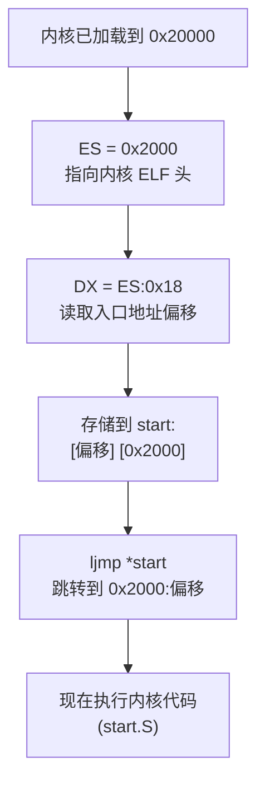

## 概述

内核已经加载到内存中，现在是引导加载程序的最后一步：将控制权交给内核。这涉及到从 ELF 头读取入口地址，并执行跳转。

---

## 原始代码

```
#### Transfer control to the kernel that we loaded.  We read the start
#### address out of the ELF header (see [ELF1]) and convert it from a
#### 32-bit linear address into a 16:16 segment:offset address for
#### real mode, then jump to the converted address.  The 80x86 doesn't
#### have an instruction to jump to an absolute segment:offset kept in
#### registers, so in fact we store the address in a temporary memory
#### location, then jump indirectly through that location.  To save 4
#### bytes in the loader, we reuse 4 bytes of the loader's code for
#### this temporary pointer.

	mov $0x2000, %ax
	mov %ax, %es
	mov %es:0x18, %dx
	mov %dx, start
	movw $0x2000, start + 2
	ljmp *start
```

---

## 前置知识

### ELF 头部结构

ELF 文件的开头是一个固定格式的头部：

```
偏移    大小    字段名           说明
────────────────────────────────────────────
0x00    4      e_ident[0-3]     魔数 "\x7FELF"
0x04    1      e_ident[4]       类别（32位/64位）
0x05    1      e_ident[5]       字节序（小端/大端）
0x06    1      e_ident[6]       ELF 版本
0x07    9      e_ident[7-15]    填充
0x10    2      e_type           文件类型
0x12    2      e_machine        目标架构
0x14    4      e_version        ELF 版本
0x18    4      e_entry          入口点地址 ← 我们要读这个！
0x1C    4      e_phoff          程序头表偏移
0x20    4      e_shoff          节头表偏移
...
```

**入口点地址**（e_entry）位于偏移 0x18，是一个 32 位地址，告诉系统从哪里开始执行程序。

### 远跳转（Far Jump）

在 x86 实模式中，有两种跳转：

1. **近跳转（Near Jump）**：只改变 IP，在当前代码段内跳转
2. **远跳转（Far Jump）**：同时改变 CS 和 IP，可以跳转到任何地址

```
近跳转：            远跳转：
jmp label          ljmp segment:offset
只修改 IP          修改 CS 和 IP
```

### 间接跳转

x86 的 `ljmp`（远跳转）指令不能直接从寄存器获取地址，必须通过内存：

```
# 错误：不能这样做
ljmp %ax:%dx        # 语法错误！

# 正确：通过内存间接跳转
ljmp *memory_address
```

内存中的格式：

```
memory_address:     [偏移低字节] [偏移高字节] [段低字节] [段高字节]
                    ←─── 偏移（2字节）────→ ←── 段（2字节）──→
```

---

## 逐行详解

### 第 1-2 行：设置 ES 指向内核

```
	mov $0x2000, %ax
	mov %ax, %es
```

将 ES 设置为 0x2000，这样 ES:0x18 就指向内核 ELF 头的入口地址字段。

**地址计算：**
- ES = 0x2000
- 物理地址 = 0x2000 × 16 + 0x18 = 0x20018

---

### 第 3 行：读取入口地址

```
	mov %es:0x18, %dx
```

从 ELF 头偏移 0x18 处读取入口地址的低 16 位到 DX。

**为什么只读低 16 位？**

Pintos 内核的入口地址在实模式下可以用 16:16 的段:偏移表示。入口地址的低 16 位就是偏移部分。

**Pintos 内核的入口地址：**

内核加载到 0x20000，入口地址通常在这附近。假设入口地址是 0x20000：
- 段 = 0x2000
- 偏移 = 0x0000

---

### 第 4 行：存储偏移部分

```
	mov %dx, start
```

将 DX（偏移）存储到 `start` 标签处。

**`start` 在哪里？**

```
read_failed:
start:
	# Disk sector read failed.
	call puts
1:	.string "\rBad read\r"
```

`start` 和 `read_failed` 是同一个位置！这是一个巧妙的代码复用：
- 如果读取失败，会执行这里的错误处理代码
- 如果读取成功，这里的代码会被跳转地址覆盖

---

### 第 5 行：存储段部分

```
	movw $0x2000, start + 2
```

将段地址 0x2000 存储到 `start + 2` 处（偏移之后的 2 个字节）。

**内存布局：**

```
start:      [偏移低] [偏移高] [段低] [段高]
            └── DX ──┘     └─0x2000─┘
```

---

### 第 6 行：远跳转到内核

```
	ljmp *start
```

执行间接远跳转，从 `start` 处读取 4 字节的段:偏移地址，然后跳转。

**执行过程：**

1. 从 `start` 读取 4 字节
2. 低 2 字节 → IP（指令指针）
3. 高 2 字节 → CS（代码段）
4. 跳转到 CS:IP

---

## 地址转换详解

### 32 位线性地址到 16:16 段:偏移

假设 ELF 入口地址是 0x00020000：

```
32位线性地址: 0x00020000

转换为 16:16 格式:
段地址 = 0x2000
偏移   = 0x0000

验证: 0x2000 × 16 + 0x0000 = 0x20000 ✓
```

**但代码中只读了低 16 位？**

对于 Pintos，段地址总是 0x2000（内核加载地址除以 16），偏移是入口地址减去 0x20000 后的值。

由于内核入口通常在文件开头附近，偏移值很小，16 位足够。

### 更复杂的例子

如果入口地址是 0x00020100：

```
线性地址: 0x00020100

转换:
- 基址: 0x20000（段 0x2000）
- 偏移: 0x00020100 - 0x00020000 = 0x0100

段:偏移 = 0x2000:0x0100
```

---

## 代码复用技巧详解

这段代码的一个亮点是**代码复用**：

```
read_failed:
start:
	call puts
1:	.string "\rBad read\r"
```

**如果读取失败：**
- 跳转到 `read_failed`
- 执行 `call puts` 打印错误信息

**如果读取成功：**
- `mov %dx, start` 覆盖了 `call puts` 的操作码
- `movw $0x2000, start + 2` 覆盖了更多字节
- `ljmp *start` 从被覆盖的位置读取跳转地址

**内存变化：**

```
原始代码（read_failed）:
start:   E8 xx xx    (call puts 的机器码)
start+3: ...         (字符串地址)

覆盖后:
start:   [偏移低] [偏移高] [段低] [段高]
         被解释为跳转地址
```

这样节省了 4 字节的存储空间——在 512 字节限制下非常宝贵！

---

## 跳转后的状态

执行 `ljmp *start` 后：

| 寄存器/内存 | 值 | 说明 |
|-------------|-----|------|
| CS | 0x2000 | 代码段指向内核 |
| IP | 入口偏移 | 从 ELF 头读取 |
| DS | 0x0000 | 数据段（未改变）|
| SS | 0x0000 | 栈段（未改变）|
| ESP | ~0xF000 | 栈指针（基本未变）|
| DL | 启动硬盘号 | 内核可以使用 |
| 0x20000+ | 内核代码 | 已加载的内核 |

**内核（start.S）从这里接管！**

---

## 跳转目标：start.S

Loader 跳转后，控制权交给 `start.S`，它的任务是：

1. 设置保护模式的 GDT
2. 切换到 32 位保护模式
3. 设置 32 位栈
4. 跳转到 C 语言的 `main()` 函数

这是下一阶段的引导过程，超出了 loader.S 的范围。

---

## 为什么需要这么复杂？

### 问题 1：x86 没有直接的远跳转指令

```
# 我们想做的：
ljmp $0x2000, %dx       # 错误！语法不支持

# 我们必须做的：
mov %dx, memory         # 存储偏移
movw $0x2000, memory+2  # 存储段
ljmp *memory            # 间接跳转
```

### 问题 2：空间限制

引导扇区只有 512 字节，必须节省空间：
- 不能单独分配 4 字节存储跳转地址
- 复用 `read_failed` 代码的位置

---

## 执行流程图



---

## 常见问题

### Q1: 为什么段地址是 0x2000 而不是从 ELF 头读取？

简化！Pintos loader 假设：
- 内核总是加载到 0x20000
- 入口地址在 0x20000 附近
- 段地址固定为 0x2000，只需读取偏移

### Q2: 如果入口地址不在 0x20000-0x2FFFF 范围内会怎样？

会出错！但 Pintos 的构建系统保证内核入口在这个范围内。

### Q3: 为什么要用 16:16 段:偏移而不是直接用 32 位地址？

因为 CPU 还在实模式！实模式只能用段:偏移寻址。切换到保护模式后才能用 32 位线性地址。

### Q4: 跳转后 loader 的代码还在内存中吗？

是的，但已经不再执行。内存 0x7C00-0x7DFF 的内容仍然存在，直到被覆盖。

---

## 机器码分析

让我们看看 `ljmp *start` 的机器码：

```
操作码: FF 2E xx xx
        │  │  └──┴── start 的地址（2 字节）
        │  └─────── ModR/M 字节（/5 = 间接远跳转）
        └────────── 操作码前缀
```

这条指令告诉 CPU：
1. 从指定内存地址读取 4 字节
2. 低 2 字节作为新 IP
3. 高 2 字节作为新 CS
4. 跳转到 CS:IP

---

## 练习思考

1. 如果 ELF 入口地址是 0x00030000（超出 0x2000 段的范围），会发生什么？

2. 为什么不直接 `jmp $0x20000` 跳转到内核开头？（提示：ELF 文件的开头是什么？）

3. 如果要支持入口地址在任意位置，需要如何修改代码？

4. 代码复用技巧有什么潜在风险？

---

## 练习答案

<details>
<summary>点击查看答案 1</summary>
<div markdown="1">

**如果 ELF 入口地址是 0x00030000，代码会出错：**

1. **当前代码的计算**：
   ```asm
   mov %es:0x18, %dx     # DX = 入口地址低 16 位 = 0x0000
   movw $0x2000, start+2 # 段 = 0x2000
   ```
   - 最终跳转到 0x2000:0x0000 = 0x20000
   - **错误！应该跳转到 0x30000**

2. **问题原因**：
   - 代码假设段地址固定为 0x2000
   - 只读取偏移部分（低 16 位）
   - 0x30000 需要段 0x3000，但代码使用 0x2000

3. **正确做法**：
   ```asm
   # 完整的地址转换
   mov %es:0x18, %eax    # 读取完整 32 位入口地址
   shr $4, %eax          # 除以 16 得到段
   mov %ax, start+2      # 存储段
   mov %es:0x18, %ax     # 读取低 16 位
   and $0xF, %ax         # 取低 4 位作为偏移
   mov %ax, start        # 存储偏移
   ```

4. **Pintos 的假设**：
   - 内核入口总在 0x20000 附近
   - 构建系统保证这一点

</div>
</details>

<details>
<summary>点击查看答案 2</summary>
<div markdown="1">

**不能直接跳转到 0x20000 的原因是 ELF 文件的开头不是可执行代码！**

1. **ELF 文件开头的内容**：
   ```
   偏移 0x00-0x03: 魔数 "\x7FELF"
   偏移 0x04-0x0F: ELF 头标识信息
   偏移 0x10-0x17: 文件类型、架构等
   偏移 0x18-0x1B: 入口点地址 (e_entry)
   ...
   ```

2. **如果直接 jmp 0x20000**：
   - CPU 会尝试执行 `7F 45 4C 46`（"\x7FELF" 的字节）
   - 这不是有效的指令
   - 会导致崩溃或未定义行为

3. **必须读取入口地址**：
   - ELF 头的 e_entry 字段（偏移 0x18）告诉我们从哪里开始执行
   - 入口地址指向 `.text` 段的 `_start` 或 `start` 函数
   - 这才是真正的可执行代码

4. **类比**：
   - 就像打开一本书，不能从封面开始读正文
   - 需要先看目录（ELF 头）找到第一章的位置

</div>
</details>

<details>
<summary>点击查看答案 3</summary>
<div markdown="1">

**支持任意入口地址需要完整的地址转换：**

```asm
# 假设 ES:0x18 包含 32 位入口地址
mov $0x2000, %ax
mov %ax, %es

# 读取完整的 32 位地址
mov %es:0x18, %eax

# 转换为 段:偏移 格式
# 段 = 地址 / 16
# 偏移 = 地址 % 16
mov %eax, %ebx
and $0xF, %ebx        # EBX = 偏移 (低 4 位)
shr $4, %eax          # EAX = 段 (右移 4 位)

# 存储跳转地址
mov %bx, start        # 偏移
mov %ax, start+2      # 段

ljmp *start
```

**注意事项**：
- 这需要更多代码空间
- 仍然受限于实模式的 1MB 地址空间
- 超过 1MB 需要 A20 门和/或切换到保护模式

</div>
</details>

<details>
<summary>点击查看答案 4</summary>
<div markdown="1">

**代码复用技巧（将跳转地址写入错误处理代码位置）的潜在风险：**

1. **维护困难**：
   - 代码功能不明显
   - 新开发者可能不理解为什么 `start` 和 `read_failed` 是同一位置
   - 修改时容易引入 bug

2. **脆弱性**：
   - 如果错误处理代码的大小改变，可能破坏跳转
   - 如果 `call puts` 的机器码长度改变，覆盖位置可能错误
   - 依赖于特定的代码布局

3. **调试困难**：
   - 单步执行时，跳转地址可能显示为错误处理代码的地址
   - 反汇编器可能无法正确解析

4. **不可扩展**：
   - 如果需要更多存储空间（比如 6 字节），技巧可能失效
   - 依赖于当前正好需要 4 字节

5. **安全性**：
   - 在现代系统中，自修改代码可能触发安全保护
   - 好在引导加载程序运行在没有保护的环境中

**权衡**：在 512 字节限制下，这种技巧是合理的；在空间充裕的情况下，应该使用更清晰的代码。

</div>
</details>

---

## 下一部分

接下来我们分析错误处理代码。请参阅下一篇文章。
