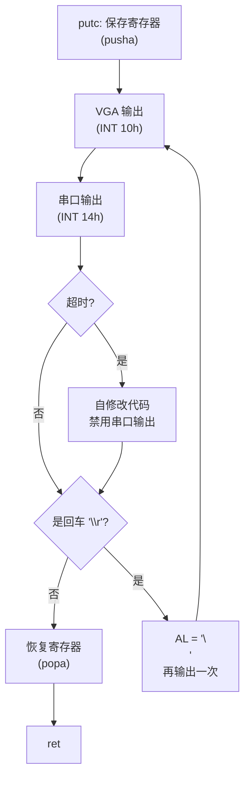

## 概述

`putc` 函数负责将单个字符输出到两个目标：VGA 显示器和串口。它包含一些有趣的技巧，比如自修改代码和自动换行处理。

---

## 原始代码

```
#### Character output subroutine.  Prints the character in AL to the
#### VGA display and serial port 0, using BIOS services (see
#### [IntrList]).  Preserves all general-purpose registers.
####
#### If called upon to output a carriage return, this subroutine
#### automatically supplies the following line feed.

putc:	pusha

1:	sub %bh, %bh			# Page 0.
	mov $0x0e, %ah			# Teletype output service.
	int $0x10

	mov $0x01, %ah			# Serial port output service.
	sub %dx, %dx			# Serial port 0.
2:	int $0x14			# Destroys AH.
	test $0x80, %ah			# Output timed out?
	jz 3f
	movw $0x9090, 2b		# Turn "int $0x14" above into NOPs.

3:
	cmp $'\r', %al
	jne popa_ret
	mov $'\n', %al
	jmp 1b

popa_ret:
	popa
	ret				# Error code still in CF
```

---

## 前置知识

### VGA 文本模式

在文本模式下，VGA 可以显示 80×25 的字符网格。BIOS 提供了简单的输出服务。

```
┌────────────────────────────────────────┐
│ 行 0:  Hello, Pintos!                  │
│ 行 1:  Loading...                      │
│ 行 2:                                  │
│ ...                                    │
│ 行 24:                                 │
└────────────────────────────────────────┘
      80 列
```

### BIOS 视频服务（INT 10h）

| AH 值 | 功能 |
|-------|------|
| 0x00 | 设置视频模式 |
| 0x02 | 设置光标位置 |
| 0x03 | 获取光标位置 |
| 0x0E | **Teletype 输出**（我们使用这个）|
| 0x13 | 写字符串 |

### BIOS 串口服务（INT 14h）

| AH 值 | 功能 |
|-------|------|
| 0x00 | 初始化串口 |
| 0x01 | **发送字符**（我们使用这个）|
| 0x02 | 接收字符 |
| 0x03 | 获取状态 |

### 什么是自修改代码？

自修改代码是指程序在运行时修改自己的机器码。这是一种古老但有效的技术，可以：
- 优化性能
- 节省空间
- 实现特殊功能

在现代系统中通常避免使用（安全原因），但在引导加载程序中仍然有用。

---

## 逐行详解

### 第 1 行：保存所有寄存器

```
putc:	pusha
```

`pusha`（Push All）将所有 8 个通用寄存器压入栈：
- 顺序：AX, CX, DX, BX, SP, BP, SI, DI
- 共 16 字节

**为什么保存所有寄存器？**

- BIOS 中断可能修改任何寄存器
- 调用者期望寄存器不变
- `pusha` 比单独 push 每个寄存器更节省空间

---

### 第 2-4 行：VGA 输出

```
1:	sub %bh, %bh			# Page 0.
	mov $0x0e, %ah			# Teletype output service.
	int $0x10
```

**`sub %bh, %bh`**：
- BH = 0，选择视频页面 0
- VGA 可以有多个页面，但我们只用第一个

**`mov $0x0e, %ah`**：
- AH = 0x0E，选择 "Teletype output" 服务
- 这个服务会自动处理光标移动和滚动

**`int $0x10`**：
- 调用 BIOS 视频服务
- AL 中的字符被显示在当前光标位置
- 光标自动前进

**INT 10h, AH=0Eh 的参数：**

| 寄存器 | 内容 |
|--------|------|
| AH | 0x0E（功能号）|
| AL | 要显示的字符 |
| BH | 页面号（通常 0）|
| BL | 前景色（图形模式下使用）|

**Teletype 输出的特点：**
- 自动处理 `\r`（回车）、`\n`（换行）、`\b`（退格）
- 自动滚动屏幕
- 自动换行

---

### 第 5-7 行：串口输出

```
	mov $0x01, %ah			# Serial port output service.
	sub %dx, %dx			# Serial port 0.
2:	int $0x14			# Destroys AH.
```

**`mov $0x01, %ah`**：
- AH = 0x01，选择 "发送字符" 服务

**`sub %dx, %dx`**：
- DX = 0，选择串口 0（COM1）

**`2:`**：
- 这是一个局部标签，用于后面的自修改代码

**`int $0x14`**：
- 调用 BIOS 串口服务
- 将 AL 中的字符发送到串口

**INT 14h, AH=01h 的参数：**

| 寄存器 | 内容 |
|--------|------|
| AH | 0x01（功能号）|
| AL | 要发送的字符 |
| DX | 串口号（0-3）|

**返回值：**
- AH 的位 7 如果为 1，表示超时错误

---

### 第 8-10 行：超时处理和自修改代码

```
	test $0x80, %ah			# Output timed out?
	jz 3f
	movw $0x9090, 2b		# Turn "int $0x14" above into NOPs.
```

**`test $0x80, %ah`**：
- 测试 AH 的位 7
- 如果位 7 = 1，表示串口输出超时

**`jz 3f`**：
- 如果没有超时（位 7 = 0），跳到标签 3 继续

**`movw $0x9090, 2b`**：
- 这是**自修改代码**！
- 将 0x9090 写入标签 `2:` 的位置
- 0x90 是 NOP（No Operation）指令的操作码
- 0x9090 = 两个 NOP，刚好覆盖 `int $0x14`（CD 14，2 字节）

**自修改代码详解：**

```
修改前:                修改后:
2: int $0x14          2: nop
   (CD 14)               nop
                         (90 90)
```

**为什么要这样做？**

如果串口不存在或故障，每次尝试输出都会超时。通过把 `int $0x14` 改成 NOP：
- 后续调用不再尝试串口输出
- 避免反复超时等待
- 大大加快输出速度

**这安全吗？**

在引导加载程序环境中是安全的：
- 单处理器
- 代码在 RAM 中（不是 ROM）
- 没有代码签名或保护

---

### 第 11-15 行：自动换行处理

```
3:
	cmp $'\r', %al
	jne popa_ret
	mov $'\n', %al
	jmp 1b
```

**`cmp $'\r', %al`**：
- 比较 AL 和回车符（0x0D）

**`jne popa_ret`**：
- 如果不是回车符，跳到结束

**`mov $'\n', %al` 和 `jmp 1b`**：
- 如果是回车符，追加一个换行符
- 跳回标签 1，再次执行输出

**为什么要这样做？**

不同系统使用不同的行结束符：
- Unix/Linux: `\n`（LF，换行）
- Mac (旧): `\r`（CR，回车）
- Windows: `\r\n`（CRLF）

通过自动在 `\r` 后添加 `\n`，确保在各种终端上都能正确换行。

**`\r` 和 `\n` 的区别：**

```
\r (回车): 光标移到行首
\n (换行): 光标移到下一行

单独 \r:        单独 \n:        \r\n 组合:
Hello           Hello           Hello
World           Hello           World
     ^World         ^
     光标在 W       World 覆盖了 Hello
```

---

### 第 16-18 行：返回

```
popa_ret:
	popa
	ret				# Error code still in CF
```

**`popa`**：
- 恢复之前保存的所有寄存器
- 顺序相反：DI, SI, BP, (跳过 SP), BX, DX, CX, AX

**`ret`**：
- 返回调用者

**"Error code still in CF" 注释：**

`popa` 和 `ret` 都不会修改标志寄存器。如果之前的操作设置了进位标志（如磁盘读取失败），它仍然保持。这个标签被 `read_sector` 函数共享使用。

---

## 执行流程图



---

## 自修改代码深入分析

### 机器码变化

```
原始代码:
地址    机器码    汇编
0x...   CD 14     int $0x14

修改后:
地址    机器码    汇编
0x...   90 90     nop; nop
```

### 为什么用两个 NOP？

- `int $0x14` 是 2 字节指令（CD 14）
- 需要用 2 字节来覆盖
- 90 是单字节 NOP 指令
- 所以用两个 NOP (90 90)

### 自修改代码的风险

| 风险 | 说明 | 在这里是否适用？ |
|------|------|-----------------|
| 多核同步问题 | 其他核可能执行旧代码 | 否（单核引导）|
| 指令缓存问题 | CPU 缓存可能有旧指令 | 可能，但 8086/8088 无缓存 |
| 安全问题 | 可被恶意利用 | 否（引导代码不受保护）|
| 可维护性差 | 代码难以理解 | 是，但空间受限时值得 |

---

## 双输出的好处

同时输出到 VGA 和串口有多个好处：

```
┌─────────────────────────────────────────────────────────┐
│                        计算机                          │
│  ┌─────────────┐                    ┌─────────────┐   │
│  │   CPU       │                    │   串口      │───┼──► 调试终端
│  │   运行      │ ──────────────────►│   COM1      │   │
│  │   putc      │        │           └─────────────┘   │
│  └─────────────┘        │                              │
│                         ▼           ┌─────────────┐   │
│                    ┌─────────────┐  │   显示器    │   │
│                    │   VGA       │──┤             │   │
│                    │   控制器    │  └─────────────┘   │
│                    └─────────────┘                     │
└─────────────────────────────────────────────────────────┘
```

**使用场景：**

1. **本地调试**：直接看显示器
2. **远程调试**：通过串口连接另一台电脑
3. **日志记录**：串口输出可以重定向到文件
4. **无头服务器**：没有显示器时用串口

---

## 常见问题

### Q1: 如果 VGA 也出错怎么办？

代码没有检查 VGA 输出错误。通常 VGA 输出不会失败（除非硬件彻底坏了）。

### Q2: 为什么不用更高级的 VGA 函数？

INT 10h AH=0Eh（Teletype）是最简单、最兼容的选择。更高级的函数可能需要更多参数或不是所有 BIOS 都支持。

### Q3: 串口禁用后能重新启用吗？

不能。自修改代码永久地将 `int $0x14` 改成了 NOP。要重新启用，需要重新启动。

### Q4: 为什么把标签放在 `int $0x14` 之前？

```
2:	int $0x14           # 标签 2 在这
	test $0x80, %ah
	...
	movw $0x9090, 2b    # 修改标签 2 处的代码
```

标签必须精确地指向要修改的指令。`2b` 表示"向后（backward）找标签 2"。

### Q5: popa 为什么不恢复 SP？

`popa` 会跳过 SP 的恢复，因为：
- SP 在 pusha/popa 期间一直在变化
- 恢复 pusha 时的 SP 值会导致栈混乱
- x86 的设计就是这样

---

## 性能分析

### 超时的代价

如果串口每次都超时：

```
每个字符:
- VGA 输出: ~微秒级
- 串口超时: ~毫秒级（取决于 BIOS）

假设 1000 个字符:
- 没有超时: ~秒级完成
- 每次超时: 可能需要几秒
```

通过自修改代码禁用串口后，性能回到正常水平。

### 空间效率

`pusha/popa` vs 单独 push/pop：

| 方法 | 指令 | 字节数 |
|------|------|--------|
| pusha | 1 条 | 1 字节 |
| 8 个 push | 8 条 | 8 字节 |

节省 7 字节！

---

## 练习思考

1. 如果要支持不同颜色的文本输出，需要如何修改代码？

2. 自修改代码在现代 CPU 上可能有什么问题？（提示：考虑指令缓存）

3. 为什么 `\r` 后面自动加 `\n`，而不是在源代码中直接写 `\r\n`？

4. 如果串口输出成功后又开始超时，会发生什么？

5. 能否用条件跳转代替自修改代码？有什么优缺点？

---

## 练习答案

<details>
<summary>点击查看答案 1</summary>
<div markdown="1">

**支持不同颜色需要修改 INT 10h 调用：**

```asm
# 新的 putc 函数，支持颜色
# AL = 字符，BL = 颜色属性
putc_color:
    pusha
    
    # VGA 输出
    mov $0x0e, %ah          # Teletype 输出
    mov $0, %bh             # 页面 0
    # BL 已包含颜色
    int $0x10
    
    # ... 串口输出 ...
```

**颜色属性字节**：
```
位 7:   闪烁
位 6-4: 背景色 (0-7)
位 3:   高亮度
位 2-0: 前景色 (0-7)

示例：
0x07 = 白字黑底（默认）
0x04 = 红字黑底
0x0C = 亮红字黑底
0x1F = 白字蓝底
```

**注意**：Teletype 输出 (AH=0Eh) 在文本模式下不一定支持颜色，可能需要使用 AH=09h（写字符和属性）。

</div>
</details>

<details>
<summary>点击查看答案 2</summary>
<div markdown="1">

**自修改代码在现代 CPU 上的问题：**

1. **指令缓存不一致**：
   - 现代 CPU 有独立的指令缓存 (I-Cache) 和数据缓存 (D-Cache)
   - 修改代码写入 D-Cache
   - I-Cache 可能仍然包含旧代码
   - 结果：执行的可能是旧代码！

2. **解决方案**：
   ```asm
   # 修改代码后刷新缓存
   movw $0x9090, 2b
   wbinvd              # 写回并无效化缓存
   # 或者
   cpuid               # 序列化指令
   ```

3. **在引导阶段为什么没问题**：
   - 实模式下，很多老 CPU 没有缓存
   - 这段代码很短，可能全部在 L1 缓存行内
   - 写入同一缓存行可能触发自动刷新
   - BIOS/引导环境通常缓存配置简单

4. **现代最佳实践**：
   - 避免自修改代码
   - 使用条件跳转或函数指针

</div>
</details>

<details>
<summary>点击查看答案 3</summary>
<div markdown="1">

**`\r` 后自动加 `\n` 的原因：**

1. **节省字符串空间**：
   - 每次写 `\r\n` 需要 2 字节
   - 如果有 5 个换行，节省 5 字节
   - 在 512 字节限制下很有价值

2. **历史原因**：
   - `\r` (CR) = 回车，光标移到行首
   - `\n` (LF) = 换行，光标移到下一行
   - 在老式电传打字机上是两个独立操作
   - DOS/Windows 使用 `\r\n`
   - Unix/Linux 只使用 `\n`

3. **代码逻辑**：
   ```asm
   cmp $'\r', %al      # 是回车吗？
   jne popa_ret        # 不是，返回
   mov $'\n', %al      # 是，改为换行
   jmp 1b              # 再输出一次
   ```
   这样写 `\r` 就自动变成 `\r\n`。

</div>
</details>

<details>
<summary>点击查看答案 4</summary>
<div markdown="1">

**如果串口输出成功后又开始超时，串口输出已经被禁用，不会再尝试！**

**原因**：
1. 自修改代码是永久性的
2. `int $0x14` 已经被改成 `nop nop`
3. 后续所有调用都不会执行串口输出

**场景分析**：
```
时间线：
1. 输出 'P' - 串口正常
2. 输出 'i' - 串口正常
3. 串口线被拔掉
4. 输出 'n' - 超时，禁用串口
5. 输出 't','o','s' - 只有 VGA，没有串口
6. 串口重新连接
7. 输出后续字符 - 仍然没有串口（已被永久禁用）
```

**这是设计折衷**：
- 优点：避免反复超时耗时
- 缺点：不能自动恢复
- 对于引导过程，这是可接受的

</div>
</details>

<details>
<summary>点击查看答案 5</summary>
<div markdown="1">

**用条件跳转代替自修改代码：**

```asm
# 使用标志变量的版本
serial_disabled: .byte 0    # 标志：0=启用, 1=禁用

putc:
    pusha
    
    # VGA 输出...
    
    # 检查串口是否禁用
    cmpb $0, serial_disabled
    jne skip_serial
    
    # 尝试串口输出
    mov $0x01, %ah
    sub %dx, %dx
    int $0x14
    test $0x80, %ah
    jz skip_serial
    movb $1, serial_disabled  # 设置禁用标志
    
skip_serial:
    # ... 继续 ...
```

**比较**：

| 方面 | 自修改代码 | 条件跳转 |
|------|------------|----------|
| 代码大小 | 较小 | 较大（需要存储标志）|
| 每次开销 | 0 条指令（NOP）| 2-3 条指令（cmp + jne）|
| 可读性 | 差 | 好 |
| 可恢复性 | 不能 | 可以清除标志 |
| 缓存安全 | 可能有问题 | 安全 |
| 现代性 | 不推荐 | 推荐 |

在 512 字节限制下，自修改代码是合理的选择。

</div>
</details>

---

## 代码复习

完整的 `putc` 函数，带详细注释：

```
# 输出单个字符到 VGA 和串口
# 参数: AL = 要输出的字符
# 保留所有通用寄存器
# 如果输出 '\r'，自动追加 '\n'

putc:
    pusha                       # 保存所有寄存器

1:  sub %bh, %bh                # VGA 页面 0
    mov $0x0e, %ah              # Teletype 输出
    int $0x10                   # BIOS 视频服务

    mov $0x01, %ah              # 串口发送
    sub %dx, %dx                # 串口 0 (COM1)
2:  int $0x14                   # BIOS 串口服务
    test $0x80, %ah             # 检查超时
    jz 3f                       # 没超时，继续
    movw $0x9090, 2b            # 超时！禁用串口输出

3:  cmp $'\r', %al              # 是回车符？
    jne popa_ret                # 不是，返回
    mov $'\n', %al              # 是，追加换行
    jmp 1b                      # 再输出一次

popa_ret:
    popa                        # 恢复所有寄存器
    ret
```

---

## 下一部分

`read_sector` 函数是最后一个重要的辅助函数，负责从磁盘读取扇区。请参阅下一篇文章。
