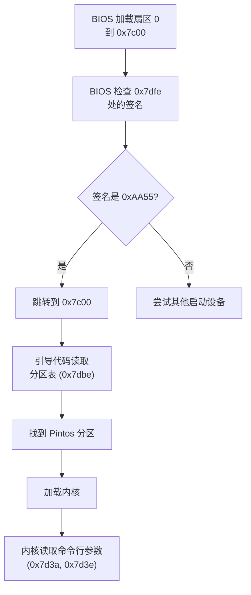

## 概述

`loader.S` 的末尾定义了一些重要的数据结构，包括命令行参数区域、分区表区域和引导签名。这些结构使 512 字节的引导扇区符合 BIOS 规范，并允许外部工具（如 `pintos` 命令）与引导加载程序通信。

---

## 原始代码

```
#### Command-line arguments and their count.
#### This is written by the `pintos' utility and read by the kernel.
#### The loader itself does not do anything with the command line.
	.org LOADER_ARG_CNT - LOADER_BASE
	.fill LOADER_ARG_CNT_LEN, 1, 0

	.org LOADER_ARGS - LOADER_BASE
	.fill LOADER_ARGS_LEN, 1, 0

#### Partition table.
	.org LOADER_PARTS - LOADER_BASE
	.fill LOADER_PARTS_LEN, 1, 0

#### Boot-sector signature for BIOS inspection.
	.org LOADER_SIG - LOADER_BASE
	.word 0xaa55
```

---

## 前置知识

### .org 指令

`.org` 是汇编器指令，用于设置**位置计数器**（location counter）。

```
.org 100        # 从偏移 100 开始放置后续代码/数据
```

如果当前位置小于指定值，汇编器会填充字节（默认是 0）。

### .fill 指令

`.fill` 用于填充指定数量的字节。

```
.fill count, size, value
# count: 重复次数
# size: 每次填充的字节数
# value: 填充的值
```

例如：
```
.fill 10, 1, 0    # 填充 10 个字节，每个都是 0
.fill 5, 2, 0xFF  # 填充 5 个双字节，每个都是 0x00FF
```

### loader.h 中的常量

```c
#define LOADER_BASE 0x7c00      // 加载器基地址
#define LOADER_END  0x7e00      // 加载器结束地址 (0x7c00 + 512)

#define LOADER_SIG_LEN 2        // 签名长度
#define LOADER_PARTS_LEN 64     // 分区表长度
#define LOADER_ARGS_LEN 128     // 命令行参数长度
#define LOADER_ARG_CNT_LEN 4    // 参数计数长度

// 计算各部分地址
#define LOADER_SIG (LOADER_END - LOADER_SIG_LEN)           // 0x7dfe
#define LOADER_PARTS (LOADER_SIG - LOADER_PARTS_LEN)       // 0x7dbe
#define LOADER_ARGS (LOADER_PARTS - LOADER_ARGS_LEN)       // 0x7d3e
#define LOADER_ARG_CNT (LOADER_ARGS - LOADER_ARG_CNT_LEN)  // 0x7d3a
```

---

## 引导扇区布局

```
偏移      地址        大小    内容
──────────────────────────────────────────────────────
0x000    0x7c00      314    引导代码
                            (实际大小可能不同)
...      ...         ...    (未使用空间)
0x1ba    0x7d3a      4      命令行参数数量
0x1be    0x7d3e      128    命令行参数字符串
0x23e    0x7dbe      64     分区表 (4 × 16 字节)
0x27e    0x7dfe      2      引导签名 (0xAA55)
──────────────────────────────────────────────────────
                     512    总计
```

**图形表示：**

```
    0x7c00                                           0x7e00
    ┌────────────────────────────────────────────────┐
    │                                                │
    │              引导代码                           │
    │           (约 314 字节)                         │
    │                                                │
    ├────────────────────────────────────────────────┤ 0x7d3a
    │         命令行参数数量 (4 字节)                 │
    ├────────────────────────────────────────────────┤ 0x7d3e
    │                                                │
    │          命令行参数 (128 字节)                  │
    │                                                │
    ├────────────────────────────────────────────────┤ 0x7dbe
    │  分区表项 1 (16 字节)                          │
    ├────────────────────────────────────────────────┤
    │  分区表项 2 (16 字节)                          │
    ├────────────────────────────────────────────────┤
    │  分区表项 3 (16 字节)                          │
    ├────────────────────────────────────────────────┤
    │  分区表项 4 (16 字节)                          │
    ├────────────────────────────────────────────────┤ 0x7dfe
    │    引导签名 0xAA55 (2 字节)                    │
    └────────────────────────────────────────────────┘ 0x7e00
```

---

## 逐部分详解

### 第一部分：命令行参数数量

```
	.org LOADER_ARG_CNT - LOADER_BASE
	.fill LOADER_ARG_CNT_LEN, 1, 0
```

**计算：**
- `LOADER_ARG_CNT` = 0x7d3a
- `LOADER_BASE` = 0x7c00
- 偏移 = 0x7d3a - 0x7c00 = 0x13a = 314

**作用：**
- 存储命令行参数的数量（32 位整数）
- 由 `pintos` 工具写入
- 内核在启动时读取

**示例：**
```
如果命令行是: pintos -- run alarm-multiple
参数数量 = 3 ("run", "alarm-multiple", 可能还有其他)
```

---

### 第二部分：命令行参数字符串

```
	.org LOADER_ARGS - LOADER_BASE
	.fill LOADER_ARGS_LEN, 1, 0
```

**计算：**
- `LOADER_ARGS` = 0x7d3e
- 偏移 = 0x7d3e - 0x7c00 = 0x13e = 318

**作用：**
- 存储命令行参数字符串（最多 128 字节）
- 格式：null 分隔的字符串序列

**示例：**
```
"run\0alarm-multiple\0-q\0"

内存布局:
0x7d3e: 'r' 'u' 'n' '\0' 'a' 'l' 'a' 'r' 'm' '-' ...
```

**限制：**
- 最大 128 字节
- 超出部分会被截断

---

### 第三部分：分区表

```
	.org LOADER_PARTS - LOADER_BASE
	.fill LOADER_PARTS_LEN, 1, 0
```

**计算：**
- `LOADER_PARTS` = 0x7dbe
- 偏移 = 0x7dbe - 0x7c00 = 0x1be = 446

**这是标准 MBR 分区表的位置！**

**分区表结构：**

| 偏移 | 大小 | 内容 |
|------|------|------|
| 446 | 16 | 分区表项 1 |
| 462 | 16 | 分区表项 2 |
| 478 | 16 | 分区表项 3 |
| 494 | 16 | 分区表项 4 |

**每个分区表项：**

| 偏移 | 大小 | 内容 |
|------|------|------|
| 0 | 1 | 启动标志 |
| 1 | 3 | CHS 起始 |
| 4 | 1 | 分区类型 |
| 5 | 3 | CHS 结束 |
| 8 | 4 | LBA 起始 |
| 12 | 4 | 扇区总数 |

**为什么用 .fill 而不是真实数据？**

- 分区表由磁盘工具（如 `fdisk`）写入
- 引导加载程序只需要预留空间
- `.fill 64, 1, 0` 初始化为全零（无分区）

---

### 第四部分：引导签名

```
	.org LOADER_SIG - LOADER_BASE
	.word 0xaa55
```

**计算：**
- `LOADER_SIG` = 0x7dfe
- 偏移 = 0x7dfe - 0x7c00 = 0x1fe = 510

**这是最关键的！**

**0xAA55 签名的意义：**

```
位置 510: 0x55
位置 511: 0xAA

作为 16 位字（小端序）读取: 0xAA55
```

BIOS 在加载引导扇区后检查这个签名：
- 如果是 0xAA55：有效的引导扇区，跳转执行
- 如果不是：无效，尝试其他启动设备

**历史背景：**

这个签名从 IBM PC 时代就开始使用（1981年），沿用至今。

---

## 工作流程

### 磁盘镜像创建


### 引导过程



---

## pintos 工具如何写入参数

`pintos` 是一个 Perl 脚本，用于启动 Pintos。它会：

1. 打开磁盘镜像文件
2. 定位到偏移 0x1ba (LOADER_ARG_CNT - 0x7c00)
3. 写入参数数量（4 字节）
4. 定位到偏移 0x1be (LOADER_ARGS - 0x7c00)
5. 写入参数字符串（最多 128 字节）

**伪代码：**

```perl
# 打开磁盘镜像
open(DISK, "+<", $disk_image);

# 写入参数数量
seek(DISK, 0x1ba, SEEK_SET);
print DISK pack("V", $arg_count);  # V = 32位小端

# 写入参数字符串
seek(DISK, 0x1be, SEEK_SET);
print DISK join("\0", @args);
```

---

## 内核如何读取参数

在 `threads/init.c` 中：

```c
// 参数数量
extern uint32_t init_ram_pages;  // 不是这个，只是示例

// 实际上，内核通过固定地址读取：
// 参数数量在 0x7d3a
// 参数字符串在 0x7d3e
```

内核可以通过这些参数来：
- 决定运行哪个测试
- 设置调试选项
- 配置系统参数

---

## 空间计算

```
总空间: 512 字节

引导签名:     2 字节
分区表:       64 字节
命令行参数:   128 字节
参数数量:     4 字节
──────────────────────
数据区总计:   198 字节

可用于代码:   512 - 198 = 314 字节
```

这就是为什么引导加载程序的代码必须非常紧凑！

---

## 验证布局

可以用 `hexdump` 或 `xxd` 验证：

```bash
# 查看引导签名
xxd -s 510 -l 2 pintos.dsk
# 应该显示: 55 aa

# 查看分区表
xxd -s 446 -l 64 pintos.dsk

# 查看命令行参数
xxd -s 314 -l 4 pintos.dsk   # 参数数量
xxd -s 318 -l 128 pintos.dsk # 参数字符串
```

---

## 常见问题

### Q1: 如果代码超过 314 字节会怎样？

汇编器会报错，因为 `.org` 会尝试回退位置计数器（这是不允许的）。

### Q2: 为什么命令行参数在引导代码和分区表之间？

这是 Pintos 特有的设计。传统 MBR 不包含命令行参数。Pintos 在保持 MBR 兼容性的同时，利用未使用的空间传递参数。

### Q3: 引导加载程序为什么不使用这些参数？

引导加载程序的任务很简单：加载内核。命令行参数是给内核用的，告诉它该做什么。

### Q4: 如果没有分区表会怎样？

代码会打印 "Not found" 并调用 INT 18h。分区表全零等于没有有效分区。

### Q5: 0xAA55 有什么特殊含义？

没有深层含义，只是 IBM 在 1981 年选择的一个容易识别的模式：
- 55 = 01010101
- AA = 10101010
这种交替的位模式容易检测硬件错误。

---

## 扩展思考：为什么是 512 字节？

**历史原因：**

1. 早期软盘使用 512 字节扇区
2. 这成为事实标准
3. 硬盘沿用了这个大小
4. BIOS 被设计为加载一个扇区

**现代发展：**

- 高级格式（AF）硬盘使用 4096 字节物理扇区
- 但逻辑上仍模拟 512 字节扇区
- UEFI 可以加载更大的引导程序

---

## 练习思考

1. 如果要将命令行参数扩展到 256 字节，需要修改哪些地方？

2. 为什么分区表正好在偏移 446 处？（提示：MBR 规范）

3. 如果把引导签名改成其他值（如 0x1234），会发生什么？

4. 能否在不修改 loader.S 的情况下，通过磁盘编辑器改变命令行参数？

5. 如果引导代码需要更多空间，有什么解决方案？（提示：两阶段引导）

---

## 练习答案

<details>
<summary>点击查看答案 1</summary>
<div markdown="1">

**扩展命令行参数到 256 字节需要修改：**

1. **修改 loader.h**：
   ```c
   #define LOADER_ARGS_LEN 256     // 原来是 128
   ```

2. **重新计算地址**：
   ```
   LOADER_SIG = 0x7dfe               // 不变
   LOADER_PARTS = 0x7dbe             // 不变
   LOADER_ARGS = 0x7dbe - 256 = 0x7cbe  // 改变
   LOADER_ARG_CNT = 0x7cbe - 4 = 0x7cba // 改变
   ```

3. **问题**：
   - 命令行参数会从 0x7cba 开始
   - 引导代码从 0x7c00 开始
   - 只剩 0x7cba - 0x7c00 = **186 字节**给代码！
   - 当前代码约 314 字节，**会冲突**！

4. **解决方案**：
   - 缩短代码
   - 使用两阶段引导
   - 将参数存储在其他位置（如内存中）

</div>
</details>

<details>
<summary>点击查看答案 2</summary>
<div markdown="1">

**分区表在偏移 446 的原因是 MBR 规范：**

1. **MBR 标准布局**：
   ```
   偏移 0-445:   引导代码（446 字节）
   偏移 446-509: 分区表（64 字节）
   偏移 510-511: 签名（2 字节）
   ```

2. **计算**：
   ```
   512 - 2(签名) - 64(分区表) = 446
   ```

3. **为什么分区表是 64 字节**：
   - 4 个主分区 × 16 字节/分区 = 64 字节
   - 这是 IBM PC 原始设计

4. **Pintos 的特殊处理**：
   - 利用了引导代码后面的空间存储命令行参数
   - 但分区表位置仍然符合标准，保持兼容性

</div>
</details>

<details>
<summary>点击查看答案 3</summary>
<div markdown="1">

**如果把引导签名改成 0x1234，BIOS 会拒绝引导：**

1. **BIOS 的检查过程**：
   ```
   1. 读取磁盘第一个扇区到 0x7C00
   2. 检查偏移 510-511 处的值
   3. 如果是 0xAA55，跳转执行
   4. 如果不是，尝试下一个启动设备
   ```

2. **如果签名是 0x1234**：
   - BIOS 认为这不是有效的引导扇区
   - 不会跳转到 0x7C00 执行
   - 尝试其他启动设备（CD、USB 等）
   - 或者显示 "No bootable device found"

3. **0xAA55 的字节序**：
   ```
   内存地址 510: 0x55
   内存地址 511: 0xAA
   ```
   这是小端字节序（little-endian）

4. **为什么选择 0xAA55**：
   - 0x55 = 01010101
   - 0xAA = 10101010
   - 交替的位模式容易检测硬件错误
   - IBM 1981 年原始设计

</div>
</details>

<details>
<summary>点击查看答案 4</summary>
<div markdown="1">

**可以通过磁盘编辑器修改命令行参数：**

1. **定位参数位置**：
   ```
   参数数量: 偏移 0x13a (314)
   参数字符串: 偏移 0x13e (318)
   ```

2. **使用十六进制编辑器**：
   ```bash
   # 查看当前值
   xxd -s 314 -l 132 pintos.dsk
   
   # 使用 dd 修改
   echo -n "new args" | dd of=pintos.dsk bs=1 seek=318 conv=notrunc
   
   # 修改参数数量
   printf '\x02\x00\x00\x00' | dd of=pintos.dsk bs=1 seek=314 conv=notrunc
   ```

3. **更方便的方式**：
   - Pintos 的 `pintos` 命令会自动处理这些
   - 手动修改主要用于调试

4. **注意**：
   - 字符串必须以 null 终止
   - 不能超过 128 字节
   - 参数数量要与字符串匹配

</div>
</details>

<details>
<summary>点击查看答案 5</summary>
<div markdown="1">

**如果引导代码需要更多空间，可以使用两阶段引导：**

1. **两阶段引导原理**：
   ```
   阶段 1: MBR (512 字节)
     - 基本初始化
     - 加载阶段 2 到内存
     - 跳转到阶段 2
   
   阶段 2: 更大的引导加载程序
     - 可以跨越多个扇区
     - 复杂的内核加载逻辑
     - 文件系统支持
   ```

2. **GRUB 的实现**：
   - Stage 1: 446 字节的 MBR 代码
   - Stage 1.5: 嵌入在 MBR 和第一个分区之间
   - Stage 2: 完整的 GRUB 核心

3. **Pintos 可能的修改**：
   ```asm
   # 阶段 1: 加载阶段 2
   mov $0x8000, %ax    # 加载到 0x80000
   mov %ax, %es
   mov $1, %ebx        # 从扇区 1 开始
   mov $10, %cx        # 读 10 个扇区 (5KB)
   .load_loop:
       call read_sector
       add $0x20, %ax
       inc %bx
       loop .load_loop
   ljmp $0x8000, $0    # 跳转到阶段 2
   ```

4. **UEFI 替代**：
   - 现代系统使用 UEFI 而不是 BIOS
   - UEFI 可以直接加载大型 EFI 应用程序
   - 不受 512 字节限制

</div>
</details>

---

## 总结：loader.S 完整布局

```
地址范围          大小      内容
─────────────────────────────────────────────────
0x7c00-0x7d39    314       引导代码
                           - 初始化
                           - 串口配置
                           - 扫描分区
                           - 加载内核
                           - 跳转
                           - 辅助函数 (puts, putc, read_sector)
─────────────────────────────────────────────────
0x7d3a-0x7d3d    4         命令行参数数量
─────────────────────────────────────────────────
0x7d3e-0x7dbd    128       命令行参数字符串
─────────────────────────────────────────────────
0x7dbe-0x7dfd    64        分区表 (4 × 16 字节)
─────────────────────────────────────────────────
0x7dfe-0x7dff    2         引导签名 (0xAA55)
─────────────────────────────────────────────────
                 512       总计
```

---

这是 loader.S 分析系列的最后一部分。希望这些文档能帮助你理解 Pintos 引导加载程序的工作原理！

## 系列文档索引

1. 初始化 - 段寄存器和栈的设置
2. 串口配置 - 配置串口用于调试输出
3. 扫描硬盘分区 - 寻找 Pintos 内核分区
4. 加载内核 - 将内核从磁盘读取到内存
5. 跳转到内核 - 从 ELF 头读取入口地址并跳转
6. 错误处理 - 处理各种启动失败情况
7. puts 函数 - 巧妙的字符串打印实现
8. putc 函数 - 字符输出和自修改代码
9. read_sector 函数 - 使用 BIOS 扩展读取磁盘
10. 数据结构 - 引导扇区末尾的数据定义（本文档）
