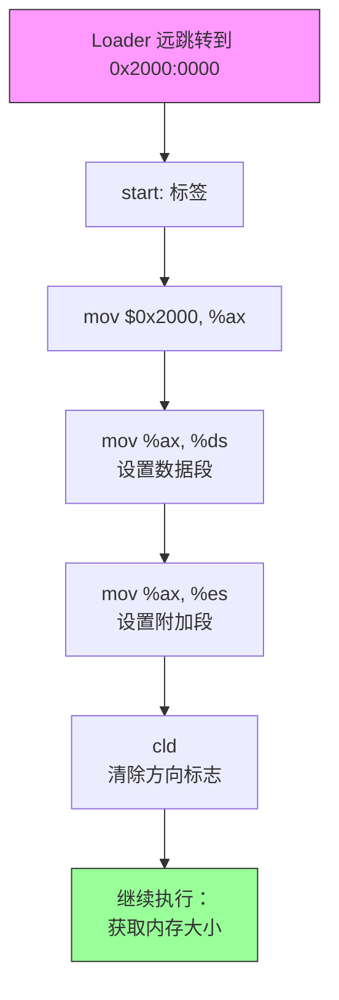

## 概述

当 Loader 完成内核加载后，它会跳转到内核的入口点 `start`。这个入口点位于 `start.S` 文件中，是内核的第一段代码。

`start.S` 的主要任务是：
1. 初始化段寄存器
2. 获取系统内存大小
3. 启用 A20 地址线
4. 创建临时页表
5. 切换到保护模式
6. 启用分页
7. 跳转到 C 语言的 `pintos_init()` 函数

本文档详细介绍文件的开头部分和段寄存器的初始化。

---

## 原始代码

```plaintext
#include "threads/loader.h"

#### Kernel startup code.

#### The loader (in loader.S) loads the kernel at physical address
#### 0x20000 (128 kB) and jumps to "start", defined here.  This code
#### switches from real mode to 32-bit protected mode and calls
#### pintos_init().

/* Flags in control register 0. */
#define CR0_PE 0x00000001      /* Protection Enable. */
#define CR0_EM 0x00000004      /* (Floating-point) Emulation. */
#define CR0_PG 0x80000000      /* Paging. */
#define CR0_WP 0x00010000      /* Write-Protect enable in kernel mode. */

	.section .start

# The following code runs in real mode, which is a 16-bit code segment.
	.code16

.func start
.globl start
start:

# The loader called into us with CS = 0x2000, SS = 0x0000, ESP = 0xf000,
# but we should initialize the other segment registers.

	mov $0x2000, %ax
	mov %ax, %ds
	mov %ax, %es

# Set string instructions to go upward.
	cld
```

---

## 前置知识

### Loader 完成后的状态

当 Loader 跳转到 `start` 时，系统处于以下状态：

```
┌─────────────────────────────────────────────────────────────────┐
│                    Loader 跳转后的 CPU 状态                       │
├─────────────────────────────────────────────────────────────────┤
│                                                                  │
│  CPU 模式: 16 位实模式                                           │
│                                                                  │
│  段寄存器:                                                       │
│    CS = 0x2000  (代码段，由远跳转设置)                            │
│    SS = 0x0000  (栈段)                                           │
│    DS = ?       (数据段，未初始化)                                │
│    ES = ?       (附加段，未初始化)                                │
│                                                                  │
│  栈指针:                                                         │
│    ESP = 0xF000  (栈顶在 60KB 处)                                │
│                                                                  │
│  当前执行地址:                                                   │
│    CS:IP = 0x2000:0000                                           │
│    物理地址 = 0x2000 × 16 + 0 = 0x20000 (128KB)                  │
│                                                                  │
└─────────────────────────────────────────────────────────────────┘
```

### 内核在内存中的位置

```
内存布局 (实模式视角):

    0x00000 ┌─────────────────────┐
            │    中断向量表        │ 1 KB
    0x00400 ├─────────────────────┤
            │    BIOS 数据区       │
    0x00500 ├─────────────────────┤
            │                     │
            │    可用内存          │
            │                     │
    0x07C00 ├─────────────────────┤
            │    Loader 代码       │ 512 字节
    0x07E00 ├─────────────────────┤
            │                     │
            │    可用内存          │
            │                     │
    0x0F000 ├─────────────────────┤
            │    栈空间 ↓         │ 向下增长
            │    （栈顶在此）       │
    0x20000 ├─────────────────────┤  ← 内核加载位置！
            │                     │
            │    Pintos 内核       │
            │    start.S 在这里    │
            │                     │
            └─────────────────────┘
```

### 为什么内核加载到 0x20000？

选择 128KB (0x20000) 作为内核加载位置的原因：

1. **避开低端内存**：低端内存包含中断向量表和 BIOS 数据
2. **足够的栈空间**：在内核之前有足够的空间给栈使用
3. **对齐考虑**：128KB 是一个整齐的地址
4. **避开 BIOS 保留区域**：某些 BIOS 在特定区域存放临时数据

---

## 逐行详解

### 第 1 行：包含头文件

```plaintext
#include "threads/loader.h"
```

**这是什么？**

这是 C 预处理器指令（不是汇编指令），用于包含头文件。在汇编之前，预处理器会将 `loader.h` 的内容插入到这里。

**loader.h 中定义了什么？**

```c
/* 来自 loader.h 的重要定义 */

#define LOADER_BASE 0x7c00      /* Loader 的物理地址 */
#define LOADER_END  0x7e00      /* Loader 结束地址 */

#define LOADER_KERN_BASE 0x20000       /* 内核加载地址 (128 kB) */
#define LOADER_PHYS_BASE 0xc0000000    /* 内核虚拟地址基址 (3 GB) */

/* GDT 选择子 */
#define SEL_NULL        0x00    /* 空选择子 */
#define SEL_KCSEG       0x08    /* 内核代码段选择子 */
#define SEL_KDSEG       0x10    /* 内核数据段选择子 */
```

**为什么汇编文件可以用 #include？**

因为 GCC 工具链会先用 C 预处理器处理 `.S` 文件（注意大写的 S），然后再传给汇编器。小写的 `.s` 文件则不会经过预处理。

---

### 第 2-9 行：注释和 CR0 常量定义

```plaintext
#### Kernel startup code.

#### The loader (in loader.S) loads the kernel at physical address
#### 0x20000 (128 kB) and jumps to "start", defined here.  This code
#### switches from real mode to 32-bit protected mode and calls
#### pintos_init().

/* Flags in control register 0. */
#define CR0_PE 0x00000001      /* Protection Enable. */
#define CR0_EM 0x00000004      /* (Floating-point) Emulation. */
#define CR0_PG 0x80000000      /* Paging. */
#define CR0_WP 0x00010000      /* Write-Protect enable in kernel mode. */
```

**CR0 寄存器是什么？**

CR0 是 x86 的第一个控制寄存器（Control Register 0），它包含控制 CPU 操作模式的重要标志位：

```
CR0 寄存器结构（32位）:

 31 30 29 28 ... 18 17 16 15 ... 5  4  3  2  1  0
┌──┬──┬──┬──────────┬──┬──────────┬──┬──┬──┬──┬──┐
│PG│CD│NW│ Reserved │WP│ Reserved │NE│ET│TS│EM│MP│PE│
└──┴──┴──┴──────────┴──┴──────────┴──┴──┴──┴──┴──┘
```

| 位 | 名称 | 含义 |
|---|------|------|
| PE (0) | Protection Enable | 1 = 启用保护模式 |
| EM (2) | Emulation | 1 = 浮点指令会产生异常 |
| WP (16) | Write Protect | 1 = 内核也遵守页面写保护 |
| PG (31) | Paging | 1 = 启用分页 |

---

### 第 10 行：段定义

```plaintext
	.section .start
```

**这是什么？**

这是一个汇编器指令，告诉汇编器将接下来的代码放入名为 `.start` 的段（section）中。

**为什么需要单独的 .start 段？**

在链接时，链接器脚本 (`kernel.lds.S`) 会确保 `.start` 段被放在内核的最开始位置：

```
/* 来自 kernel.lds.S 的片段 */
SECTIONS
{
    . = LOADER_PHYS_BASE + LOADER_KERN_BASE;
    
    _start = .;
    
    .start : {
        *(.start)       /* start.S 的代码放在这里 */
    }
    
    .text : {
        *(.text)        /* 其他代码 */
    }
    ...
}
```

这确保了 Loader 跳转到 0x20000 时，执行的就是 `start` 函数。

---

### 第 11-12 行：指定 16 位代码

```plaintext
# The following code runs in real mode, which is a 16-bit code segment.
	.code16
```

**为什么需要 .code16？**

CPU 启动时处于 16 位实模式。如果我们不告诉汇编器，它可能会生成 32 位指令，导致 CPU 错误解释代码。

**例子：mov 指令的区别**

```
同一条指令在不同模式下的机器码：

指令: mov $0x2000, %ax

16 位模式: B8 00 20        (3 字节)
32 位模式: 66 B8 00 20     (4 字节，有 66 前缀)

如果在 16 位模式下执行 32 位编码，CPU 会错误地解释后面的字节！
```

---

### 第 13-16 行：函数声明

```plaintext
.func start
.globl start
start:
```

**`.func start`**

这是 GAS（GNU 汇编器）的调试指令，标记函数的开始。它帮助调试器（如 GDB）识别函数边界。

**`.globl start`**

将 `start` 符号声明为全局可见，这样：
1. 其他文件可以引用这个符号
2. 链接器可以看到它
3. Loader 可以跳转到它

**`start:`**

这是 `start` 函数的标签（入口点）。当 Loader 执行跳转指令后，CPU 会从这里开始执行。

---

### 第 17-21 行：初始化数据段寄存器

```plaintext
# The loader called into us with CS = 0x2000, SS = 0x0000, ESP = 0xf000,
# but we should initialize the other segment registers.

	mov $0x2000, %ax
	mov %ax, %ds
	mov %ax, %es
```

**Loader 留下的状态**

注释说明了 Loader 跳转时的寄存器状态：
- `CS = 0x2000`：代码段，由 Loader 的远跳转设置
- `SS = 0x0000`：栈段，Loader 之前设置的
- `ESP = 0xF000`：栈指针，指向 60KB
- `DS` 和 `ES`：**未初始化！**

**为什么要设置 DS 和 ES 为 0x2000？**

```
内存访问时的地址计算：

当代码访问数据时（如 mov (%bx), %ax），CPU 使用 DS:
    物理地址 = DS × 16 + 偏移

如果 DS = 0x2000：
    物理地址 = 0x2000 × 16 + 偏移 = 0x20000 + 偏移

这意味着偏移量 0 指向内核开始处，
与代码段 CS = 0x2000 一致！
```

**为什么不能直接 `mov $0x2000, %ds`？**

x86 不允许将立即数直接移动到段寄存器。必须先通过通用寄存器中转：

```plaintext
# 错误！不允许
mov $0x2000, %ds

# 正确：通过 AX 中转
mov $0x2000, %ax
mov %ax, %ds
```

**设置后的状态图**

```
设置前：                           设置后：
┌─────────────────────┐           ┌─────────────────────┐
│  CS = 0x2000  ✓     │           │  CS = 0x2000  ✓     │
│  SS = 0x0000  ✓     │           │  SS = 0x0000  ✓     │
│  DS = ????    ✗     │    →      │  DS = 0x2000  ✓     │
│  ES = ????    ✗     │           │  ES = 0x2000  ✓     │
│  ESP = 0xF000 ✓     │           │  ESP = 0xF000 ✓     │
└─────────────────────┘           └─────────────────────┘

现在所有数据访问都会正确指向内核所在的内存区域
```

---

### 第 22-23 行：设置字符串方向

```plaintext
# Set string instructions to go upward.
	cld
```

**`cld` 指令是什么？**

CLD = **CL**ear **D**irection flag（清除方向标志）

它清除 FLAGS 寄存器中的 DF（Direction Flag）位。

**DF 标志的作用**

DF 控制字符串指令（如 `rep movsb`, `rep stosb`）的方向：

| DF 值 | 方向 | 效果 |
|-------|------|------|
| 0 (CLD) | 向上（递增） | SI/DI 每次操作后加 1 |
| 1 (STD) | 向下（递减） | SI/DI 每次操作后减 1 |

**为什么要清除 DF？**

```
示例：rep stosl 填充内存

假设：ES:DI = 目标地址, ECX = 次数, EAX = 要填充的值

如果 DF = 0（清除）:
    内存地址:  [0] [1] [2] [3] [4] ...
    填充顺序:   ①   ②   ③   ④   ⑤
    (从低地址到高地址)

如果 DF = 1（设置）:
    内存地址:  ... [4] [3] [2] [1] [0]
    填充顺序:       ⑤   ④   ③   ②   ①
    (从高地址到低地址)
```

后面的代码会用 `rep stosl` 来清零页表，需要确保方向是向上的。

**BIOS 不保证 DF 的值**

BIOS 可能会以任意状态离开 DF 标志，所以我们必须显式设置它。这是一个良好的编程习惯。

---

## 内存映射详解

在这个阶段，内存布局如下：

```
┌─────────────────────────────────────────────────────────────────┐
│                      实模式内存布局                               │
├─────────────────────────────────────────────────────────────────┤
│                                                                  │
│  物理地址          内容                段:偏移 表示               │
│  ─────────────────────────────────────────────────────────────  │
│                                                                  │
│  0x00000-0x003FF   中断向量表           0000:0000 - 0000:03FF    │
│  0x00400-0x004FF   BIOS 数据区          0000:0400 - 0000:04FF    │
│  0x00500-0x07BFF   可用内存             0000:0500 - 0000:7BFF    │
│  0x07C00-0x07DFF   Loader (512字节)     0000:7C00 - 0000:7DFF    │
│  0x07E00-0x0EFFF   可用内存             0000:7E00 - 0000:EFFF    │
│                    ↑                                             │
│                    栈向下增长                                     │
│  0x0F000           栈顶 (ESP)           0000:F000                │
│  0x0F000-0x0FFFF   将用作临时页目录      0F00:0000 - 0F00:0FFF   │
│  0x10000-0x1FFFF   将用作临时页表        1000:0000 - ...         │
│                                                                  │
│  0x20000           内核入口点 (start)   2000:0000                │
│  0x20000-...       Pintos 内核代码      2000:0000 - ...         │
│                                                                  │
│  ...                                                             │
│                                                                  │
│  0xA0000-0xBFFFF   VGA 显存              A000:0000 - ...         │
│  0xC0000-0xFFFFF   BIOS ROM 区域         C000:0000 - ...         │
│                                                                  │
└─────────────────────────────────────────────────────────────────┘
```

---

## 执行流程图



---

## 常见问题

### Q1: 为什么 Loader 不设置好所有段寄存器？

**A**: 主要有两个原因：

1. **空间限制**：Loader 只有 512 字节，每条指令都很宝贵
2. **职责分离**：Loader 的任务是加载内核并跳转，不需要关心内核的运行环境

### Q2: ES 段寄存器什么时候会用到？

**A**: ES 主要用于字符串操作的目标地址：

```plaintext
# movsb: 从 DS:SI 复制到 ES:DI
rep movsb

# stosb: 将 AL 存储到 ES:DI
rep stosb
```

后面创建页表时会大量使用 `rep stosl`。

### Q3: 为什么不设置 FS 和 GS？

**A**: 在 16 位实模式下，FS 和 GS 段寄存器很少使用。代码只用到 DS（数据访问）和 ES（字符串操作目标），所以不需要设置其他段寄存器。

### Q4: 如果忘记设置 DS 会怎样？

**A**: 后果不可预测！DS 可能包含任意值：

```
假设 DS 碰巧是 0x1234:
    
    当代码尝试读取内核中的数据时：
    物理地址 = 0x1234 × 16 + 偏移 = 0x12340 + 偏移
    
    这会读取完全错误的内存位置！
    最好情况：读到垃圾数据
    最坏情况：系统崩溃
```

---

## 练习思考

### 思考题 1
如果将 DS 设置为 0 而不是 0x2000，会发生什么？代码还能正常工作吗？

<details>
<summary>点击查看答案</summary>

如果 DS = 0，那么数据访问的物理地址计算会是：
```
物理地址 = 0 × 16 + 偏移 = 偏移
```

这意味着偏移 0x1000 会指向物理地址 0x1000，而不是内核中的数据。

内核数据实际在 0x20000 开始的地方，所以访问会指向完全错误的位置（可能是中断向量表或 BIOS 数据），导致系统行为异常。

</details>

### 思考题 2
为什么栈指针 ESP 被设置为 0xF000（60KB）而不是更高的地址？

<details>
<summary>点击查看答案</summary>

几个原因：
1. 0xF000 在内核（0x20000）之前，给栈留出足够空间
2. 0xF000-0xFFFF 区域后面会被用作临时页目录
3. 栈向下增长，从 0xF000 开始可以使用 0x0500 到 0xF000 的空间（约 58KB）
4. 避开低端内存中的中断向量表和 BIOS 数据

</details>

### 思考题 3
如果在一个已经运行的系统中执行 `std`（设置方向标志），会有什么影响？

<details>
<summary>点击查看答案</summary>

设置 DF 后，所有字符串操作会从高地址向低地址进行。这会导致：

1. 标准库函数（如 `memcpy`、`memset`）可能出错
2. 缓冲区操作方向相反
3. 如果代码假设 DF=0，会产生难以调试的 bug

这就是为什么 x86 调用约定规定：**进入函数时 DF 必须为 0**。
每个函数如果修改了 DF，必须在返回前恢复它。

</details>

---

## 下一步

段寄存器设置完成后，内核需要知道系统有多少内存。下一篇文档将介绍如何使用 BIOS 中断来获取内存大小：[内存大小检测](2026-01-22-pintos-kernel-02-memory-detection.md)
