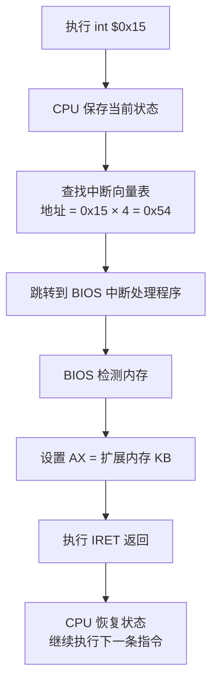
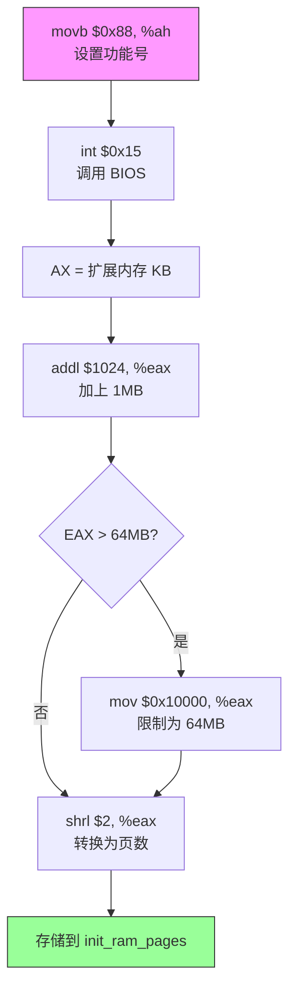

## 概述

在设置好段寄存器后，内核需要知道系统有多少物理内存。这个信息对后续的内存管理至关重要：
- 决定可以创建多少页表
- 决定可以分配多少物理页面
- 决定内存池的大小

由于此时仍在实模式下运行，我们可以使用 BIOS 提供的服务来获取内存信息。

---

## 原始代码

```plaintext
#### Get memory size, via interrupt 15h function 88h (see [IntrList]),
#### which returns AX = (kB of physical memory) - 1024.  This only
#### works for memory sizes <= 65 MB, which should be fine for our
#### purposes.  We cap memory at 64 MB because that's all we prepare
#### page tables for, below.

	movb $0x88, %ah
	int $0x15
	addl $1024, %eax	# Total kB memory
	cmp $0x10000, %eax	# Cap at 64 MB
	jbe 1f
	mov $0x10000, %eax
1:	shrl $2, %eax		# Total 4 kB pages
	addr32 movl %eax, init_ram_pages - LOADER_PHYS_BASE - 0x20000
```

---

## 前置知识

### BIOS 中断服务

BIOS（Basic Input/Output System）提供了许多通过软件中断调用的服务：

| 中断号 | 功能类别 |
|--------|----------|
| INT 10h | 视频服务 |
| INT 13h | 磁盘服务 |
| INT 15h | 系统服务（包括内存检测） |
| INT 16h | 键盘服务 |

### INT 15h, AH=88h：扩展内存大小

这是一个古老但简单的内存检测方法：

```
输入：
    AH = 88h

输出：
    AX = 扩展内存大小（以 KB 为单位）
         这是 1MB 以上的内存量
    
    CF = 0 表示成功
    CF = 1 表示错误
```

**"扩展内存" 是什么？**

```
PC 内存布局的历史包袱：

    0x00000 - 0x9FFFF    常规内存 (640 KB)      ← "基本内存"
    0xA0000 - 0xFFFFF    系统保留 (384 KB)      ← VGA、ROM 等
    ─────────────────────────────────────────
    0x100000 以上         扩展内存              ← INT 15h/88h 返回这部分

早期 PC 只有 1MB 内存，其中只有 640KB 可用（著名的 640KB 限制）。
后来的扩展内存需要特殊方式访问。
```

### 为什么这个方法只支持 65MB？

INT 15h/88h 返回的是 16 位值（AX 寄存器）：
- 最大返回值：0xFFFF = 65535
- 单位是 KB
- 65535 KB ≈ 64 MB（扩展内存）
- 加上 1MB 基本内存 ≈ 65 MB 总内存

对于更大的内存，需要使用更复杂的检测方法（如 INT 15h/E820h），但 Pintos 选择了简单的方法。

---

## 逐行详解

### 第 1 行：设置功能号

```plaintext
	movb $0x88, %ah
```

**指令分析**

| 部分 | 含义 |
|------|------|
| movb | 移动字节（8位） |
| $0x88 | 立即数 0x88（功能号） |
| %ah | AX 寄存器的高 8 位 |

**AX 寄存器的结构**

```
       AX (16 位)
    ┌─────┬─────┐
    │ AH  │ AL  │
    │(高8)│(低8)│
    └─────┴─────┘
    
示例：AX = 0x1234
      AH = 0x12
      AL = 0x34
```

BIOS 中断通常使用 AH 来指定功能号，AL 或整个 AX 来传递参数或返回值。

---

### 第 2 行：调用 BIOS 中断

```plaintext
	int $0x15
```

**软件中断的工作原理**



**BIOS 返回后 AX 的含义**

```
假设系统有 32 MB RAM：

总内存 = 32 MB = 32768 KB

扩展内存 = 总内存 - 1024 KB = 31744 KB

BIOS 返回：AX = 31744 = 0x7C00
```

---

### 第 3 行：加上基本内存

```plaintext
	addl $1024, %eax	# Total kB memory
```

**为什么加 1024？**

BIOS 只返回 1MB 以上的内存（扩展内存）。要得到总内存，需要加上第一个 1MB：

```
总内存 (KB) = 扩展内存 (KB) + 1024 KB

为什么是 1024 而不是 1MB (1048576)?
因为单位已经是 KB，1MB = 1024 KB
```

**为什么使用 addl 而不是 addw？**

```plaintext
addl $1024, %eax    # 32 位加法，操作 EAX
addw $1024, %ax     # 16 位加法，操作 AX
```

虽然在实模式下，但我们想要 32 位的结果以支持更大的值。
使用 EAX（32位）可以避免溢出问题。

**注意**：在 16 位实模式下使用 32 位操作数会自动添加操作数大小前缀（0x66）。

---

### 第 4-6 行：限制最大内存为 64MB

```plaintext
	cmp $0x10000, %eax	# Cap at 64 MB
	jbe 1f
	mov $0x10000, %eax
1:
```

**为什么限制在 64MB？**

1. **页表大小限制**：Pintos 只准备了映射 64MB 的页表
2. **简化设计**：更大的内存需要更复杂的页表管理
3. **教学目的**：64MB 对教学操作系统来说足够了

**代码逻辑详解**

```
0x10000 (十进制 65536) = 64 MB (以 KB 为单位)

    64 MB = 64 × 1024 KB = 65536 KB = 0x10000 KB

代码流程：
    
    if (EAX > 0x10000) {      # cmp + jbe
        EAX = 0x10000;        # mov
    }
    # 1: 标签
```

**指令详解**

| 指令 | 含义 |
|------|------|
| `cmp $0x10000, %eax` | 计算 EAX - 0x10000，设置标志位，不保存结果 |
| `jbe 1f` | Jump if Below or Equal（如果 ≤ 则跳转）<br/>`1f` 表示"向前找标签 1" |
| `mov $0x10000, %eax` | 将 64MB 值存入 EAX |
| `1:` | 本地标签（数字标签可以重复使用） |

**GAS 数字标签**

```
1:      # 标签定义
jmp 1f  # 向前（forward）跳转到下一个 1:
jmp 1b  # 向后（backward）跳转到上一个 1:
```

---

### 第 7 行：转换为页数

```plaintext
	shrl $2, %eax		# Total 4 kB pages
```

**为什么右移 2 位？**

```
EAX 当前值 = 总内存 (KB)

要得到 4KB 页面的数量：
    页数 = 总内存 (KB) ÷ 4

÷ 4 等价于右移 2 位：
    EAX >> 2 = EAX ÷ 4

示例：
    32 MB = 32768 KB
    页数 = 32768 ÷ 4 = 8192 页
    
    二进制: 0x8000 >> 2 = 0x2000
    十进制: 32768 >> 2 = 8192 ✓
```

**为什么页面大小是 4KB？**

4KB (4096 字节) 是 x86 分页的标准页面大小。这个大小是硬件决定的：
- 页表项使用 10 位索引
- 页内偏移使用 12 位
- 2^12 = 4096 = 4KB

---

### 第 8 行：存储结果

```plaintext
	addr32 movl %eax, init_ram_pages - LOADER_PHYS_BASE - 0x20000
```

这是最复杂的一行，让我们拆解它。

**目标变量 init_ram_pages**

在 `start.S` 末尾定义了这个变量：

```plaintext
.globl init_ram_pages
init_ram_pages:
	.long 0
```

这是一个全局变量，后面 C 代码会用它来知道有多少物理内存页。

**地址计算的问题**

问题在于 `init_ram_pages` 的地址是**链接时的虚拟地址**，而我们现在运行在**实模式**下需要**物理地址**。

```
链接器设置：
    init_ram_pages 的虚拟地址 = LOADER_PHYS_BASE + 0x20000 + 偏移
                              = 0xC0000000 + 0x20000 + 偏移
    
实际物理位置：
    内核加载在 0x20000
    所以 init_ram_pages 的物理地址 = 0x20000 + 偏移

要得到相对于内核起始的偏移：
    偏移 = 虚拟地址 - LOADER_PHYS_BASE - 0x20000
```

**示意图**

```
虚拟地址空间（链接时）：
    
    0xC0020000 ┌─────────────────────┐  ← 内核虚拟起始
               │    .start 段        │
               │    start:           │
               │    ...              │
               │    init_ram_pages   │  ← 假设这里是 0xC0020XXX
               └─────────────────────┘

物理地址空间（实际运行）：

    0x00020000 ┌─────────────────────┐  ← 内核物理起始
               │    .start 段        │
               │    start:           │
               │    ...              │
               │    init_ram_pages   │  ← 物理地址 0x00020XXX
               └─────────────────────┘

转换公式：
    物理地址 = 虚拟地址 - LOADER_PHYS_BASE
    
相对于内核起始的偏移：
    偏移 = 虚拟地址 - LOADER_PHYS_BASE - 0x20000
```

**addr32 前缀**

```plaintext
addr32 movl %eax, ...
```

在 16 位实模式下，默认地址大小是 16 位。`addr32` 前缀告诉 CPU 使用 32 位地址计算。

这是必要的，因为：
1. 目标地址计算可能超过 16 位
2. 我们需要访问内核数据区

**最终效果**

执行后，`init_ram_pages` 变量被设置为系统的物理页面数。

```c
// 在 C 代码中可以这样使用：
extern uint32_t init_ram_pages;

printf("System has %u pages of RAM (%u MB)\n", 
       init_ram_pages, 
       init_ram_pages * 4 / 1024);
```

---

## 完整流程图



---

## 数值示例

让我们用具体数字走一遍流程：

### 示例 1：32MB 系统

```
初始：系统有 32 MB 物理内存

1. int $0x15 返回：
   AX = 32768 - 1024 = 31744 KB

2. addl $1024, %eax：
   EAX = 31744 + 1024 = 32768 KB

3. cmp $0x10000, %eax：
   32768 < 65536，不跳转

4. 等等...32768 < 65536 应该跳转！
   让我重新计算...
   
   32768 KB = 32 MB
   65536 KB = 64 MB
   32 MB < 64 MB ✓
   所以会跳过 mov $0x10000, %eax

5. shrl $2, %eax：
   EAX = 32768 >> 2 = 8192 页

结果：init_ram_pages = 8192
```

### 示例 2：128MB 系统

```
初始：系统有 128 MB 物理内存

1. int $0x15 返回：
   但是！INT 15h/88h 最多只能返回 65535...
   
   128 MB - 1 MB = 127 MB = 130048 KB
   这超过了 16 位最大值 65535！
   
   BIOS 可能返回 65535（饱和值）

2. addl $1024, %eax：
   EAX = 65535 + 1024 = 66559 KB

3. cmp $0x10000, %eax：
   66559 > 65536，不跳转

4. mov $0x10000, %eax：
   EAX = 65536 KB (64 MB)

5. shrl $2, %eax：
   EAX = 65536 >> 2 = 16384 页

结果：init_ram_pages = 16384（被限制在 64MB）
```

---

## 为什么不用更现代的内存检测？

INT 15h/E820h 是更现代的内存检测方法，它可以：
- 检测任意大小的内存
- 报告内存区域的类型（可用、保留、ACPI等）
- 处理内存空洞

但 Pintos 选择 INT 15h/88h 因为：

1. **简单**：一条中断调用，一个返回值
2. **足够**：64MB 对教学目的已经足够
3. **可靠**：这个方法在所有 x86 系统上都支持
4. **代码短**：引导代码空间宝贵

---

## 常见问题

### Q1: 如果系统内存小于 1MB 会怎样？

**A**: 在现代系统中不太可能发生。但如果发生：
- BIOS 可能返回 0 或错误
- 代码会计算出很小的页数
- 系统可能无法正常运行

### Q2: 为什么使用 KB 而不是字节作为单位？

**A**: 历史原因。这个 BIOS 接口是为早期 PC 设计的，当时 KB 是合适的单位。如果用字节，16 位寄存器只能表示 64KB。

### Q3: 内存大小信息后面怎么使用？

**A**: 在 `init.c` 的 `pintos_init()` 中：

```c
printf ("Pintos booting with %'"PRIu32" kB RAM...\n",
        init_ram_pages * PGSIZE / 1024);

// 用于初始化物理页面分配器
palloc_init (user_page_limit);
```

### Q4: 为什么要在实模式下获取内存大小？

**A**: 因为 BIOS 服务只能在实模式下使用。一旦切换到保护模式，就不能再调用 BIOS 了。

---

## 其他内存检测方法

供参考，这是更复杂但更强大的 E820 方法：

```plaintext
# INT 15h/E820h - 获取系统内存映射
# 输入:
#   EAX = 0xE820
#   EBX = 继续值（第一次调用为 0）
#   ECX = 缓冲区大小
#   EDX = 签名 'SMAP' (0x534D4150)
#   ES:DI = 缓冲区指针
# 输出:
#   EAX = 'SMAP'
#   EBX = 下一次调用的继续值（0 表示结束）
#   ECX = 实际写入字节数
#   缓冲区包含内存区域描述符
```

这个方法可以完整描述系统的内存布局，包括哪些区域可用、哪些被保留。

---

## 练习思考

### 思考题 1
如果我们不限制内存在 64MB，需要做哪些额外的工作？

<details>
<summary>点击查看答案</summary>

需要做的工作包括：
1. **更多页表**：每 4MB 需要一个页表（1024 × 4KB = 4MB），64MB 以上需要更多页表
2. **更大的页目录**：可能需要多级页表
3. **修改临时页表创建代码**：当前代码只创建映射 64MB 的页表
4. **可能需要更多的栈空间**：页表创建需要更多内存访问

简单地提高上限不够，还需要相应增加后面创建的页表数量。

</details>

### 思考题 2
为什么 `addl $1024, %eax` 而不是 `addw $1024, %ax`？

<details>
<summary>点击查看答案</summary>

虽然 BIOS 返回的值在 AX 中（16位），但我们想要处理完整的 32 位值：

1. 加上 1024 后可能超过 16 位最大值 65535
2. 后面的比较和右移操作需要 32 位精度
3. 使用 EAX 可以避免溢出和符号扩展问题

例如：如果 BIOS 返回 65535，加上 1024 得到 66559，这超过了 16 位范围。

</details>

### 思考题 3
`init_ram_pages` 的地址计算 `init_ram_pages - LOADER_PHYS_BASE - 0x20000` 如果计算错误会发生什么？

<details>
<summary>点击查看答案</summary>

后果很严重：

1. 如果写入地址太低（如中断向量表区域）：
   - 可能覆盖 BIOS 数据
   - 后续的 BIOS 调用可能失败

2. 如果写入地址在内核代码区域：
   - 可能覆盖内核指令
   - 导致系统崩溃或不可预测的行为

3. 如果写入地址太高：
   - 可能写入不存在的内存
   - 在某些系统上可能被忽略，在其他系统上可能出错

这就是为什么这行代码需要非常精确的地址计算。

</details>

---

## 下一步

现在我们知道了系统有多少内存，但还有一个问题：历史遗留的 A20 地址线问题限制了我们只能访问 1MB 内存。下一篇文档将介绍如何启用 A20 地址线：[A20 地址线启用](2026-01-22-pintos-kernel-03-a20-gate.md)
