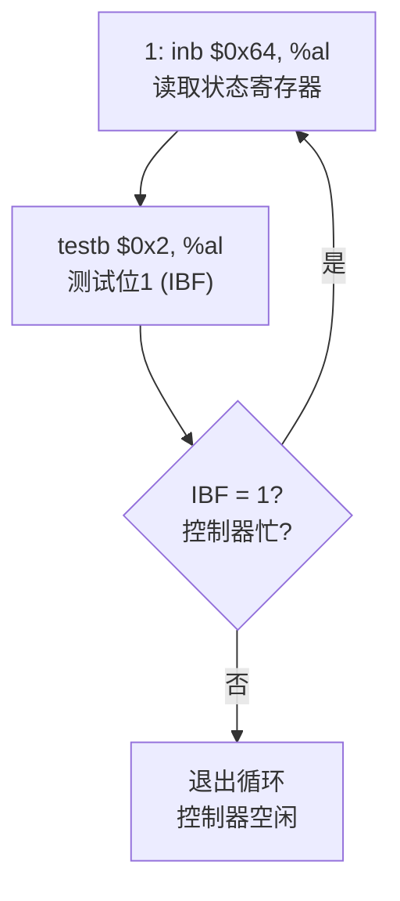
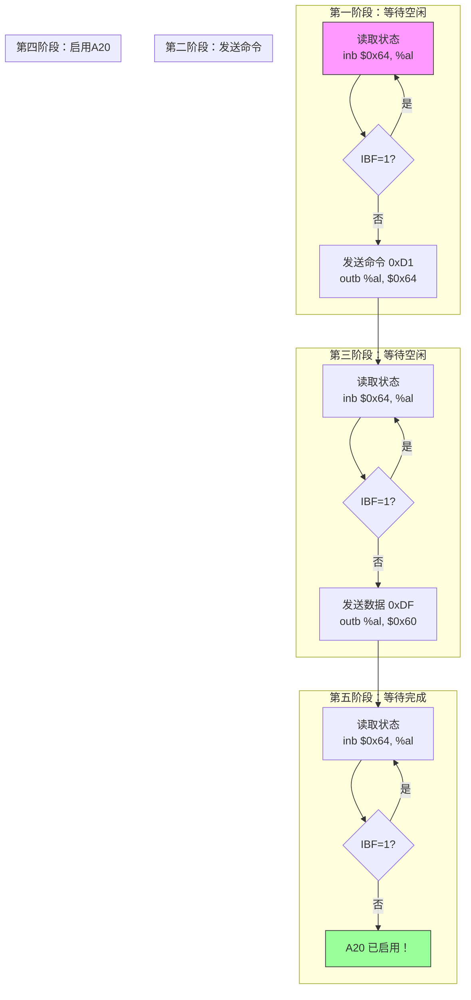

## 概述

A20 地址线问题是 x86 架构最著名的历史包袱之一。由于早期 IBM PC 的兼容性设计，地址线 A20 在系统启动时被禁用，导致无法访问 1MB 以上的内存。

本节代码通过键盘控制器（8042）启用 A20 地址线，为访问扩展内存做准备。

---

## 原始代码

```plaintext
#### Enable A20.  Address line 20 is tied low when the machine boots,
#### which prevents addressing memory about 1 MB.  This code fixes it.

# Poll status register while busy.

1:	inb $0x64, %al
	testb $0x2, %al
	jnz 1b

# Send command for writing output port.

	movb $0xd1, %al
	outb %al, $0x64

# Poll status register while busy.

1:	inb $0x64, %al
	testb $0x2, %al
	jnz 1b

# Enable A20 line.

	movb $0xdf, %al
	outb %al, $0x60

# Poll status register while busy.

1:	inb $0x64, %al
	testb $0x2, %al
	jnz 1b
```

---

## 前置知识

### A20 地址线的历史

**故事背景：1981年的 IBM PC**

最初的 IBM PC 使用 Intel 8088 CPU，有 20 根地址线（A0-A19），可以寻址 2^20 = 1MB 内存。

**地址回绕特性**

在 8088 上，当程序访问超过 1MB 的地址时，地址会"回绕"：

```
1MB = 0x100000
访问 0x100000 实际访问 0x00000
访问 0x100001 实际访问 0x00001
...

这是因为第 21 位（A20）不存在，被忽略
```

一些早期程序（包括某些 DOS 程序）**依赖这个回绕行为**！

**80286 的问题**

1982年的 Intel 80286 有 24 根地址线（A0-A23），可以寻址 16MB。但如果 A20 总是有效，那些依赖回绕的旧程序就会崩溃。

**IBM 的"解决方案"**

IBM 的工程师想出了一个"天才"的方法：

```
通过键盘控制器（8042芯片）的一个空闲引脚来控制 A20！

默认情况下，A20 被强制拉低（等于0）
这样地址就会像 8088 一样回绕
需要访问高内存时，通过键盘控制器启用 A20
```

这个设计一直保留到现代 x86 系统中，成为了著名的历史包袱。

### A20 对内存访问的影响

```
A20 禁用时的地址映射：

物理地址（期望）    实际访问地址
────────────────    ──────────────
0x000000            0x000000    (正常)
0x0FFFFF            0x0FFFFF    (正常，1MB-1)
0x100000            0x000000    (回绕！)
0x100001            0x000001    (回绕！)
0x1FFFFF            0x0FFFFF    (回绕！)
0x200000            0x000000    (再次回绕！)

A20 启用后：
所有地址正常访问，不再回绕
```

### 8042 键盘控制器

8042（或兼容芯片）是 PC 中的键盘控制器，但它也被赋予了一些额外的功能，包括控制 A20 线。

**端口地址**

| 端口 | 读取时 | 写入时 |
|------|--------|--------|
| 0x60 | 输出缓冲区（数据） | 输入缓冲区（数据/命令参数） |
| 0x64 | 状态寄存器 | 命令寄存器 |

**状态寄存器 (端口 0x64 读取)**

```
位 7  6  5  4  3  2  1  0
   │  │  │  │  │  │  │  │
   │  │  │  │  │  │  │  └─ OBF: 输出缓冲区满（数据可读）
   │  │  │  │  │  │  └──── IBF: 输入缓冲区满（控制器忙）
   │  │  │  │  │  └─────── 系统标志
   │  │  │  │  └────────── 命令/数据（0=数据，1=命令）
   │  │  │  └───────────── 键盘解锁
   │  │  └──────────────── 辅助设备输出缓冲区满
   │  └─────────────────── 超时错误
   └────────────────────── 奇偶错误
```

**我们关心的是位 1 (IBF)**：
- IBF = 0：控制器空闲，可以发送命令
- IBF = 1：控制器忙，需要等待

---

## 逐行详解

### 第 1-3 行：等待控制器空闲（第一次）

```plaintext
1:	inb $0x64, %al
	testb $0x2, %al
	jnz 1b
```

**这是一个轮询循环**



**指令详解**

| 指令 | 说明 |
|------|------|
| `inb $0x64, %al` | 从端口 0x64 读取一个字节到 AL |
| `testb $0x2, %al` | 测试 AL 的位 1（与 0x2 进行 AND 操作）|
| `jnz 1b` | 如果结果非零（位1=1），跳转回标签 1 |

**`testb` 指令**

```
testb $0x2, %al

效果：计算 AL AND 0x02，设置标志位，不保存结果

0x02 = 0000 0010 (只有位1为1)

示例：
    AL = 0x03 = 0000 0011
    0x02      = 0000 0010
    AND 结果  = 0000 0010 = 0x02 (非零)
    ZF = 0 (Zero Flag)
    
    AL = 0x01 = 0000 0001
    0x02      = 0000 0010
    AND 结果  = 0000 0000 = 0x00 (零)
    ZF = 1 (Zero Flag)
```

---

### 第 4-5 行：发送"写输出端口"命令

```plaintext
	movb $0xd1, %al
	outb %al, $0x64
```

**命令 0xD1**

向端口 0x64 写入 0xD1 告诉键盘控制器：

> "接下来写入 0x60 端口的数据应该被当作输出端口的新值"

**输出端口的结构**

8042 的输出端口包含几个控制位：

```
输出端口 (通过命令 0xD0 读取，0xD1 写入):

位 7  6  5  4  3  2  1  0
   │  │  │  │  │  │  │  │
   │  │  │  │  │  │  │  └─ 系统复位（0=复位）
   │  │  │  │  │  │  └──── A20 Gate（1=启用）← 我们要设置这个！
   │  │  │  │  │  └─────── 未定义
   │  │  │  │  └────────── 未定义
   │  │  │  └───────────── 输出缓冲区满中断
   │  │  └──────────────── 输入缓冲区空中断
   │  └─────────────────── 键盘时钟
   └────────────────────── 键盘数据
```

---

### 第 6-8 行：等待控制器空闲（第二次）

```plaintext
1:	inb $0x64, %al
	testb $0x2, %al
	jnz 1b
```

与第一次相同的等待循环。必须等待控制器处理完 0xD1 命令后才能发送数据。

---

### 第 9-10 行：写入启用 A20 的值

```plaintext
	movb $0xdf, %al
	outb %al, $0x60
```

**为什么是 0xDF？**

```
0xDF = 1101 1111

位分析：
    位 0 = 1：不复位系统
    位 1 = 1：启用 A20！
    位 2 = 1：未定义，保持为 1
    位 3 = 1：未定义，保持为 1
    位 4 = 1：启用输出缓冲区满中断
    位 5 = 1：启用输入缓冲区空中断
    位 6 = 1：键盘时钟高
    位 7 = 1：键盘数据高
```

简而言之：设置所有位为 1，特别是位 1 来启用 A20。

**注意端口变化**

```
命令发送到端口 0x64
数据发送到端口 0x60

这是 8042 的标准协议
```

---

### 第 11-13 行：等待控制器空闲（第三次）

```plaintext
1:	inb $0x64, %al
	testb $0x2, %al
	jnz 1b
```

最后一次等待，确保 A20 启用命令被处理完毕。

---

## 完整流程图



---

## I/O 端口操作详解

### IN 指令

```plaintext
inb $port, %al    # 从 port 读取 1 字节到 AL
inw $port, %ax    # 从 port 读取 2 字节到 AX
inl $port, %eax   # 从 port 读取 4 字节到 EAX
```

### OUT 指令

```plaintext
outb %al, $port   # 将 AL 写入 port
outw %ax, $port   # 将 AX 写入 port
outl %eax, $port  # 将 EAX 写入 port
```

### 端口 vs 内存

```
内存访问：
    mov (%ebx), %eax    # 读取内存
    mov %eax, (%ebx)    # 写入内存

端口访问：
    inb $port, %al      # 读取端口
    outb %al, $port     # 写入端口

端口是独立的地址空间，不是内存映射！
x86 有 65536 个 I/O 端口（0x0000 - 0xFFFF）
```

---

## 其他启用 A20 的方法

通过键盘控制器不是唯一的方法。以下是几种替代方案：

### 方法 2：BIOS INT 15h

```plaintext
# 使用 BIOS 服务启用 A20
mov $0x2401, %ax
int $0x15
```

更简单，但并非所有 BIOS 都支持。

### 方法 3：Fast A20 Gate

```plaintext
# 通过系统控制端口 A（端口 0x92）
inb $0x92, %al
orb $0x02, %al
outb %al, $0x92
```

更快，但可能导致某些系统出问题。

### 方法 4：键盘控制器命令 0xDF

```plaintext
# 直接命令启用 A20
mov $0xdf, %al
outb %al, $0x64
```

某些键盘控制器支持这种简化方法。

### Pintos 为什么选择当前方法？

1. **兼容性**：这是最标准的方法，几乎所有 PC 都支持
2. **可靠性**：正确处理了等待控制器空闲
3. **完整性**：设置了输出端口的所有相关位

---

## 验证 A20 是否启用

启用 A20 后，可以通过以下方式验证：

```plaintext
# 验证 A20：比较 0x000000 和 0x100000 处的内容
# 如果 A20 禁用，它们会映射到同一位置

mov $0, %ax
mov %ax, %es            # ES = 0
mov $0xFFFF, %ax
mov %ax, %fs            # FS = 0xFFFF

# 在 ES:0 (物理 0x000000) 写入值
movl $0x12345678, %es:0

# 从 FS:0x10 (物理 0x100000) 读取
# FS:0x10 = 0xFFFF * 16 + 0x10 = 0x100000
movl %fs:0x10, %eax

# 比较
cmp $0x12345678, %eax
je a20_disabled         # 如果相同，A20 仍禁用
```

Pintos 没有这个验证代码，假设启用成功。

---

## 常见问题

### Q1: 为什么 A20 用键盘控制器控制？

**A**: 纯粹是历史原因。当 IBM 设计 PC/AT 时，需要一种方式来控制 A20，而键盘控制器碰巧有一个空闲的输出引脚。使用现有硬件比添加新芯片便宜。这个"临时"解决方案一直沿用至今。

### Q2: 现代系统还需要启用 A20 吗？

**A**: 是的！现代 x86 CPU 和主板仍然模拟这个行为以保持兼容性。BIOS 启动时 A20 默认禁用。不过，许多 BIOS 会在启用保护模式之前自动启用 A20。

### Q3: 如果不启用 A20 就切换到保护模式会怎样？

**A**: 系统会表现出奇怪的行为：
- 访问奇数 MB 的内存会回绕到偶数 MB
- 例如：访问 3MB 位置实际访问 2MB 位置
- 内核可能会覆盖自己的代码或数据
- 通常导致系统崩溃

### Q4: 轮询循环会不会无限循环？

**A**: 在正常工作的硬件上不会。键盘控制器通常在几微秒内处理完命令。如果控制器真的卡住了，系统会挂起，这是硬件故障的表现。

---

## 技术细节补充

### 8042 命令表（部分）

| 命令 | 功能 |
|------|------|
| 0x20 | 读取命令字节 |
| 0x60 | 写入命令字节 |
| 0xD0 | 读取输出端口 |
| 0xD1 | 写入输出端口 |
| 0xDD | 禁用 A20 |
| 0xDF | 启用 A20 |
| 0xFE | 系统复位（脉冲） |

### 时序考虑

```
8042 键盘控制器的大致时序：

命令/数据写入后，控制器需要处理时间
典型的处理时间：10-100 微秒

轮询循环确保：
1. 不在控制器忙时发送数据
2. 给控制器足够时间处理上一个命令
```

---

## 练习思考

### 思考题 1
为什么要轮询三次而不是两次？能不能去掉最后一次轮询？

<details>
<summary>点击查看答案</summary>

三次轮询的原因：
1. 第一次：确保可以发送 0xD1 命令
2. 第二次：确保 0xD1 命令被处理，可以发送数据
3. 第三次：确保 0xDF 数据被处理完成

理论上可以去掉最后一次轮询，因为后续代码不会立即使用键盘控制器。但是：
- 留着更安全，确保 A20 完全启用
- 如果后面代码依赖 A20，不等待可能导致竞态条件

保守的做法是保留所有轮询。

</details>

### 思考题 2
如果键盘控制器不存在或损坏，代码会怎样？

<details>
<summary>点击查看答案</summary>

可能的情况：
1. **控制器不存在**：读取 0x64 可能返回 0xFF（所有位为1），包括 IBF 位。代码会进入无限循环。

2. **控制器损坏**：取决于损坏方式。可能：
   - 无限循环
   - A20 启用失败
   - 产生异常

3. **虚拟化环境**：虚拟机通常正确模拟 8042，或者默认启用 A20。

实际上，没有键盘控制器的系统很少见。更稳健的代码会：
- 设置超时计数器
- 尝试多种 A20 启用方法
- 在失败时报告错误

</details>

### 思考题 3
0xDF 中哪些位是必须设置的，哪些是可选的？

<details>
<summary>点击查看答案</summary>

必须设置的位：
- 位 0 = 1：防止系统复位
- 位 1 = 1：启用 A20

可能重要的位：
- 位 6、7：键盘时钟和数据，应保持为 1

理论上，最小值可以是 0x03（只设置位 0 和位 1）。

但使用 0xDF（所有位为 1 除了位 5）是更安全的选择，因为：
- 保持键盘正常工作
- 不改变其他可能重要的设置
- 是广泛测试过的值

</details>

---

## 下一步

A20 地址线已启用，现在我们可以访问超过 1MB 的内存了。但在切换到保护模式之前，还需要创建临时页表来支持分页。下一篇文档将介绍：[临时页表创建](2026-01-22-pintos-kernel-04-page-tables.md)
