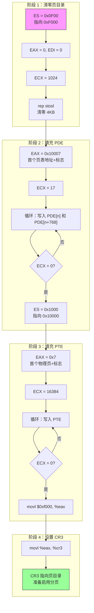

## 概述

在切换到保护模式并启用分页之前，必须先创建页表结构。这部分代码在实模式下创建一个临时的页目录和页表，用于映射前 64MB 的物理内存。

这个临时页表有两个重要特点：
1. **恒等映射**：虚拟地址等于物理地址（用于切换过程）
2. **高地址映射**：从 0xC0000000 开始的地址也映射到物理内存（内核将在这里运行）

---

## 原始代码

```plaintext
#### Create temporary page directory and page table and set page
#### directory base register.

# Create page directory at 0xf000 (60 kB) and fill with zeroes.
	mov $0xf00, %ax
	mov %ax, %es
	subl %eax, %eax
	subl %edi, %edi
	movl $0x400, %ecx
	rep stosl

# Add PDEs to point to page tables for the first 64 MB of RAM.
# Also add identical PDEs starting at LOADER_PHYS_BASE.
# See [IA32-v3a] section 3.7.6 "Page-Directory and Page-Table Entries"
# for a description of the bits in %eax.

	movl $0x10007, %eax
	movl $0x11, %ecx
	subl %edi, %edi
1:	movl %eax, %es:(%di)
	movl %eax, %es:LOADER_PHYS_BASE >> 20(%di)
	addw $4, %di
	addl $0x1000, %eax
	loop 1b

# Set up page tables for one-to-map linear to physical map for the
# first 64 MB of RAM.
# See [IA32-v3a] section 3.7.6 "Page-Directory and Page-Table Entries"
# for a description of the bits in %eax.

	movw $0x1000, %ax
	movw %ax, %es
	movl $0x7, %eax
	movl $0x4000, %ecx
	subl %edi, %edi
1:	movl %eax, %es:(%di)
	addw $4, %di
	addl $0x1000, %eax
	loop 1b

# Set page directory base register.

	movl $0xf000, %eax
	movl %eax, %cr3
```

---

## 前置知识

### x86 分页机制

x86 分页使用**两级页表**结构（在非 PAE 模式下）：

```
32 位虚拟地址分解：

 31        22 21        12 11         0
┌───────────┬────────────┬────────────┐
│  PDE 索引  │  PTE 索引   │  页内偏移   │
│  (10 位)   │  (10 位)    │  (12 位)   │
└───────────┴────────────┴────────────┘

地址转换过程：
1. 用高 10 位索引页目录，找到页表地址
2. 用中间 10 位索引页表，找到物理页框地址
3. 加上低 12 位偏移，得到最终物理地址
```

### 页目录和页表的布局

```
页目录（Page Directory）:
    - 包含 1024 个 PDE（Page Directory Entry）
    - 每个 PDE 4 字节
    - 总大小 = 1024 × 4 = 4096 字节 = 1 页
    - 每个 PDE 指向一个页表

页表（Page Table）:
    - 包含 1024 个 PTE（Page Table Entry）
    - 每个 PTE 4 字节
    - 总大小 = 1024 × 4 = 4096 字节 = 1 页
    - 每个 PTE 映射一个 4KB 物理页

一个页目录可以映射的内存：
    1024 PDEs × 1024 PTEs × 4KB = 4GB
```

### 页目录项（PDE）格式

```
 31                    12 11  9 8 7 6 5 4 3 2 1 0
┌────────────────────────┬─────┬─┬─┬─┬─┬─┬─┬─┬─┬─┐
│    页表物理地址[31:12]   │ AVL │G│S│0│A│D│W│U│W│P│
└────────────────────────┴─────┴─┴─┴─┴─┴─┴─┴─┴─┴─┘
                              │ │ │   │ │ │ │ │ │
                              │ │ │   │ │ │ │ │ └─ P: Present (存在位)
                              │ │ │   │ │ │ │ └─── R/W: Read/Write
                              │ │ │   │ │ │ └───── U/S: User/Supervisor
                              │ │ │   │ │ └─────── PWT: Page Write-Through
                              │ │ │   │ └───────── PCD: Page Cache Disable
                              │ │ │   └─────────── A: Accessed
                              │ │ └─────────────── PS: Page Size (4MB页)
                              │ └───────────────── G: Global
                              └─────────────────── AVL: Available
```

### 页表项（PTE）格式

与 PDE 类似，但地址部分指向物理页框：

```
 31                    12 11  9 8 7 6 5 4 3 2 1 0
┌────────────────────────┬─────┬─┬─┬─┬─┬─┬─┬─┬─┬─┐
│    物理页地址[31:12]     │ AVL │G│0│D│A│C│W│U│W│P│
└────────────────────────┴─────┴─┴─┴─┴─┴─┴─┴─┴─┴─┘
```

### Pintos 的内存映射策略

```
Pintos 创建两套映射：

1. 恒等映射（Identity Mapping）:
   虚拟地址 0x00000000 - 0x03FFFFFF → 物理地址 0x00000000 - 0x03FFFFFF
   用于模式切换时代码可以继续执行

2. 高地址映射:
   虚拟地址 0xC0000000 - 0xC3FFFFFF → 物理地址 0x00000000 - 0x03FFFFFF
   内核代码链接到这个地址范围

两种映射指向相同的物理内存！
```

---

## 逐行详解

### 第 1-5 行：清零页目录

```plaintext
# Create page directory at 0xf000 (60 kB) and fill with zeroes.
	mov $0xf00, %ax
	mov %ax, %es
	subl %eax, %eax
	subl %edi, %edi
	movl $0x400, %ecx
	rep stosl
```

**页目录位置选择**

选择 0xF000 (60 KB) 的原因：
- 在内核 (0x20000) 之前
- 在栈之下（栈从 0xF000 向下增长，但我们现在重用这块空间）
- 页对齐（必须是 4KB 边界）

**设置 ES 段**

```plaintext
mov $0xf00, %ax
mov %ax, %es
```

```
ES = 0x0F00
物理基址 = 0x0F00 × 16 = 0xF000

后续使用 ES:DI 寻址：
ES:DI = 0x0F00:0x0000 = 物理地址 0xF000
```

**清零 EAX 和 EDI**

```plaintext
subl %eax, %eax    # EAX = 0（要存储的值）
subl %edi, %edi    # EDI = 0（目标偏移）
```

使用 `sub reg, reg` 比 `mov $0, reg` 节省空间。

**设置计数并执行**

```plaintext
movl $0x400, %ecx  # ECX = 1024（双字数量）
rep stosl          # 重复存储 EAX 到 ES:DI
```

```
rep stosl 的工作原理：

while (ECX != 0) {
    ES:[DI] = EAX      # 存储 4 字节
    DI += 4            # 递增（因为前面执行了 cld）
    ECX -= 1           # 减少计数
}

结果：从 ES:0 开始的 1024 × 4 = 4096 字节被清零
即整个页目录被清零
```

---

### 第 6-13 行：填充页目录项

```plaintext
# Add PDEs to point to page tables for the first 64 MB of RAM.
# Also add identical PDEs starting at LOADER_PHYS_BASE.

	movl $0x10007, %eax
	movl $0x11, %ecx
	subl %edi, %edi
1:	movl %eax, %es:(%di)
	movl %eax, %es:LOADER_PHYS_BASE >> 20(%di)
	addw $4, %di
	addl $0x1000, %eax
	loop 1b
```

**初始 PDE 值 0x10007**

```
0x10007 = 0001 0000 0000 0000 0111 (二进制)

解析：
    地址部分 [31:12] = 0x10 = 0x10000 >> 12
    第一个页表位于物理地址 0x10000 (64 KB)
    
    标志位：
    位 0 (P)   = 1：页表存在
    位 1 (R/W) = 1：可写
    位 2 (U/S) = 1：用户可访问
    其他位     = 0
```

**为什么需要 17 个 PDE？**

```plaintext
movl $0x11, %ecx   # 0x11 = 17
```

```
每个 PDE 映射 4 MB：
    1 PDE → 1 页表 → 1024 PTE → 1024 × 4KB = 4MB

映射 64 MB 需要：
    64 MB ÷ 4 MB = 16 个 PDE

但代码设置 17 个？让我们验证：
    实际上是 16 + 1 = 17，可能是为了包含边界
    或者代码作者考虑了对齐问题
    
更正：0x11 = 17，但循环前 ECX 已经减 1
实际上 loop 会执行 17 次

64 MB = 16 个 4MB 区块，需要 16 个页表
但代码可能故意多设置一个以留余量
```

**双重映射的实现**

```plaintext
1:	movl %eax, %es:(%di)
	movl %eax, %es:LOADER_PHYS_BASE >> 20(%di)
```

```
两条 movl 指令实现双重映射：

1. movl %eax, %es:(%di)
   写入低地址映射的 PDE
   例如：PDE[0] 映射虚拟地址 0x00000000-0x003FFFFF

2. movl %eax, %es:LOADER_PHYS_BASE >> 20(%di)
   写入高地址映射的 PDE
   LOADER_PHYS_BASE = 0xC0000000
   0xC0000000 >> 20 = 0xC00
   
   0xC00 是什么？
   页目录偏移 = (虚拟地址 >> 22) × 4
   0xC0000000 >> 22 = 0x300 = 768 (十进制)
   偏移 = 768 × 4 = 3072 = 0xC00
   
   所以这写入 PDE[768+n]
```

**页目录布局图**

```
页目录（位于 0xF000）:

索引    偏移     指向页表        映射的虚拟地址范围
────    ────     ────────        ──────────────────
0       0x000    0x10000         0x00000000-0x003FFFFF
1       0x004    0x11000         0x00400000-0x007FFFFF
2       0x008    0x12000         0x00800000-0x00BFFFFF
...
15      0x03C    0x1F000         0x03C00000-0x03FFFFFF
16      0x040    0x20000         0x04000000-0x043FFFFF

... (中间全是 0，表示未映射) ...

768     0xC00    0x10000         0xC0000000-0xC03FFFFF  ← 高地址映射
769     0xC04    0x11000         0xC0400000-0xC07FFFFF
...
783     0xC3C    0x1F000         0xC3C00000-0xC3FFFFFF
784     0xC40    0x20000         0xC4000000-0xC43FFFFF
```

**循环过程**

```plaintext
addw $4, %di       # DI += 4（移动到下一个 PDE）
addl $0x1000, %eax # EAX += 0x1000（下一个页表地址）
loop 1b            # ECX--; if(ECX!=0) goto 1
```

```
每次迭代：
    DI 增加 4（下一个 PDE 偏移）
    EAX 的地址部分增加 0x1000（下一个页表地址）
    
页表地址序列：
    0x10000, 0x11000, 0x12000, ..., 0x20000
```

---

### 第 14-22 行：填充页表

```plaintext
# Set up page tables for one-to-map linear to physical map for the
# first 64 MB of RAM.

	movw $0x1000, %ax
	movw %ax, %es
	movl $0x7, %eax
	movl $0x4000, %ecx
	subl %edi, %edi
1:	movl %eax, %es:(%di)
	addw $4, %di
	addl $0x1000, %eax
	loop 1b
```

**页表位置**

```plaintext
movw $0x1000, %ax
movw %ax, %es      # ES = 0x1000
```

```
ES:0 = 0x1000:0 = 物理地址 0x10000 (64 KB)
页表从 0x10000 开始，紧接在页目录之后
```

**初始 PTE 值**

```plaintext
movl $0x7, %eax
```

```
0x7 = 0000 0111 (二进制)

解析：
    地址部分 [31:12] = 0（第一个物理页）
    
    标志位：
    位 0 (P)   = 1：页存在
    位 1 (R/W) = 1：可写
    位 2 (U/S) = 1：用户可访问
    
第一个 PTE 映射物理地址 0x00000
```

**PTE 数量**

```plaintext
movl $0x4000, %ecx   # 0x4000 = 16384
```

```
为什么是 16384？

64 MB ÷ 4 KB = 16384 页
每页需要一个 PTE
所以需要 16384 个 PTE

16384 × 4 字节 = 65536 字节 = 64 KB
16384 ÷ 1024 = 16 个页表
```

**填充循环**

```plaintext
1:	movl %eax, %es:(%di)   # 存储 PTE
	addw $4, %di            # 下一个 PTE
	addl $0x1000, %eax      # 下一个物理页地址
	loop 1b
```

```
每次迭代：
    存储当前 PTE
    DI += 4
    EAX 的地址增加 0x1000 (4 KB)

PTE 值序列：
    0x00000007 → 映射物理页 0x00000
    0x00001007 → 映射物理页 0x01000
    0x00002007 → 映射物理页 0x02000
    ...
    0x03FFF007 → 映射物理页 0x03FFF000 (64MB - 4KB)
```

---

### 第 23-25 行：设置 CR3

```plaintext
# Set page directory base register.

	movl $0xf000, %eax
	movl %eax, %cr3
```

**CR3 寄存器**

CR3（也叫 PDBR - Page Directory Base Register）存储页目录的物理地址。

```
CR3 寄存器格式：

 31                    12 11        5 4 3 2  0
┌────────────────────────┬──────────┬─┬─┬────┐
│   页目录物理地址[31:12]  │ Reserved │P│P│    │
│                        │          │C│W│Ign │
│                        │          │D│T│    │
└────────────────────────┴──────────┴─┴─┴────┘

PCD: Page-level Cache Disable
PWT: Page-level Write-Through
```

**设置效果**

```plaintext
movl $0xf000, %eax
movl %eax, %cr3
```

将 0xF000 写入 CR3，告诉 CPU 页目录在物理地址 0xF000。

**注意**：此时分页还未启用（CR0.PG = 0），所以这只是准备工作。

---

## 内存布局图

```
创建页表后的内存布局：

    0x0F000 ┌─────────────────────┐ ← 页目录 (4KB)
            │ PDE[0]   → 0x10000  │   映射 0x00000000
            │ PDE[1]   → 0x11000  │   映射 0x00400000
            │ ...                 │
            │ PDE[16]  → 0x20000  │   映射 0x04000000
            │ ...                 │   (未使用)
            │ PDE[768] → 0x10000  │   映射 0xC0000000
            │ PDE[769] → 0x11000  │   映射 0xC0400000
            │ ...                 │
            │ PDE[784] → 0x20000  │   映射 0xC4000000
    0x10000 ├─────────────────────┤ ← 页表 0 (4KB)
            │ PTE[0]   → 0x00000  │
            │ PTE[1]   → 0x01000  │
            │ ...                 │
            │ PTE[1023]→ 0x3FF000 │
    0x11000 ├─────────────────────┤ ← 页表 1 (4KB)
            │ ...                 │
    ...     │                     │
    0x20000 ├─────────────────────┤ ← 页表 16 (4KB) + 内核开始
            │ Pintos Kernel Code  │
            │ ...                 │
```

---

## 地址转换示例

```
示例：访问虚拟地址 0xC0001234

步骤 1：解析虚拟地址
    0xC0001234 = 1100 0000 0000 0000 0001 0010 0011 0100
    
    PDE 索引 = 高 10 位 = 11 0000 0000 = 768
    PTE 索引 = 中 10 位 = 00 0000 0001 = 1  
    偏移     = 低 12 位 = 0010 0011 0100 = 0x234

步骤 2：查找 PDE
    页目录地址 = CR3 = 0xF000
    PDE 地址 = 0xF000 + 768×4 = 0xF000 + 0xC00 = 0xFC00
    PDE[768] = 0x10007
    页表地址 = 0x10000

步骤 3：查找 PTE
    PTE 地址 = 0x10000 + 1×4 = 0x10004
    PTE[1] = 0x1007
    物理页地址 = 0x1000

步骤 4：计算物理地址
    物理地址 = 0x1000 + 0x234 = 0x1234

结论：虚拟地址 0xC0001234 → 物理地址 0x00001234
```

---

## 完整流程图



---

## 常见问题

### Q1: 为什么需要两套映射？

**A**: 这是模式切换的关键技巧：

```
切换到保护模式 + 分页后，下一条指令的获取：

如果只有高地址映射：
    EIP 还在低地址（如 0x20100）
    但 0x20100 没有映射
    → 页错误，系统崩溃！

有了恒等映射：
    EIP = 0x20100
    查页表：0x20100 → 物理 0x20100
    → 正常执行
    
然后跳转到高地址代码后，可以移除恒等映射
```

### Q2: 为什么页目录和页表必须 4KB 对齐？

**A**: 因为 PDE 和 CR3 中的地址字段只存储高 20 位：

```
PDE 格式：
    [31:12] = 页表地址的高 20 位
    [11:0]  = 标志位
    
这意味着地址必须是 4096 (2^12) 的倍数
```

### Q3: 创建页表后为什么还能继续在实模式下运行？

**A**: 页表只是内存中的数据结构。在 CR0.PG = 0 时，CPU 完全忽略 CR3 和页表。只有当启用分页后，这些结构才会生效。

### Q4: 为什么不使用 4MB 大页？

**A**: x86 支持 4MB 页（通过 PDE 的 PS 位），可以简化页表结构。但：
1. 4MB 页是可选特性，不是所有 CPU 都支持
2. 4KB 页提供更细粒度的内存保护
3. 教学目的使用标准页更容易理解

---

## 练习思考

### 思考题 1
如果我们要映射 128MB 而不是 64MB，需要修改哪些地方？

<details>
<summary>点击查看答案</summary>

需要修改：

1. 内存检测代码中的上限：
   ```plaintext
   cmp $0x20000, %eax   # 改为 128 MB
   ```

2. PDE 数量：
   ```plaintext
   movl $0x21, %ecx     # 32+1 = 33 个 PDE
   ```

3. PTE 数量：
   ```plaintext
   movl $0x8000, %ecx   # 32768 个 PTE
   ```

4. 确保页表区域不与内核冲突：
   128MB = 32 个页表 × 4KB = 128KB 页表空间
   从 0x10000 到 0x30000，可能与内核重叠！
   需要重新规划内存布局。

</details>

### 思考题 2
`rep stosl` 执行时如果被中断会怎样？

<details>
<summary>点击查看答案</summary>

在实模式下：
- 中断可能发生
- CPU 会保存当前状态（包括 ECX、EDI）
- 中断处理后恢复执行
- `rep stosl` 继续从断点执行

但在 Pintos 启动代码中：
- 我们还没设置 IDT
- 中断发生会导致不可预测行为
- 但通常 BIOS 已经禁用了大多数中断
- 后面很快会执行 `cli` 显式禁用中断

</details>

### 思考题 3
为什么低地址映射从 PDE[0] 开始，而高地址映射从 PDE[768] 开始？

<details>
<summary>点击查看答案</summary>

这由虚拟地址决定：

```
虚拟地址 0x00000000：
    PDE 索引 = 0x00000000 >> 22 = 0
    所以从 PDE[0] 开始

虚拟地址 0xC0000000 (LOADER_PHYS_BASE)：
    PDE 索引 = 0xC0000000 >> 22 = 768
    所以从 PDE[768] 开始

0xC0000000 >> 20 = 0xC00 是偏移量（字节），不是索引
0xC00 / 4 = 768 才是索引
```

代码中使用 `>> 20` 而不是 `>> 22` 是因为它直接计算字节偏移，用于加到 DI 上。

</details>

---

## 下一步

临时页表已经创建完成，CR3 也已设置。现在万事俱备，可以切换到保护模式并启用分页了。下一篇文档将介绍这个关键步骤：[保护模式切换](2026-01-22-pintos-kernel-05-protected-mode.md)
