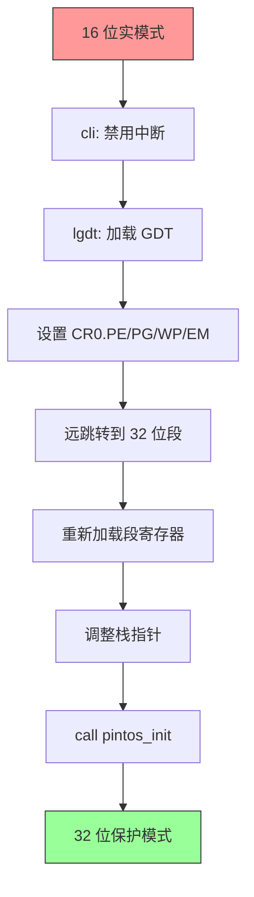
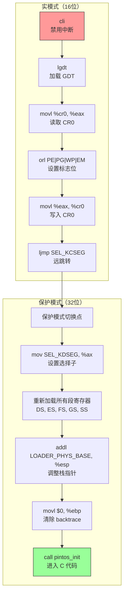

## 概述

这是整个启动过程中最关键的转折点：从 16 位实模式切换到 32 位保护模式。这个过程涉及：

1. 禁用中断（避免切换过程中被打断）
2. 加载 GDT（全局描述符表）
3. 设置 CR0 寄存器（启用保护模式和分页）
4. 执行远跳转（刷新 CS 段寄存器）
5. 重新加载段寄存器
6. 调整栈指针并调用 C 函数

完成这些步骤后，CPU 将运行在 32 位保护模式下，可以访问 4GB 地址空间并使用现代操作系统特性。

---

## 原始代码

```plaintext
#### Switch to protected mode.

# First, disable interrupts.  We won't set up the IDT until we get
# into C code, so any interrupt would blow us away.

	cli

# Protected mode requires a GDT, so point the GDTR to our GDT.
# We need a data32 prefix to ensure that all 32 bits of the GDT
# descriptor are loaded (default is to load only 24 bits).
# The CPU doesn't need an addr32 prefix but ELF doesn't do 16-bit
# relocations.

	data32 addr32 lgdt gdtdesc - LOADER_PHYS_BASE - 0x20000

# Then we turn on the following bits in CR0:
#    PE (Protect Enable): this turns on protected mode.
#    PG (Paging): turns on paging.
#    WP (Write Protect): if unset, ring 0 code ignores
#       write-protect bits in page tables (!).
#    EM (Emulation): forces floating-point instructions to trap.
#       We don't support floating point.

	movl %cr0, %eax
	orl $CR0_PE | CR0_PG | CR0_WP | CR0_EM, %eax
	movl %eax, %cr0

# We're now in protected mode in a 16-bit segment.  The CPU still has
# the real-mode code segment cached in %cs's segment descriptor.  We
# need to reload %cs, and the easiest way is to use a far jump.
# Because we're not running in a 32-bit segment the data32 prefix is
# needed to jump to a 32-bit offset in the target segment.

	data32 ljmp $SEL_KCSEG, $1f

# We're now in protected mode in a 32-bit segment.
# Let the assembler know.

	.code32

# Reload all the other segment registers and the stack pointer to
# point into our new GDT.

1:	mov $SEL_KDSEG, %ax
	mov %ax, %ds
	mov %ax, %es
	mov %ax, %fs
	mov %ax, %gs
	mov %ax, %ss
	addl $LOADER_PHYS_BASE, %esp
	movl $0, %ebp			# Null-terminate main()'s backtrace

#### Call pintos_init().

	call pintos_init

# pintos_init() shouldn't ever return.  If it does, spin.

1:	jmp 1b
```

---

## 前置知识

### 实模式 vs 保护模式

| 特性 | 实模式 | 保护模式 |
|------|--------|----------|
| 地址宽度 | 20 位（1MB） | 32 位（4GB） |
| 寄存器大小 | 16 位 | 32 位 |
| 内存保护 | 无 | 有（通过段和页） |
| 分页 | 不支持 | 支持 |
| 多任务 | 不支持 | 支持 |
| 段寻址 | 段:偏移 | 选择子:偏移 |

### 切换步骤概览



### GDT（全局描述符表）

GDT 是保护模式的核心数据结构，定义了内存段的属性：

```
GDT 结构：

    ┌─────────────────┐  索引 0
    │   空描述符       │  (必须为 0)
    ├─────────────────┤  索引 1 (选择子 0x08)
    │  内核代码段      │  SEL_KCSEG
    ├─────────────────┤  索引 2 (选择子 0x10)
    │  内核数据段      │  SEL_KDSEG
    └─────────────────┘
```

### 段选择子格式

```
 15                 3  2  1 0
┌────────────────────┬──┬────┐
│       索引         │TI│RPL │
└────────────────────┴──┴────┘

索引：GDT 中的描述符索引
TI：表指示器（0=GDT, 1=LDT）
RPL：请求特权级（0-3）

SEL_KCSEG = 0x08 = 0000 0000 0000 1000
    索引 = 1, TI = 0, RPL = 0

SEL_KDSEG = 0x10 = 0000 0000 0001 0000
    索引 = 2, TI = 0, RPL = 0
```

---

## 逐行详解

### 第 1 行：禁用中断

```plaintext
	cli
```

**CLI = Clear Interrupt Flag**

这条指令清除 FLAGS 寄存器中的 IF（Interrupt Flag）位，禁用可屏蔽中断。

**为什么要禁用中断？**

```
如果不禁用中断，可能发生：

1. 正在加载 GDT 时发生中断
2. 中断处理需要有效的 IDT（中断描述符表）
3. 我们还没设置 IDT！
4. CPU 会尝试从无效位置读取中断处理程序
5. 系统崩溃

所以必须先禁用中断，等 IDT 设置好后再启用
```

**FLAGS 寄存器中的 IF 位**

```
FLAGS 寄存器（部分）：

位:  11 10  9  8  7  6  5  4  3  2  1  0
    ┌──┬──┬──┬──┬──┬──┬──┬──┬──┬──┬──┬──┐
    │OF│DF│IF│TF│SF│ZF│ 0│AF│ 0│PF│ 1│CF│
    └──┴──┴──┴──┴──┴──┴──┴──┴──┴──┴──┴──┘
                 ↑
            IF = 0 时，禁止可屏蔽中断
            IF = 1 时，允许可屏蔽中断
```

---

### 第 2 行：加载 GDT

```plaintext
	data32 addr32 lgdt gdtdesc - LOADER_PHYS_BASE - 0x20000
```

这是一条复杂的指令，让我们拆解它。

**LGDT 指令**

LGDT（Load Global Descriptor Table Register）将 GDT 的位置和大小加载到 GDTR 寄存器。

**GDTR 寄存器格式**

```
 47                  16 15              0
┌──────────────────────┬─────────────────┐
│    GDT 基地址 (32位)  │  GDT 限长 (16位) │
└──────────────────────┴─────────────────┘

限长 = GDT 大小 - 1（字节）
基地址 = GDT 在内存中的线性地址
```

**data32 和 addr32 前缀**

```
在 16 位实模式下：
    - 默认操作数大小是 16 位
    - 默认地址大小是 16 位
    
lgdt 需要读取 6 字节的 GDT 描述符（2 + 4 字节）
但在 16 位模式下默认只读取 5 字节（2 + 3 字节）

data32：使用 32 位操作数大小
addr32：使用 32 位地址大小

这样才能正确读取完整的 48 位 GDT 描述符
```

**地址计算**

```
gdtdesc - LOADER_PHYS_BASE - 0x20000

gdtdesc 的虚拟地址在链接时确定，类似于：
    gdtdesc_virtual = LOADER_PHYS_BASE + 0x20000 + offset
    
要得到物理地址：
    物理地址 = 虚拟地址 - LOADER_PHYS_BASE
             = offset + 0x20000
             
但我们需要相对于当前 DS 的偏移：
    DS = 0x2000
    DS 基址 = 0x2000 × 16 = 0x20000
    
    需要的偏移 = 物理地址 - DS 基址
               = (offset + 0x20000) - 0x20000
               = offset
               
完整公式：
    偏移 = gdtdesc - LOADER_PHYS_BASE - 0x20000
```

---

### 第 3-5 行：设置 CR0

```plaintext
	movl %cr0, %eax
	orl $CR0_PE | CR0_PG | CR0_WP | CR0_EM, %eax
	movl %eax, %cr0
```

**读取当前 CR0**

```plaintext
movl %cr0, %eax
```

不能直接修改 CR0，必须先读取、修改、再写回。

**设置标志位**

```plaintext
orl $CR0_PE | CR0_PG | CR0_WP | CR0_EM, %eax
```

```
CR0_PE = 0x00000001  (位 0)  Protection Enable
CR0_EM = 0x00000004  (位 2)  FP Emulation
CR0_WP = 0x00010000  (位 16) Write Protect
CR0_PG = 0x80000000  (位 31) Paging

组合值：
    0x00000001
  | 0x00000004
  | 0x00010000
  | 0x80000000
  ─────────────
    0x80010005
```

**各标志位的作用**

| 标志 | 作用 |
|------|------|
| PE | 启用保护模式。这是最关键的位。 |
| PG | 启用分页。需要 PE=1 才能设置。 |
| WP | 写保护。内核也要遵守页表的写保护标志。 |
| EM | 浮点仿真。浮点指令会产生异常，因为 Pintos 不支持浮点。 |

**写回 CR0**

```plaintext
movl %eax, %cr0
```

执行这条指令的瞬间，CPU 切换到保护模式并启用分页！

**但是有个问题...**

```
CPU 缓存了段寄存器的内容！

切换前：
    CS = 0x2000（实模式段值）
    CS 缓存 = 16 位代码段属性

切换后：
    CR0.PE = 1（保护模式）
    但 CS 缓存还是旧的！
    
CPU 现在处于一个奇怪的状态：
    - 保护模式已启用
    - 但 CS 仍包含实模式属性
    
必须通过远跳转刷新 CS！
```

---

### 第 6 行：远跳转到 32 位段

```plaintext
	data32 ljmp $SEL_KCSEG, $1f
```

**远跳转（Long Jump）**

远跳转同时改变 CS 和 EIP：

```
ljmp $selector, $offset

效果：
    CS = selector
    EIP = offset
    同时刷新 CS 缓存
```

**data32 前缀**

我们仍在 16 位代码段中执行。`data32` 前缀允许使用 32 位的偏移值。

**目标地址**

```
$SEL_KCSEG = 0x08（内核代码段选择子）
$1f = 标签 "1:" 的地址（向前查找）

跳转后：
    CS = 0x08（指向 GDT 中的内核代码段描述符）
    EIP = 标签 1 的偏移
```

**为什么这能工作？**

```
GDT 中的内核代码段描述符设置：
    基地址 = 0
    限长 = 4GB
    属性 = 32 位代码段

所以：
    线性地址 = 段基址 + 偏移 = 0 + EIP = EIP
    
因为分页已启用且我们有恒等映射：
    物理地址 = 线性地址 = EIP

代码继续正常执行！
```

---

### 第 7-8 行：切换到 32 位汇编

```plaintext
	.code32

1:
```

**.code32 指令**

告诉汇编器：从现在开始生成 32 位代码。这不是 CPU 指令，只是汇编器指令。

**标签 1:**

这是远跳转的目标。从这里开始，我们在真正的 32 位保护模式下运行。

---

### 第 9-14 行：重新加载段寄存器

```plaintext
1:	mov $SEL_KDSEG, %ax
	mov %ax, %ds
	mov %ax, %es
	mov %ax, %fs
	mov %ax, %gs
	mov %ax, %ss
```

**为什么要重新加载？**

```
CS 已经通过远跳转更新了。
但其他段寄存器（DS, ES, FS, GS, SS）仍然包含实模式的值！

这些寄存器的缓存还保存着实模式的属性。
必须用新的保护模式选择子重新加载它们。
```

**SEL_KDSEG = 0x10**

这是内核数据段的选择子，指向 GDT 第 2 项：

```
GDT[2] = 内核数据段描述符
    基地址 = 0
    限长 = 4GB
    属性 = 可读写数据段
```

**加载过程**

```
不能直接 mov $immediate, %ds
必须通过通用寄存器中转：

mov $SEL_KDSEG, %ax  # AX = 0x10
mov %ax, %ds         # DS = 0x10，同时加载描述符到 DS 缓存
mov %ax, %es         # 同理
...
```

---

### 第 15 行：调整栈指针

```plaintext
	addl $LOADER_PHYS_BASE, %esp
```

**为什么要调整 ESP？**

```
之前：ESP = 0xF000（物理地址）

内核代码被链接到虚拟地址 LOADER_PHYS_BASE + 0x20000 = 0xC0020000
内核期望栈在高地址空间

需要将栈指针也调整到高地址：
    新 ESP = 0xF000 + 0xC0000000 = 0xC000F000

这是栈的虚拟地址
通过页表映射到物理地址 0xF000
```

**内存视图**

```
物理内存:                      虚拟内存:
                               
0x0000F000 ┌───────┐          0xC000F000 ┌───────┐
           │  栈   │    ←───→            │  栈   │
           └───────┘                     └───────┘
                               
栈在物理地址 0xF000
但我们通过虚拟地址 0xC000F000 访问它
页表将 0xC000F000 映射到 0x0000F000
```

---

### 第 16 行：清除基指针

```plaintext
	movl $0, %ebp			# Null-terminate main()'s backtrace
```

**什么是 backtrace？**

调试时，我们可能想要查看函数调用链（backtrace）：

```
main()
  ↳ pintos_init()
    ↳ thread_init()
      ↳ 当前位置

backtrace 通过 EBP 链来追踪：
    每个函数的栈帧有：
    [局部变量]
    [保存的 EBP]  ← 当前 EBP 指向这里
    [返回地址]
    [参数]
```

**为什么设置 EBP = 0？**

```
pintos_init() 是第一个 C 函数
它没有"调用者"
如果 backtrace 代码继续追踪，可能读到垃圾

设置 EBP = 0 告诉调试器：
    "这是调用链的终点，不要继续追踪了"
```

---

### 第 17 行：调用 C 函数

```plaintext
	call pintos_init
```

**历史性时刻！**

这是第一次从汇编调用 C 函数。从这里开始，内核主要用 C 语言运行。

**call 指令的效果**

```
call pintos_init

等价于：
    push 下一条指令地址（返回地址）
    jmp pintos_init
```

**pintos_init 在哪里？**

`pintos_init` 定义在 `init.c` 中，是内核的 C 语言入口点。

---

### 第 18-19 行：无限循环（以防万一）

```plaintext
1:	jmp 1b
```

**为什么需要这个？**

`pintos_init()` 正常情况下不应该返回。如果它返回了，说明出了问题。

这个无限循环确保：
- 系统不会继续执行随机内存
- CPU 保持忙碌但不做任何危险操作

---

## GDT 定义详解

代码末尾定义了 GDT：

```plaintext
#### GDT

	.align 8
gdt:
	.quad 0x0000000000000000	# Null segment.  Not used by CPU.
	.quad 0x00cf9a000000ffff	# System code, base 0, limit 4 GB.
	.quad 0x00cf92000000ffff    # System data, base 0, limit 4 GB.

gdtdesc:
	.word	gdtdesc - gdt - 1	# Size of the GDT, minus 1 byte.
	.long	gdt			# Address of the GDT.
```

### GDT 对齐

```plaintext
.align 8
```

GDT 应该在 8 字节边界对齐以获得最佳性能。

### 段描述符格式

每个段描述符 8 字节：

```
字节:   7      6      5      4      3      2      1      0
      ┌──────┬──────┬──────┬──────┬──────┬──────┬──────┬──────┐
      │Base  │Flags │Limit │Access│      Base [23:0]    │Limit │
      │[31:24]│+Lim  │[19:16]│     │                     │[15:0]│
      └──────┴──────┴──────┴──────┴──────┴──────┴──────┴──────┘

Base: 段基地址（分散在多处）
Limit: 段限长（分散在两处）
Flags: G(粒度), D/B(默认大小), L(64位), AVL
Access: P(存在), DPL(特权级), S(类型), Type
```

### 解析 0x00cf9a000000ffff（代码段）

```
0x00cf9a000000ffff

按字节分解：
    [7] = 0x00  Base[31:24] = 0x00
    [6] = 0xcf  Flags + Limit[19:16]
                Flags = 0xc = 1100
                    G = 1 (4KB 粒度)
                    D = 1 (32 位)
                Limit[19:16] = 0xf
    [5] = 0x9a  Access byte = 1001 1010
                    P = 1 (存在)
                    DPL = 00 (ring 0)
                    S = 1 (代码/数据段)
                    Type = 1010 (可执行,可读)
    [4] = 0x00  Base[23:16] = 0x00
    [3:2] = 0x0000  Base[15:0] = 0x0000
    [1:0] = 0xffff  Limit[15:0] = 0xffff

完整值：
    Base = 0x00000000
    Limit = 0xfffff (加上 G=1，实际 limit = 4GB)
    32 位代码段，DPL=0，可执行可读
```

### 解析 0x00cf92000000ffff（数据段）

```
与代码段类似，只是 Access byte = 0x92 = 1001 0010
    Type = 0010 (可读写数据段)
```

### GDT 描述符（gdtdesc）

```plaintext
gdtdesc:
	.word	gdtdesc - gdt - 1	# Size of the GDT, minus 1 byte.
	.long	gdt			        # Address of the GDT.
```

```
gdtdesc 结构：

偏移 0-1: 限长 = 24 - 1 = 23 (3 个描述符 × 8 字节 - 1)
偏移 2-5: 基地址 = gdt 的地址

这正是 LGDT 指令期望的格式
```

---

## 完整流程图



---

## 关键时刻的 CPU 状态

```
═══════════════════════════════════════════════════════════════════
             执行 movl %eax, %cr0 之前
═══════════════════════════════════════════════════════════════════
模式:       16 位实模式
CR0:        0x????????（各种位清零）
CS:         0x2000（实模式段地址）
EIP:        某个低地址偏移
分页:       禁用
GDTR:       已加载指向新 GDT

═══════════════════════════════════════════════════════════════════
             执行 movl %eax, %cr0 之后，ljmp 之前
═══════════════════════════════════════════════════════════════════
模式:       保护模式（但 CS 缓存还是 16 位！）
CR0.PE:     1（保护模式启用）
CR0.PG:     1（分页启用）
CS:         0x2000（旧值，缓存中是 16 位属性）
EIP:        继续执行
状态:       ⚠️ 不稳定！必须立即执行远跳转！

═══════════════════════════════════════════════════════════════════
             执行 ljmp 之后
═══════════════════════════════════════════════════════════════════
模式:       32 位保护模式
CR0.PE:     1
CR0.PG:     1
CS:         0x08（内核代码段选择子）
            缓存: 32 位代码段，DPL=0，基址=0
EIP:        标签 1 的虚拟地址
DS,ES,SS:   还是旧的实模式值

═══════════════════════════════════════════════════════════════════
             重新加载段寄存器之后
═══════════════════════════════════════════════════════════════════
所有段寄存器: 加载了正确的保护模式选择子
ESP:        0xC000F000（高地址虚拟栈）
EBP:        0（backtrace 终点）
状态:       ✓ 完全进入 32 位保护模式，可以调用 C 函数
═══════════════════════════════════════════════════════════════════
```

---

## 常见问题

### Q1: 为什么要同时启用 PE 和 PG？

**A**: 可以分开启用，但 Pintos 选择一步到位。同时启用需要确保：
1. 页表已经正确设置（我们已经做了）
2. 恒等映射存在（代码可以继续执行）

分开启用会需要更多代码，没有必要。

### Q2: 如果没有执行远跳转会怎样？

**A**: CPU 会继续使用缓存的旧段属性。这可能导致：
- 指令解码错误（16 位 vs 32 位）
- 地址计算错误
- 不可预测的行为
- 最终崩溃

远跳转是刷新 CS 缓存的**唯一方法**。

### Q3: 为什么内核代码段基址是 0？

**A**: 现代操作系统使用"平坦内存模型"：

```
平坦模型：
    所有段基址 = 0
    所有段限长 = 4GB
    段:偏移 = 0 + 偏移 = 偏移
    
效果：
    线性地址 = 偏移
    分页负责真正的内存保护和地址转换
    段机制基本被绕过
```

这简化了编程模型，内存保护完全由分页机制处理。

### Q4: CR0.WP 有什么用？

**A**: WP（Write Protect）确保内核也要遵守页表中的写保护位：

```
如果 WP = 0：
    Ring 0 代码可以写入任何页，忽略只读标志
    危险！可能意外覆盖只读数据或代码
    
如果 WP = 1：
    Ring 0 也必须遵守页表的写保护
    写只读页会产生页错误
    更安全，可以捕获内核 bug
```

---

## 练习思考

### 思考题 1
如果在设置 CR0.PE 后、执行远跳转前发生 NMI（不可屏蔽中断），会怎样？

<details>
<summary>点击查看答案</summary>

NMI 不受 IF 标志影响，`cli` 无法阻止它。

如果发生 NMI：
1. CPU 尝试查找 IDT 中的处理程序
2. 我们还没设置 IDT
3. CPU 可能读到垃圾地址
4. 跳转到随机位置
5. 系统崩溃

这是一个竞态条件，但 NMI 极少发生（通常只在硬件错误时）。
实际上，这个窗口只有几条指令，风险很低。

更健壮的实现可以在切换前设置一个临时 IDT。

</details>

### 思考题 2
为什么 `call pintos_init` 能正常工作？函数地址不是链接到高地址吗？

<details>
<summary>点击查看答案</summary>

是的，`pintos_init` 链接到类似 0xC00XXXXX 的高地址。

但这正是为什么需要高地址映射！

```
call pintos_init 的过程：

1. 链接器将 pintos_init 的地址放入 call 指令
   例如：call 0xC0021000

2. call 执行：
   - push 返回地址
   - jmp 0xC0021000

3. CPU 访问虚拟地址 0xC0021000

4. 分页单元查找：
   - 页目录索引 = 0xC0021000 >> 22 = 768
   - 页表索引 = (0xC0021000 >> 12) & 0x3FF = 33
   - 物理地址 = 0x00021000

5. 代码从物理地址 0x21000 执行
   这正是 pintos_init 所在的位置！
```

高地址映射让这一切透明地工作。

</details>

### 思考题 3
如果 GDT 放在会被覆盖的内存位置会怎样？

<details>
<summary>点击查看答案</summary>

GDT 必须在整个系统运行期间保持有效。

如果 GDT 被覆盖：
1. 段寄存器已经加载了描述符缓存
2. 短期内可能没问题
3. 但如果进行任务切换或重新加载段寄存器
4. CPU 会从被覆盖的 GDT 读取垃圾
5. 系统崩溃

Pintos 的 GDT 放在 `.start` 段中，与内核代码一起，不会被随意覆盖。

在更复杂的系统中，GDT 通常在初始化后被复制到一个永久、受保护的位置。

</details>

---

## 下一步

我们已经成功切换到保护模式并调用了 `pintos_init()`。下一篇文档将详细介绍 GDT 的结构和段描述符的各个字段：[GDT 全局描述符表](2026-01-22-pintos-kernel-06-gdt.md)
