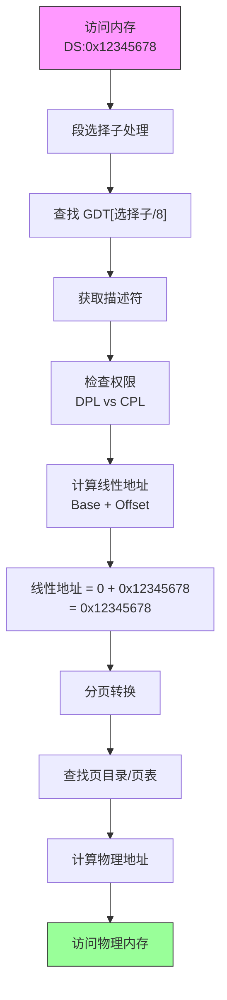

## 概述

GDT（Global Descriptor Table，全局描述符表）是 x86 保护模式的核心数据结构之一。它定义了内存段的属性，包括基地址、大小、访问权限等。

虽然现代操作系统几乎不使用段来进行内存保护（而是依赖分页），但 GDT 仍然是必需的，因为：
1. CPU 切换到保护模式时需要 GDT
2. 段寄存器必须包含有效的选择子
3. 某些功能（如 TSS）仍然依赖 GDT

本文详细解析 Pintos 中 GDT 的结构和每个字段的含义。

---

## 原始代码

```plaintext
#### GDT

	.align 8
gdt:
	.quad 0x0000000000000000	# Null segment.  Not used by CPU.
	.quad 0x00cf9a000000ffff	# System code, base 0, limit 4 GB.
	.quad 0x00cf92000000ffff    # System data, base 0, limit 4 GB.

gdtdesc:
	.word	gdtdesc - gdt - 1	# Size of the GDT, minus 1 byte.
	.long	gdt			        # Address of the GDT.
```

---

## 前置知识

### 分段的历史背景

**8086 时代（1978年）**

最初的 8086 只有 16 位寄存器，但需要寻址 1MB 内存。解决方案是**分段**：

```
物理地址 = 段基址 × 16 + 偏移

16 位段 + 16 位偏移 = 20 位地址 = 1MB
```

**80286 和保护模式（1982年）**

80286 引入了保护模式，段从简单的地址偏移变成了复杂的描述符：

```
实模式:           保护模式:
段寄存器 = 基址    段寄存器 = 选择子 → 指向描述符 → 包含基址+限长+属性
```

**现代操作系统（平坦模型）**

现代 OS 将所有段基址设为 0，限长设为 4GB，让段机制"透明"：

```
所有段: 基址=0, 限长=4GB

线性地址 = 段基址 + 偏移 = 0 + 偏移 = 偏移
```

真正的内存保护由分页机制完成。

### GDT 的作用

```
                     GDT
                  ┌────────┐
选择子 0x00 ────→ │ 空描述符 │  必须存在，不可使用
                  ├────────┤
选择子 0x08 ────→ │ 代码段  │  CS 使用
                  ├────────┤
选择子 0x10 ────→ │ 数据段  │  DS/SS 使用
                  ├────────┤
                  │  ...   │  可以有更多段
                  └────────┘

CPU 通过选择子查找 GDT 中的描述符
描述符定义了段的所有属性
```

---

## GDT 布局详解

### 整体结构

```
GDT 在内存中的布局：

偏移    内容                描述
─────   ────────────────    ──────────────────
0x00    0x0000000000000000  空描述符（索引 0）
0x08    0x00cf9a000000ffff  代码段描述符（索引 1）
0x10    0x00cf92000000ffff  数据段描述符（索引 2）

总大小：3 × 8 = 24 字节
```

### 选择子与索引的关系

```
选择子格式:
 15                 3  2  1 0
┌────────────────────┬──┬────┐
│       索引         │TI│RPL │
└────────────────────┴──┴────┘

选择子 = 索引 × 8 + TI × 4 + RPL

例如：
    SEL_KCSEG = 0x08
    二进制 = 0000 0000 0000 1000
    索引 = 1, TI = 0, RPL = 0
    
    SEL_KDSEG = 0x10
    二进制 = 0000 0000 0001 0000
    索引 = 2, TI = 0, RPL = 0
```

---

## 段描述符格式

每个段描述符占 8 字节（64 位），格式非常复杂：

```
字节布局：

  63      56 55  52 51  48 47      40 39      32
 ┌─────────┬──────┬──────┬──────────┬──────────┐
 │Base     │Flags │Limit │  Access  │  Base    │
 │[31:24]  │      │[19:16]│  Byte   │ [23:16]  │
 └─────────┴──────┴──────┴──────────┴──────────┘

  31                     16 15                 0
 ┌─────────────────────────┬───────────────────┐
 │     Base [15:0]         │   Limit [15:0]    │
 └─────────────────────────┴───────────────────┘

完整的 64 位视图：
  位      内容
  ─────   ────────────
  0-15    Limit [15:0]     段限长低 16 位
  16-31   Base [15:0]      段基址低 16 位
  32-39   Base [23:16]     段基址中间 8 位
  40-47   Access Byte      访问字节
  48-51   Limit [19:16]    段限长高 4 位
  52-55   Flags            标志位
  56-63   Base [31:24]     段基址高 8 位
```

### 为什么字段分散？

这是历史遗留问题。80286 的描述符只有 6 字节，后来 80386 扩展时为了兼容性，将新字段放在了空闲位置：

```
80286 描述符 (48 位):
┌───────────┬───────────┬───────────┐
│ Limit[15:0] │ Base[15:0] │Base[23:16]│Access│
└───────────┴───────────┴───────────┘

80386 扩展 (64 位):
┌───────────┬───────────┬───────────┬─────┬─────┬───────────┐
│Limit[15:0]│Base[15:0] │Base[23:16]│Acces│Flags│Base[31:24]│
│           │           │           │     │Lim  │           │
└───────────┴───────────┴───────────┴─────┴─────┴───────────┘
                                          ↑
                                     新增字段
```

---

## Access Byte 详解

Access Byte（访问字节）位于描述符的第 5 字节（位 40-47）：

```
Access Byte 格式：

  7    6   5    4    3    2    1    0
┌────┬───────┬────┬────┬────┬────┬────┐
│ P  │  DPL  │ S  │ E  │ DC │ RW │ A  │
└────┴───────┴────┴────┴────┴────┴────┘

P   (位 7): Present，存在位
            1 = 段在内存中
            0 = 段不存在（访问会产生异常）

DPL (位 5-6): Descriptor Privilege Level
            00 = Ring 0（最高权限，内核）
            01 = Ring 1
            02 = Ring 2
            03 = Ring 3（最低权限，用户）

S   (位 4): Descriptor Type
            1 = 代码或数据段（常规段）
            0 = 系统段（TSS、LDT 等）

E   (位 3): Executable
            1 = 代码段（可执行）
            0 = 数据段（不可执行）

DC  (位 2): Direction/Conforming
            数据段：方向位
                0 = 向上增长（正常）
                1 = 向下增长（栈）
            代码段：一致位
                0 = 非一致（需要通过门调用）
                1 = 一致（可以从低特权级调用）

RW  (位 1): Readable/Writable
            代码段：可读位
                0 = 仅执行
                1 = 可执行可读
            数据段：可写位
                0 = 只读
                1 = 可读写

A   (位 0): Accessed
            CPU 访问过该段时自动设置为 1
```

### Pintos 代码段的 Access Byte

```
0x9a = 1001 1010

P   = 1：段存在
DPL = 00：Ring 0
S   = 1：代码/数据段
E   = 1：代码段
DC  = 0：非一致
RW  = 1：可读
A   = 0：未访问

含义：Ring 0 可执行可读代码段
```

### Pintos 数据段的 Access Byte

```
0x92 = 1001 0010

P   = 1：段存在
DPL = 00：Ring 0
S   = 1：代码/数据段
E   = 0：数据段
DC  = 0：向上增长
RW  = 1：可写
A   = 0：未访问

含义：Ring 0 可读写数据段
```

---

## Flags 详解

Flags 字段位于描述符的位 52-55：

```
Flags 格式：

  55   54   53   52
┌────┬────┬────┬────┐
│ G  │D/B │ L  │AVL │
└────┴────┴────┴────┘

G   (位 55): Granularity，粒度
            0 = 限长单位是字节（最大 1MB）
            1 = 限长单位是 4KB（最大 4GB）

D/B (位 54): Default operation size / Big
            代码段 (D)：
                0 = 16 位代码段
                1 = 32 位代码段
            数据段 (B)：
                0 = 16 位栈指针（SP）
                1 = 32 位栈指针（ESP）

L   (位 53): Long mode
            1 = 64 位代码段（长模式）
            0 = 32 位/16 位代码段
            (数据段忽略此位)

AVL (位 52): Available
            系统软件可用，CPU 不使用
```

### Pintos 的 Flags 值

```
0xC = 1100

G   = 1：4KB 粒度
D/B = 1：32 位
L   = 0：非 64 位
AVL = 0：未使用

与 Limit[19:16] = 0xF 组合：
    完整 Flags+Limit 字节 = 0xCF
```

---

## 完整描述符解析

### 空描述符 (索引 0)

```
0x0000000000000000

这是必需的。CPU 规定 GDT 第一项必须是空描述符。
如果选择子为 0（空选择子），访问会产生异常。

用途：
- 检测未初始化的段寄存器
- 允许某些段寄存器保持"未使用"状态
```

### 内核代码段 (索引 1)

```
0x00cf9a000000ffff

逐字节分解：
    字节 0-1: 0xffff  → Limit[15:0] = 0xFFFF
    字节 2-3: 0x0000  → Base[15:0] = 0x0000
    字节 4:   0x00    → Base[23:16] = 0x00
    字节 5:   0x9a    → Access Byte = 1001 1010
    字节 6:   0xcf    → Flags(0xC) + Limit[19:16](0xF)
    字节 7:   0x00    → Base[31:24] = 0x00

组合结果：
    Base  = 0x00000000
    Limit = 0xFFFFF × 4KB = 4GB
    Access: P=1, DPL=0, S=1, E=1, RW=1
    Flags: G=1, D=1

结论：32 位内核代码段，基址 0，大小 4GB
```

### 内核数据段 (索引 2)

```
0x00cf92000000ffff

字节 5:   0x92    → Access Byte = 1001 0010

与代码段唯一的区别是 Access Byte：
    代码段: E=1 (可执行)
    数据段: E=0 (数据段)

结论：32 位内核数据段，基址 0，大小 4GB
```

---

## GDT 描述符 (GDTR)

```plaintext
gdtdesc:
	.word	gdtdesc - gdt - 1	# Size of the GDT, minus 1 byte.
	.long	gdt			        # Address of the GDT.
```

### GDTR 格式

```
 47                  16 15              0
┌──────────────────────┬─────────────────┐
│  GDT 线性基地址 (32位) │  限长 (16位)    │
└──────────────────────┴─────────────────┘

限长 = GDT 大小 - 1
基地址 = GDT 起始地址
```

### 计算限长

```
gdtdesc - gdt - 1 = ?

gdt 定义了 3 个 .quad（每个 8 字节）
总大小 = 3 × 8 = 24 字节

限长 = 24 - 1 = 23 = 0x17

所以 gdtdesc 的内容是：
    偏移 0-1: 0x0017 (限长)
    偏移 2-5: gdt 的地址
```

### LGDT 指令如何使用

```plaintext
lgdt gdtdesc

执行后：
    GDTR.Limit = 23
    GDTR.Base = gdt 的地址

CPU 现在知道 GDT 在哪里、有多大
```

---

## 限长（Limit）的计算

### 粒度位 (G) 的影响

```
Limit 字段是 20 位：
    Limit[15:0] 在描述符低字
    Limit[19:16] 在 Flags 字节

如果 G = 0（字节粒度）：
    段大小 = Limit + 1（字节）
    最大 = 0xFFFFF + 1 = 1MB

如果 G = 1（4KB 粒度）：
    段大小 = (Limit + 1) × 4KB
    最大 = (0xFFFFF + 1) × 4KB = 4GB
```

### Pintos 的限长

```
Limit[19:0] = 0xFFFFF
G = 1

段大小 = (0xFFFFF + 1) × 4096
       = 0x100000 × 0x1000
       = 0x100000000
       = 4GB

所以代码段和数据段都覆盖整个 4GB 地址空间
```

---

## 平坦内存模型

### 什么是平坦模型？

```
平坦模型特点：
    所有段基址 = 0
    所有段限长 = 4GB
    
效果：
    段:偏移 = 0 + 偏移 = 偏移
    线性地址 = 偏移
    
段机制变得"透明"，就像不存在一样
```

### 为什么使用平坦模型？

1. **简化编程**：不需要管理多个段
2. **与分页配合**：分页提供更灵活的内存管理
3. **兼容性**：现代编译器默认生成平坦模型代码
4. **性能**：减少段检查开销

### 真正的保护靠什么？

```
分页提供：
    - 页级权限（用户/内核）
    - 页级可写/只读
    - 页存在/不存在
    - 独立地址空间
    
分段在平坦模型下只提供：
    - 代码/数据区分
    - Ring 级别检查
    - 系统段（TSS 等）支持
```

---

## 完整的内存访问流程



---

## 常见问题

### Q1: 为什么空描述符不能使用？

**A**: 这是 CPU 的硬件规定。用途包括：
- 检测未初始化的段寄存器
- 允许 DS、ES 等保持无效状态
- 某些操作（如加载 LDT）可能产生空选择子

如果访问空选择子，CPU 产生 #GP（通用保护异常）。

### Q2: Ring 0/3 是什么？

**A**: x86 有 4 个特权级（Ring 0-3）：

```
Ring 0: 内核态，最高权限
Ring 1: 未使用（某些虚拟化场景）
Ring 2: 未使用
Ring 3: 用户态，最低权限

大多数 OS 只使用 Ring 0 和 Ring 3
```

### Q3: 一致代码段有什么用？

**A**: 一致（Conforming）代码段允许低特权级代码调用而不改变特权级：

```
非一致段：
    Ring 3 → Ring 0 必须通过调用门
    
一致段：
    Ring 3 可以直接调用 Ring 0 的一致代码
    但运行时仍是 Ring 3 特权级
    
用途：提供共享库代码，不需要特权切换
```

### Q4: 为什么数据段需要设置为可写？

**A**: 如果数据段只读：
- 任何写操作都会产生 #GP 异常
- 局部变量（在栈上）无法创建
- 任何 `mov` 到内存都会失败

实际上，栈也使用 SS 数据段，必须可写。

---

## GDT 的扩展

Pintos 初始 GDT 只有 3 项，但后面会扩展：

### userprog/gdt.c 中的完整 GDT

```c
// 完整的 GDT（后续添加）
static uint64_t gdt[SEL_CNT];

// SEL_NULL  = 0x00  空选择子
// SEL_KCSEG = 0x08  内核代码段
// SEL_KDSEG = 0x10  内核数据段
// SEL_UCSEG = 0x1B  用户代码段 (RPL=3)
// SEL_UDSEG = 0x23  用户数据段 (RPL=3)
// SEL_TSS   = 0x28  任务状态段
```

---

## 练习思考

### 思考题 1
如果把 DPL 改为 3（Ring 3），内核代码还能正常运行吗？

<details>
<summary>点击查看答案</summary>

能运行，但会产生安全问题：

```
DPL 检查规则：
    CPL <= DPL 才能访问

如果 DPL = 3：
    Ring 3 用户程序可以访问这些段
    用户可以直接执行内核代码！
    
这完全破坏了内核保护
```

所以内核段必须是 DPL = 0。

</details>

### 思考题 2
为什么需要分开的代码段和数据段，不能用一个段？

<details>
<summary>点击查看答案</summary>

主要原因：

1. **执行权限不同**：
   - 代码段需要 E=1（可执行）
   - 数据段需要 E=0（不可执行）
   
2. **CPU 强制区分**：
   - CS 只能加载代码段选择子
   - DS/SS 只能加载数据段选择子
   - 尝试加载错误类型会产生 #GP

3. **安全性**：
   - 防止数据被当作代码执行
   - 防止代码被修改

即使基址和限长相同，也需要两个描述符。

</details>

### 思考题 3
如果限长设置为 2GB 而不是 4GB 会怎样？

<details>
<summary>点击查看答案</summary>

```
Limit = 0x7FFFF (而不是 0xFFFFF)
G = 1

段大小 = (0x7FFFF + 1) × 4KB = 2GB

效果：
    只有低 2GB 地址可访问
    访问 0x80000000 以上地址会产生 #GP
    
对 Pintos 的影响：
    内核链接到 0xC0000000
    这个地址超过 2GB
    内核无法正常运行！
```

所以必须设置限长为 4GB 以覆盖高地址。

</details>

---

## 下一步

我们已经详细了解了 GDT 和保护模式。现在，CPU 成功调用了 `pintos_init()` 函数。下一篇文档将开始介绍 C 语言的内核初始化：[pintos_init 主函数](2026-01-22-pintos-kernel-07-pintos-init.md)
