## 概述

`pintos_init()` 是 Pintos 内核的 C 语言入口点。当 `start.S` 完成模式切换后，它调用这个函数来完成剩余的初始化工作。

`pintos_init()` 负责：
1. 初始化 BSS 段
2. 解析命令行参数
3. 初始化各子系统（线程、内存、中断等）
4. 启动调度器
5. 执行用户指定的任务

这个函数是理解 Pintos 内核结构的关键。

---

## 原始代码

```c
/** Pintos main entry point. */
int
pintos_init (void)
{
  char **argv;

  /* Clear BSS. */  
  bss_init ();

  /* Break command line into arguments and parse options. */
  argv = read_command_line ();
  argv = parse_options (argv);

  /* Initialize ourselves as a thread so we can use locks,
     then enable console locking. */
  thread_init ();
  console_init ();  

  /* Greet user. */
  printf ("Pintos booting with %'"PRIu32" kB RAM...\n",
          init_ram_pages * PGSIZE / 1024);

  /* Initialize memory system. */
  palloc_init (user_page_limit);
  malloc_init ();
  paging_init ();

  /* Segmentation. */
#ifdef USERPROG
  tss_init ();
  gdt_init ();
#endif

  /* Initialize interrupt handlers. */
  intr_init ();
  timer_init ();
  kbd_init ();
  input_init ();
#ifdef USERPROG
  exception_init ();
  syscall_init ();
#endif

  /* Start thread scheduler and enable interrupts. */
  thread_start ();
  serial_init_queue ();
  timer_calibrate ();

#ifdef FILESYS
  /* Initialize file system. */
  ide_init ();
  locate_block_devices ();
  filesys_init (format_filesys);
#endif

  printf ("Boot complete.\n");
  
  if (*argv != NULL) {
    /* Run actions specified on kernel command line. */
    run_actions (argv);
  } else {
    // TODO: no command line passed to kernel. Run interactively 
  }

  /* Finish up. */
  shutdown ();
  thread_exit ();
}
```

---

## 前置知识

### 函数签名分析

```c
int pintos_init (void) NO_RETURN;
```

**`NO_RETURN` 宏**

这个宏告诉编译器这个函数永不返回：

```c
// 在 debug.h 中定义
#define NO_RETURN __attribute__ ((noreturn))
```

这有助于编译器优化，并在函数意外返回时发出警告。

**返回类型为 `int`**

虽然函数不返回，但声明为返回 `int` 是 C 语言的惯例（类似 `main` 函数）。

### 内核的构建配置

Pintos 支持多种配置，通过预处理器宏控制：

```c
USERPROG  // 用户程序支持（project 2+）
FILESYS   // 文件系统支持（project 4）
VM        // 虚拟内存支持（project 3）
```

这些宏影响哪些子系统被初始化。

---

## 初始化流程图

```mermaid
flowchart TD
    subgraph "第一阶段：基础设置"
        A["bss_init()<br/>清零 BSS 段"]
        A --> B["read_command_line()<br/>解析命令行"]
        B --> C["parse_options()<br/>处理选项"]
    end
    
    subgraph "第二阶段：核心子系统"
        C --> D["thread_init()<br/>线程系统"]
        D --> E["console_init()<br/>控制台"]
        E --> F["printf()<br/>打印欢迎信息"]
    end
    
    subgraph "第三阶段：内存系统"
        F --> G["palloc_init()<br/>页面分配器"]
        G --> H["malloc_init()<br/>内核 malloc"]
        H --> I["paging_init()<br/>永久页表"]
    end
    
    subgraph "第四阶段：中断和设备"
        I --> J["intr_init()<br/>中断系统"]
        J --> K["timer_init()<br/>定时器"]
        K --> L["kbd_init()<br/>键盘"]
        L --> M["input_init()<br/>输入系统"]
    end
    
    subgraph "第五阶段：启动调度器"
        M --> N["thread_start()<br/>启动调度器"]
        N --> O["serial_init_queue()<br/>串口队列"]
        O --> P["timer_calibrate()<br/>定时器校准"]
    end
    
    subgraph "第六阶段：文件系统（可选）"
        P --> Q["ide_init()<br/>IDE 驱动"]
        Q --> R["filesys_init()<br/>文件系统"]
    end
    
    subgraph "第七阶段：执行任务"
        R --> S["run_actions()<br/>执行命令"]
        S --> T["shutdown()<br/>关机"]
    end
    
    style A fill:#f9f,stroke:#333
    style T fill:#9f9,stroke:#333
```



---

## 逐段详解

### 阶段一：BSS 初始化

```c
/* Clear BSS. */  
bss_init ();
```

**什么是 BSS？**

BSS（Block Started by Symbol）是程序中未初始化的全局变量区域：

```c
int initialized = 42;     // 在 .data 段，有初始值
int uninitialized;        // 在 .bss 段，需要清零
```

**为什么要手动清零？**

C 语言标准规定：未初始化的全局/静态变量应该为 0。

但 Pintos 的内核加载过程不会自动清零 BSS：
- ELF 文件中 BSS 不占空间
- 加载器只复制有内容的段
- 所以 BSS 区域可能包含随机数据

必须在使用任何全局变量之前清零 BSS！

**bss_init 的实现**

```c
static void
bss_init (void) 
{
  extern char _start_bss, _end_bss;
  memset (&_start_bss, 0, &_end_bss - &_start_bss);
}
```

`_start_bss` 和 `_end_bss` 是链接器脚本定义的符号，标记 BSS 段的边界。

---

### 阶段二：命令行解析

```c
/* Break command line into arguments and parse options. */
argv = read_command_line ();
argv = parse_options (argv);
```

**命令行从哪里来？**

Loader 在加载内核时，将命令行参数存放在特定位置：

```c
// loader.h 中的定义
#define LOADER_ARGS (LOADER_PARTS - LOADER_ARGS_LEN)
#define LOADER_ARG_CNT (LOADER_ARGS - LOADER_ARG_CNT_LEN)

// 参数存储位置（物理地址）
// 参数数量：LOADER_ARG_CNT
// 参数字符串：LOADER_ARGS
```

**read_command_line() 的工作**

```c
static char **
read_command_line (void) 
{
  static char *argv[LOADER_ARGS_LEN / 2 + 1];
  char *p, *end;
  int argc;
  
  // 从物理地址读取参数数量
  argc = *(uint32_t *) ptov (LOADER_ARG_CNT);
  
  // 从物理地址读取参数字符串
  p = ptov (LOADER_ARGS);
  end = p + LOADER_ARGS_LEN;
  
  // 解析以 null 分隔的参数
  for (i = 0; i < argc; i++) {
    argv[i] = p;
    p += strnlen (p, end - p) + 1;
  }
  argv[argc] = NULL;
  
  return argv;
}
```

**ptov 宏**

```c
// 物理地址到虚拟地址的转换
#define ptov(PADDR) ((void *) (((PADDR)) + LOADER_PHYS_BASE))

// 例如：
// ptov(0x1000) = 0x1000 + 0xC0000000 = 0xC0001000
```

**parse_options() 处理的选项**

```c
-h          // 显示帮助
-q          // 完成后关机
-r          // 完成后重启
-f          // 格式化文件系统
-rs=SEED    // 随机数种子
-mlfqs      // 使用多级反馈队列调度
-ul=COUNT   // 用户内存页数限制
```

---

### 阶段三：线程和控制台

```c
/* Initialize ourselves as a thread so we can use locks,
   then enable console locking. */
thread_init ();
console_init ();  

/* Greet user. */
printf ("Pintos booting with %'"PRIu32" kB RAM...\n",
        init_ram_pages * PGSIZE / 1024);
```

**thread_init() 的作用**

将当前执行流转换为一个正式的线程：

```c
void thread_init (void) 
{
  // 初始化线程系统的数据结构
  lock_init (&tid_lock);
  list_init (&ready_list);
  list_init (&all_list);

  // 将当前执行流包装成 "main" 线程
  initial_thread = running_thread ();
  init_thread (initial_thread, "main", PRI_DEFAULT);
  initial_thread->status = THREAD_RUNNING;
  initial_thread->tid = allocate_tid ();
}
```

**为什么要初始化线程系统？**

后续的初始化代码需要使用锁（lock）等同步原语。锁依赖于线程系统。

**console_init() 的作用**

初始化控制台输出，包括：
- 初始化控制台锁（防止多线程输出混乱）
- 设置 VGA 显示

**打印欢迎信息**

```c
printf ("Pintos booting with %'"PRIu32" kB RAM...\n",
        init_ram_pages * PGSIZE / 1024);

// 例如输出：
// Pintos booting with 32,768 kB RAM...
```

`init_ram_pages` 是之前在 `start.S` 中检测并存储的物理页数。

---

### 阶段四：内存系统

```c
/* Initialize memory system. */
palloc_init (user_page_limit);
malloc_init ();
paging_init ();
```

**palloc_init(): 页面分配器**

初始化物理页面分配器，将物理内存分为两个池：

```c
void palloc_init (size_t user_page_limit)
{
  // 内核池：用于内核数据结构
  // 用户池：用于用户进程
  
  // 划分物理内存
  // 初始化空闲页面位图
}
```

**malloc_init(): 内核 malloc**

初始化内核的动态内存分配器：

```c
void malloc_init (void)
{
  // 设置内存分配描述符
  // 初始化各大小级别的空闲块列表
}
```

之后内核代码可以使用 `malloc()` 和 `free()`。

**paging_init(): 永久页表**

替换 `start.S` 创建的临时页表，建立永久的页表结构：

```c
static void paging_init (void)
{
  uint32_t *pd, *pt;
  
  // 分配新的页目录
  pd = init_page_dir = palloc_get_page (PAL_ASSERT | PAL_ZERO);
  
  // 为每个物理页创建映射
  for (page = 0; page < init_ram_pages; page++) {
    // 分配页表（如需要）
    // 创建 PTE
  }
  
  // 切换到新页目录
  asm volatile ("movl %0, %%cr3" : : "r" (vtop (init_page_dir)));
}
```

---

### 阶段五：中断系统

```c
/* Initialize interrupt handlers. */
intr_init ();
timer_init ();
kbd_init ();
input_init ();
#ifdef USERPROG
exception_init ();
syscall_init ();
#endif
```

**intr_init(): 中断描述符表**

设置 IDT（Interrupt Descriptor Table）：

```c
void intr_init (void)
{
  // 初始化 8259A PIC
  pic_init ();
  
  // 初始化 IDT
  for (i = 0; i < INTR_CNT; i++)
    idt[i] = make_intr_gate (intr_stubs[i], 0);
  
  // 加载 IDTR
  asm volatile ("lidt %0" : : "m" (idtr_operand));
  
  // 初始化中断名称（用于调试）
  intr_names[0] = "#DE Divide Error";
  // ...
}
```

**timer_init(): 定时器**

初始化 8254 PIT（Programmable Interval Timer）：

```c
void timer_init (void)
{
  // 配置 PIT 产生 100 Hz 中断
  pit_configure_channel (0, 2, TIMER_FREQ);
  
  // 注册定时器中断处理程序
  intr_register_ext (0x20, timer_interrupt, "8254 Timer");
}
```

**kbd_init(): 键盘**

初始化键盘控制器：

```c
void kbd_init (void)
{
  // 注册键盘中断处理程序
  intr_register_ext (0x21, keyboard_interrupt, "8042 Keyboard");
}
```

---

### 阶段六：启动调度器

```c
/* Start thread scheduler and enable interrupts. */
thread_start ();
serial_init_queue ();
timer_calibrate ();
```

**thread_start(): 启动抢占式调度**

```c
void thread_start (void) 
{
  // 创建空闲线程
  struct semaphore idle_started;
  sema_init (&idle_started, 0);
  thread_create ("idle", PRI_MIN, idle, &idle_started);

  // 启用中断！
  intr_enable ();

  // 等待空闲线程初始化完成
  sema_down (&idle_started);
}
```

**重要：intr_enable()**

这是中断第一次被启用！在此之前，所有代码都是以中断禁用状态运行的。

启用中断后：
- 定时器中断开始触发
- 抢占式调度开始工作
- 系统变成真正的多任务

**timer_calibrate(): 校准定时器**

测量 CPU 速度，用于精确的延时：

```c
void timer_calibrate (void) 
{
  // 测量忙等待循环的次数
  // 确定每秒可以执行多少次循环
  // 用于实现 timer_msleep() 等函数
}
```

---

### 阶段七：文件系统（可选）

```c
#ifdef FILESYS
  /* Initialize file system. */
  ide_init ();
  locate_block_devices ();
  filesys_init (format_filesys);
#endif
```

这部分只在 Project 4 中启用：

- **ide_init()**: 初始化 IDE 硬盘驱动
- **locate_block_devices()**: 扫描并识别块设备
- **filesys_init()**: 初始化文件系统

---

### 阶段八：执行任务

```c
printf ("Boot complete.\n");

if (*argv != NULL) {
  /* Run actions specified on kernel command line. */
  run_actions (argv);
} else {
  // TODO: no command line passed to kernel. Run interactively 
}

/* Finish up. */
shutdown ();
thread_exit ();
```

**run_actions(): 执行命令**

根据命令行参数执行操作：

```c
// 支持的 actions:
run TEST        // 运行测试
ls              // 列出文件
cat FILE        // 显示文件内容
rm FILE         // 删除文件
extract         // 解压文件
append FILE     // 追加到文件
```

**shutdown(): 关机**

```c
void shutdown (void)
{
  // 根据配置选择关机或重启
  if (shutdown_type == SHUTDOWN_POWER_OFF)
    shutdown_power_off ();  // ACPI 关机
  else
    shutdown_reboot ();      // 触发三重故障重启
}
```

**thread_exit(): 退出**

主线程退出。这通常不会被执行到，因为 `shutdown()` 已经停止了系统。

---

## 初始化顺序的重要性

初始化的顺序是精心设计的，有严格的依赖关系：

```
┌──────────────────────────────────────────────────────────────┐
│                      依赖关系图                               │
├──────────────────────────────────────────────────────────────┤
│                                                              │
│  bss_init      ← 所有全局变量需要先清零                        │
│      │                                                        │
│      ▼                                                        │
│  thread_init   ← printf 需要锁，锁需要线程系统                 │
│      │                                                        │
│      ▼                                                        │
│  console_init  ← printf 需要控制台初始化                      │
│      │                                                        │
│      ▼                                                        │
│  palloc_init   ← malloc 需要页面分配器                        │
│      │                                                        │
│      ▼                                                        │
│  malloc_init   ← 其他子系统可能需要 malloc                    │
│      │                                                        │
│      ▼                                                        │
│  paging_init   ← 需要 palloc 来分配页表                       │
│      │                                                        │
│      ▼                                                        │
│  intr_init     ← thread_start 需要 IDT                       │
│      │                                                        │
│      ▼                                                        │
│  timer_init    ← 调度依赖定时器中断                           │
│      │                                                        │
│      ▼                                                        │
│  thread_start  ← 启用中断，启动调度器                          │
│                                                              │
└──────────────────────────────────────────────────────────────┘
```

---

## 常见问题

### Q1: 为什么 pintos_init 标记为 NO_RETURN？

**A**: 
1. 函数最后调用 `shutdown()` 或 `thread_exit()`
2. 这两个函数都不返回
3. 如果返回，`start.S` 中的无限循环会捕获
4. 告诉编译器可以优化掉返回相关的代码

### Q2: 如果在 thread_init 之前调用 printf 会怎样？

**A**: 
- `printf` 内部使用锁来防止输出混乱
- 锁需要线程系统来工作
- 在 `thread_init` 之前，锁操作会失败或产生未定义行为
- 系统可能会挂起或崩溃

### Q3: intr_enable 之后发生了什么？

**A**: 
```
intr_enable() 执行后：
1. IF 标志被设置
2. 挂起的中断开始触发
3. 定时器中断每 10ms 触发一次
4. 如果时间片用完，可能发生线程切换
5. 系统变成真正的多任务环境
```

---

## 练习思考

### 思考题 1
如果调换 `palloc_init` 和 `malloc_init` 的顺序会怎样？

<details>
<summary>点击查看答案</summary>

会导致系统崩溃或未定义行为：

```
malloc_init 需要 palloc_get_page() 来分配内存
如果 palloc 未初始化，palloc_get_page 会失败
malloc_init 无法正常完成
后续所有需要 malloc 的代码都会失败
```

</details>

### 思考题 2
为什么要先 `thread_init` 再 `console_init`？

<details>
<summary>点击查看答案</summary>

因为 console_init 内部使用锁：

```c
void console_init (void)
{
  lock_init (&console_lock);  // 这需要线程系统！
  // ...
}
```

锁的初始化和操作依赖于线程系统的存在。

</details>

### 思考题 3
如果 `timer_calibrate` 在中断启用之前执行会怎样？

<details>
<summary>点击查看答案</summary>

`timer_calibrate` 需要测量时间：

```c
void timer_calibrate (void)
{
  // ...
  int64_t start = timer_ticks();  // 读取定时器
  // 执行忙等待
  int64_t end = timer_ticks();
  // 计算经过的时间
}
```

`timer_ticks()` 返回的是中断累加的计数。
如果中断禁用，定时器中断不会触发，计数不会增加。
校准会得到错误的结果或无限循环。

</details>

---

## 下一步

`pintos_init` 的第一步是清零 BSS 段。下一篇文档将详细介绍 BSS 段的作用和初始化：[BSS 段初始化](2026-01-22-pintos-kernel-08-bss-init.md)
