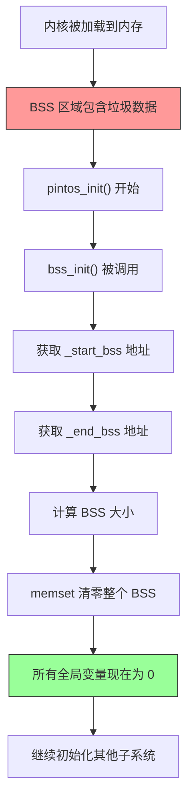

## 概述

BSS（Block Started by Symbol）段是程序中存放未初始化全局变量和静态变量的区域。在 `pintos_init()` 的第一步就是调用 `bss_init()` 来清零这个区域。

这是一个看似简单但极其重要的步骤——如果 BSS 没有正确清零，所有未初始化的全局变量都可能包含随机垃圾数据，导致不可预测的系统行为。

---

## 原始代码

```c
/** Clear the "BSS", a segment that should be initialized to
   zeros.  It isn't actually stored on disk or zeroed by the
   kernel loader, so we have to zero it ourselves.

   The start and end of the BSS segment is recorded by the
   linker as _start_bss and _end_bss.  See kernel.lds. */
static void
bss_init (void) 
{
  extern char _start_bss, _end_bss;
  memset (&_start_bss, 0, &_end_bss - &_start_bss);
}
```

---

## 前置知识

### 程序的内存布局

一个典型的程序在内存中分为几个段：

```
┌─────────────────────────────────────────────────────────────┐
│                    程序内存布局                               │
├─────────────────────────────────────────────────────────────┤
│                                                              │
│  高地址 ↑                                                    │
│                                                              │
│  ┌──────────────┐                                           │
│  │    Stack     │  栈：局部变量、函数调用帧                   │
│  │      ↓       │  向下增长                                  │
│  ├──────────────┤                                           │
│  │              │  未使用空间                                │
│  │      ↑       │                                           │
│  │    Heap      │  堆：动态分配的内存                        │
│  ├──────────────┤                                           │
│  │    .bss      │  未初始化的全局/静态变量                   │
│  ├──────────────┤                                           │
│  │    .data     │  初始化的全局/静态变量                     │
│  ├──────────────┤                                           │
│  │   .rodata    │  只读数据（字符串常量等）                  │
│  ├──────────────┤                                           │
│  │    .text     │  程序代码                                  │
│  └──────────────┘                                           │
│                                                              │
│  低地址 ↓                                                    │
│                                                              │
└─────────────────────────────────────────────────────────────┘
```

### .data vs .bss

```c
// 这些变量在 .data 段
int initialized_global = 42;
static int initialized_static = 100;
char message[] = "Hello";

// 这些变量在 .bss 段
int uninitialized_global;
static int uninitialized_static;
char buffer[1024];  // 初始化为 0 的数组也在 .bss
int zero_initialized = 0;  // 显式初始化为 0 也可能在 .bss
```

### 为什么要分开 .data 和 .bss？

**关键原因：节省文件空间！**

```
.data 段：
    - 变量有初始值
    - 这些初始值必须存储在可执行文件中
    - 加载时原样复制到内存

.bss 段：
    - 所有变量初始值都是 0
    - 可执行文件中不需要存储这些 0
    - 只需要记录 .bss 的大小
    - 加载时分配空间并清零
```

**文件大小对比示例**

```c
int big_array[1000000];           // 4 MB 数组

// 如果在 .data 段：
// 可执行文件大小 += 4 MB（存储 1000000 个 0）

// 如果在 .bss 段：
// 可执行文件大小 += 几字节（只存储大小信息）
```

---

## ELF 文件格式与段

### ELF 头中的段信息

```
ELF 文件结构：

┌──────────────────────┐
│      ELF Header      │  文件类型、入口点等
├──────────────────────┤
│   Program Headers    │  描述如何加载到内存
├──────────────────────┤
│      .text           │  代码段（实际数据）
├──────────────────────┤
│      .rodata         │  只读数据（实际数据）
├──────────────────────┤
│      .data           │  数据段（实际数据）
├──────────────────────┤
│      .bss            │  ← 只有头信息，没有实际数据！
├──────────────────────┤
│   Section Headers    │  描述各段的属性
└──────────────────────┘
```

### .bss 段在文件中不占空间

```
使用 readelf 查看段信息：

$ readelf -S kernel.o

Section Headers:
  [Nr] Name    Type      Address   Offset  Size    ...
  ...
  [10] .data   PROGBITS  c0020000  001000  000234  ...  ← 有内容
  [11] .bss    NOBITS    c0020234  001234  001000  ...  ← 无内容！
  ...

NOBITS 类型表示段在文件中没有数据，只有大小信息
```

---

## Pintos 的内核加载过程

### Loader 的限制

Pintos 的 Loader 是一个简化的引导加载器，它：

1. 读取 ELF 头获取加载信息
2. 将各段从磁盘复制到内存
3. **但不会清零 .bss 段！**

```
Loader 的工作：

磁盘上的内核 ELF 文件           内存中的内核映像
┌────────────┐                ┌────────────┐
│ ELF Header │────读取────→   │            │
├────────────┤                │            │
│   .text    │────复制────→   │   .text    │
├────────────┤                ├────────────┤
│   .data    │────复制────→   │   .data    │
├────────────┤                ├────────────┤
│            │                │   .bss     │ ← 分配了空间
│            │   （无数据）     │  (垃圾?)   │    但没有清零！
└────────────┘                └────────────┘
```

### 为什么 Loader 不清零 BSS？

1. **简化 Loader**：Loader 代码越少越好（只有 512 字节）
2. **灵活性**：让内核自己处理 BSS 初始化
3. **历史原因**：很多系统都是内核自己清零 BSS

---

## bss_init() 详解

### 代码分析

```c
static void
bss_init (void) 
{
  extern char _start_bss, _end_bss;
  memset (&_start_bss, 0, &_end_bss - &_start_bss);
}
```

### 链接器符号

```c
extern char _start_bss, _end_bss;
```

这两个符号不是普通变量，而是**链接器定义的符号**。

**在 kernel.lds.S 中定义：**

```ld
SECTIONS
{
  ...
  
  .bss : {
    _start_bss = .;        /* BSS 开始地址 */
    *(.bss)                /* 收集所有 .bss 输入段 */
    *(COMMON)              /* 收集 COMMON 符号 */
    _end_bss = .;          /* BSS 结束地址 */
  }
  
  ...
}
```

**符号的含义**

```
_start_bss：BSS 段第一个字节的地址
_end_bss：BSS 段最后一个字节之后的地址

BSS 大小 = &_end_bss - &_start_bss
```

### 为什么用 char 类型？

```c
extern char _start_bss, _end_bss;
```

这是一个技巧：

1. 我们只关心这些符号的**地址**
2. 用 `char` 类型可以方便地进行地址算术
3. `&_start_bss` 得到 `char *` 类型
4. 两个 `char *` 相减得到字节数

```c
// 这样就可以计算字节数：
size_t bss_size = &_end_bss - &_start_bss;
```

### memset 调用

```c
memset (&_start_bss, 0, &_end_bss - &_start_bss);
```

```
memset 函数原型：
void *memset(void *s, int c, size_t n);

参数：
    &_start_bss         - BSS 起始地址
    0                   - 要填充的值（0）
    &_end_bss - &_start_bss  - BSS 大小（字节）

效果：将 BSS 段的每个字节都设置为 0
```

---

## 执行流程可视化



---

## BSS 中的变量示例

### Pintos 中的 BSS 变量

```c
// threads/thread.c
static struct list ready_list;      // 就绪队列
static struct list all_list;        // 所有线程列表
static struct thread *idle_thread;  // 空闲线程指针

// threads/palloc.c
static struct pool kernel_pool;     // 内核内存池
static struct pool user_pool;       // 用户内存池

// threads/malloc.c
static struct arena *arenas;        // 内存分配器区域
```

这些变量都在 BSS 段，如果不清零：
- 链表头可能指向随机地址
- 指针可能不是 NULL
- 结构体字段包含垃圾值

### 未清零 BSS 的后果

```c
// 假设这是一个 BSS 变量
static struct list my_list;  // 期望：{NULL, NULL}
                             // 实际：{0x12345678, 0x87654321} (垃圾)

void use_list(void) {
    if (list_empty(&my_list)) {   // 检查 head == tail
        // 可能错误地认为列表不为空！
    }
    
    list_push_front(&my_list, &elem);  // 可能访问无效指针！
}
```

---

## memset 的实现

### Pintos 的 memset (lib/string.c)

```c
void *
memset (void *dst_, int value, size_t size) 
{
  unsigned char *dst = dst_;

  ASSERT (dst != NULL || size == 0);
  
  while (size-- > 0)
    *dst++ = value;

  return dst_;
}
```

这是一个简单的字节级实现。更优化的版本可能使用：
- 字对齐的操作
- SIMD 指令
- 特殊的字符串指令（如 `rep stosb`）

---

## 链接器脚本详解

### kernel.lds.S 的结构

```ld
/* Pintos 内核链接器脚本（简化版）*/

ENTRY(start)                    /* 入口点 */

SECTIONS
{
  . = LOADER_PHYS_BASE + LOADER_KERN_BASE;  /* 起始地址 */
  
  _start = .;                   /* 内核起始 */
  
  .start : {
    *(.start)                   /* start.S 代码 */
  }
  
  .text : {
    *(.text)                    /* 所有代码 */
  }
  
  .rodata : {
    *(.rodata)                  /* 只读数据 */
  }
  
  .data : {
    *(.data)                    /* 初始化数据 */
  }
  
  .bss : {
    _start_bss = .;             /* BSS 开始标记 */
    *(.bss)                     /* 未初始化数据 */
    *(COMMON)                   /* COMMON 符号 */
    _end_bss = .;               /* BSS 结束标记 */
  }
  
  _end = .;                     /* 内核结束 */
}
```

### COMMON 符号是什么？

```c
// 在 C 语言中，未初始化的全局变量（非 static）
// 可能被放入 COMMON 段而不是 .bss

int global_var;    // 可能是 COMMON
static int static_var;  // 一定是 .bss
```

COMMON 符号是为了支持多个文件定义同名变量的传统 C 行为。现代做法是将它们也收集到 .bss。

---

## 常见问题

### Q1: 为什么不在 Loader 中清零 BSS？

**A**: 
1. Loader 只有 512 字节空间
2. 清零 BSS 需要知道 BSS 的确切位置和大小
3. 这会增加 Loader 的复杂性
4. 让内核自己处理更灵活

### Q2: bss_init() 能在任何时候调用吗？

**A**: 
**不能！** 必须是第一个调用的初始化函数：
- 在它之前不能使用任何全局变量
- 很多子系统依赖全局变量为 0
- 甚至 printf 都可能使用全局状态

### Q3: 静态局部变量在 BSS 中吗？

**A**: 
```c
void foo(void) {
    static int counter;  // 在 .bss
    static int init = 5; // 在 .data
}
```

静态局部变量的存储方式与全局变量相同，只是名字可见性不同。

### Q4: 如果 BSS 特别大会怎样？

**A**: 
`memset` 会花更长时间，但通常不是问题：
- 现代 CPU 的内存带宽很高
- 几 MB 的清零只需要毫秒级
- 内核 BSS 通常不会太大

---

## 调试技巧

### 查看 BSS 段信息

```bash
# 使用 nm 查看符号
nm kernel.o | grep "_bss"
# 输出：
# c0021000 B _start_bss
# c0022000 B _end_bss

# 使用 size 查看段大小
size kernel.o
#    text    data     bss     dec     hex filename
#   40000    4000    4096   48096    bc00 kernel.o
```

### 在 GDB 中检查

```gdb
(gdb) p &_start_bss
$1 = 0xc0021000
(gdb) p &_end_bss
$2 = 0xc0022000
(gdb) p &_end_bss - &_start_bss
$3 = 4096

# 检查 BSS 是否已清零
(gdb) x/10x &_start_bss
0xc0021000: 0x00000000 0x00000000 0x00000000 0x00000000
```

---

## 练习思考

### 思考题 1
如果在 bss_init() 中不小心写成：
```c
memset (&_start_bss, 0, &_start_bss - &_end_bss);
```
会发生什么？

<details>
<summary>点击查看答案</summary>

参数顺序错了，计算结果是负数：
```c
&_start_bss - &_end_bss  // 负数！

// memset 的第三个参数是 size_t（无符号）
// 负数会被解释为非常大的正数
// 例如：-4096 → 0xFFFFF000（约 4GB）

// memset 会尝试清零约 4GB 内存
// 这会覆盖整个内核代码和其他数据
// 系统立即崩溃
```

</details>

### 思考题 2
如果有一个全局变量初始化为 0：
```c
int zero_var = 0;
```
它应该在 .data 还是 .bss？编译器如何决定？

<details>
<summary>点击查看答案</summary>

这取决于编译器的优化：

1. **严格来说**：变量有初始值，应该在 .data
2. **优化后**：很多编译器会将初始化为 0 的变量放入 .bss

编译器的决定因素：
- `-fno-zero-initialized-in-bss`：强制放入 .data
- 默认行为：通常优化到 .bss

验证方法：
```bash
gcc -c -S test.c -o test.s
# 查看汇编输出中变量的段
```

</details>

### 思考题 3
为什么 bss_init 要用 memset 而不是简单的循环？

<details>
<summary>点击查看答案</summary>

实际上，Pintos 的 memset 就是简单循环。但使用 memset 有好处：

1. **可读性**：意图更清晰
2. **可移植性**：memset 是标准函数
3. **潜在优化**：高质量的 libc 实现有优化版本
4. **代码复用**：memset 在其他地方也会用到

如果要手写循环：
```c
for (char *p = &_start_bss; p < &_end_bss; p++)
    *p = 0;
```

但这不如 `memset` 简洁。

</details>

---

## 下一步

BSS 清零后，内核需要读取和解析命令行参数。下一篇文档将介绍命令行处理：[命令行解析](2026-01-22-pintos-kernel-09-command-line.md)
