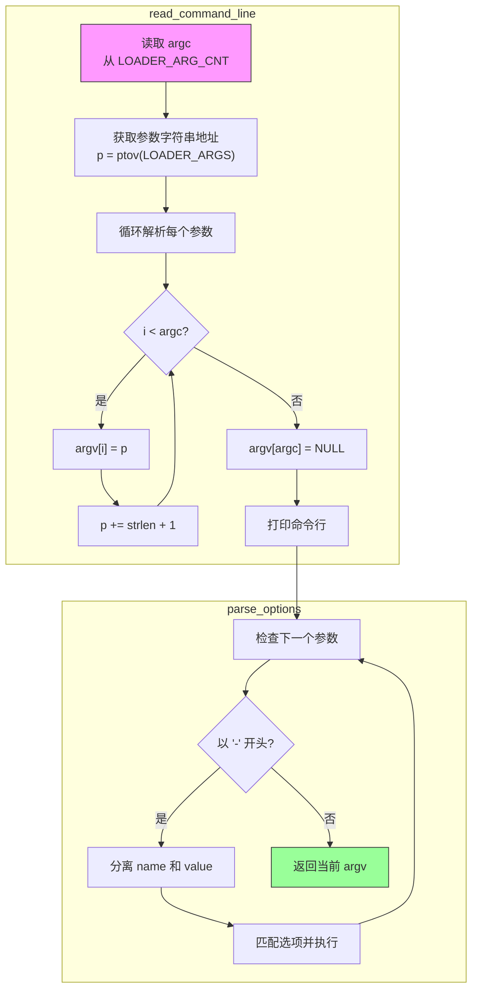

## 概述

内核命令行参数允许用户在启动时配置 Pintos 的行为。例如：

```bash
pintos -- -q run alarm-multiple
```

这会传递参数给内核，指定要运行的测试和完成后关机。

本文详细介绍 Pintos 如何从 Loader 获取命令行参数，以及如何解析这些参数。

---

## 原始代码

### read_command_line()

```c
/** Breaks the kernel command line into words and returns them as
   an argv-like array. */
static char **
read_command_line (void) 
{
  static char *argv[LOADER_ARGS_LEN / 2 + 1];
  char *p, *end;
  int argc;
  int i;

  argc = *(uint32_t *) ptov (LOADER_ARG_CNT);
  p = ptov (LOADER_ARGS);
  end = p + LOADER_ARGS_LEN;
  for (i = 0; i < argc; i++) 
    {
      if (p >= end)
        PANIC ("command line arguments overflow");

      argv[i] = p;
      p += strnlen (p, end - p) + 1;
    }
  argv[argc] = NULL;

  /* Print kernel command line. */
  printf ("Kernel command line:");
  for (i = 0; i < argc; i++)
    if (strchr (argv[i], ' ') == NULL)
      printf (" %s", argv[i]);
    else
      printf (" '%s'", argv[i]);
  printf ("\n");

  return argv;
}
```

### parse_options()

```c
/** Parses options in ARGV[]
   and returns the first non-option argument. */
static char **
parse_options (char **argv) 
{
  for (; *argv != NULL && **argv == '-'; argv++)
    {
      char *save_ptr;
      char *name = strtok_r (*argv, "=", &save_ptr);
      char *value = strtok_r (NULL, "", &save_ptr);
      
      if (!strcmp (name, "-h"))
        usage ();
      else if (!strcmp (name, "-q"))
        shutdown_configure (SHUTDOWN_POWER_OFF);
      else if (!strcmp (name, "-r"))
        shutdown_configure (SHUTDOWN_REBOOT);
#ifdef FILESYS
      else if (!strcmp (name, "-f"))
        format_filesys = true;
      else if (!strcmp (name, "-filesys"))
        filesys_bdev_name = value;
      else if (!strcmp (name, "-scratch"))
        scratch_bdev_name = value;
#ifdef VM
      else if (!strcmp (name, "-swap"))
        swap_bdev_name = value;
#endif
#endif
      else if (!strcmp (name, "-rs"))
        random_init (atoi (value));
      else if (!strcmp (name, "-mlfqs"))
        thread_mlfqs = true;
#ifdef USERPROG
      else if (!strcmp (name, "-ul"))
        user_page_limit = atoi (value);
#endif
      else
        PANIC ("unknown option `%s' (use -h for help)", name);
    }

  /* Initialize the random number generator... */
  random_init (rtc_get_time ());
  
  return argv;
}
```

---

## 前置知识

### 命令行参数的传递路径

```
用户输入:
    pintos -- -q run alarm-multiple

           │
           ▼

pintos 脚本处理:
    解析参数，准备虚拟机配置

           │
           ▼

Loader (loader.S):
    从磁盘读取参数
    存储到内存的固定位置

           │
           ▼

内核 (init.c):
    从固定位置读取参数
    解析并执行
```

### Loader 中的参数存储位置

```c
// loader.h 中定义的常量

// 引导扇区末尾的布局：
// LOADER_SIG (2字节): 0xAA55 BIOS 签名
// LOADER_PARTS (64字节): 分区表
// LOADER_ARGS (128字节): 命令行参数字符串
// LOADER_ARG_CNT (4字节): 参数数量

#define LOADER_END  0x7e00
#define LOADER_SIG_LEN 2
#define LOADER_PARTS_LEN 64
#define LOADER_ARGS_LEN 128
#define LOADER_ARG_CNT_LEN 4

#define LOADER_SIG (LOADER_END - LOADER_SIG_LEN)           // 0x7DFE
#define LOADER_PARTS (LOADER_SIG - LOADER_PARTS_LEN)       // 0x7DBE
#define LOADER_ARGS (LOADER_PARTS - LOADER_ARGS_LEN)       // 0x7D3E
#define LOADER_ARG_CNT (LOADER_ARGS - LOADER_ARG_CNT_LEN)  // 0x7D3A
```

### 内存布局图

```
物理地址:

0x7C00  ┌────────────────────┐  ← Loader 代码开始
        │                    │
        │   Loader 代码      │
        │                    │
0x7D3A  ├────────────────────┤  ← LOADER_ARG_CNT
        │   参数数量 (4字节)  │
0x7D3E  ├────────────────────┤  ← LOADER_ARGS
        │                    │
        │   参数字符串       │     "-q\0run\0alarm-multiple\0"
        │   (128字节)        │
        │                    │
0x7DBE  ├────────────────────┤  ← LOADER_PARTS
        │   分区表 (64字节)  │
0x7DFE  ├────────────────────┤  ← LOADER_SIG
        │   0xAA55 (2字节)   │
0x7E00  └────────────────────┘  ← Loader 结束
```

---

## read_command_line() 详解

### 函数签名

```c
static char **
read_command_line (void)
```

返回一个指向字符串指针数组的指针（argv 风格）。

### 静态 argv 数组

```c
static char *argv[LOADER_ARGS_LEN / 2 + 1];
```

**为什么是 LOADER_ARGS_LEN / 2 + 1？**

```
最坏情况：每个参数只有 1 个字符 + 1 个 null 终止符

LOADER_ARGS_LEN = 128 字节
最多参数数量 = 128 / 2 = 64 个参数
+ 1 是为了 argv 末尾的 NULL 哨兵

所以数组大小 = 128 / 2 + 1 = 65
```

**为什么用 static？**

1. 函数返回的是 argv 的地址
2. 如果是自动变量，函数返回后内存会失效
3. static 保证 argv 在程序整个运行期间有效

### 读取参数数量

```c
argc = *(uint32_t *) ptov (LOADER_ARG_CNT);
```

**逐步分析：**

```c
// 1. LOADER_ARG_CNT 是物理地址 (0x7D3A)
LOADER_ARG_CNT

// 2. ptov() 转换为虚拟地址
ptov(LOADER_ARG_CNT)  // = 0xC0007D3A

// 3. 转换为 uint32_t 指针
(uint32_t *) ptov(LOADER_ARG_CNT)

// 4. 解引用读取值
*(uint32_t *) ptov(LOADER_ARG_CNT)
```

### 获取参数字符串起始地址

```c
p = ptov (LOADER_ARGS);
end = p + LOADER_ARGS_LEN;
```

`p` 指向参数字符串的开始，`end` 指向边界。

### 解析参数循环

```c
for (i = 0; i < argc; i++) 
{
    if (p >= end)
        PANIC ("command line arguments overflow");

    argv[i] = p;
    p += strnlen (p, end - p) + 1;
}
argv[argc] = NULL;
```

**参数存储格式**

参数以 null 分隔的字符串形式存储：

```
内存中的参数：

地址:    │ 0  │ 1  │ 2  │ 3  │ 4  │ 5  │ 6  │ 7  │...│
内容:    │ -  │ q  │\0  │ r  │ u  │ n  │\0  │ a  │...│
         └────┴────┴────┴────┴────┴────┴────┴────┴───┘
          ↑             ↑             ↑
        argv[0]       argv[1]       argv[2]
        "-q"          "run"         "alarm-..."
```

**循环逻辑**

```
第 1 次迭代 (i=0):
    argv[0] = p (指向 "-q")
    p += strlen("-q") + 1 = p + 3
    
第 2 次迭代 (i=1):
    argv[1] = p (指向 "run")
    p += strlen("run") + 1 = p + 4
    
...
```

### 打印命令行

```c
printf ("Kernel command line:");
for (i = 0; i < argc; i++)
    if (strchr (argv[i], ' ') == NULL)
        printf (" %s", argv[i]);
    else
        printf (" '%s'", argv[i]);
printf ("\n");
```

如果参数包含空格，用引号括起来显示：

```
输出示例:
Kernel command line: -q run alarm-multiple
Kernel command line: -q run 'my program with spaces'
```

---

## parse_options() 详解

### 选项解析循环

```c
for (; *argv != NULL && **argv == '-'; argv++)
```

这个循环：
1. 继续直到 argv 数组结束 (`*argv != NULL`)
2. 只处理以 `-` 开头的参数 (`**argv == '-'`)
3. 每次移动到下一个参数 (`argv++`)

### 分离选项名和值

```c
char *save_ptr;
char *name = strtok_r (*argv, "=", &save_ptr);
char *value = strtok_r (NULL, "", &save_ptr);
```

**strtok_r 的工作原理**

```
输入: "-rs=12345"

第一次 strtok_r(*argv, "=", &save_ptr):
    返回: "rs"
    save_ptr 指向 "12345"

第二次 strtok_r(NULL, "", &save_ptr):
    返回: "12345"
```

### 选项处理

```c
if (!strcmp (name, "-h"))
    usage ();
else if (!strcmp (name, "-q"))
    shutdown_configure (SHUTDOWN_POWER_OFF);
// ... 更多选项
```

**支持的选项**

| 选项 | 含义 | 示例 |
|------|------|------|
| -h | 显示帮助 | `pintos -- -h` |
| -q | 完成后关机 | `pintos -- -q run test` |
| -r | 完成后重启 | `pintos -- -r run test` |
| -f | 格式化文件系统 | `pintos -f` |
| -rs=SEED | 设置随机种子 | `pintos -- -rs=12345` |
| -mlfqs | 使用 MLFQS 调度器 | `pintos -- -mlfqs` |
| -ul=COUNT | 限制用户内存页数 | `pintos -- -ul=1000` |

### 初始化随机数

```c
random_init (rtc_get_time ());
```

如果没有指定 `-rs` 选项，使用当前时间作为随机种子。

### 返回非选项参数

```c
return argv;
```

返回指向第一个非选项参数的指针。例如：

```
输入: ["-q", "run", "alarm-multiple", NULL]
                 ↑
            返回这里
```

---

## 执行流程图



---

## 关键数据结构

### argv 数组结构

```
执行 "pintos -- -q run alarm-multiple" 后:

argv:
┌───────┬───────┬────────────────┬──────┐
│argv[0]│argv[1]│    argv[2]     │argv[3]│
│  ↓    │   ↓   │       ↓        │  ↓   │
│ "-q"  │"run"  │"alarm-multiple"│ NULL │
└───────┴───────┴────────────────┴──────┘

parse_options 处理后返回:
                   ↓
             argv 指向 "run"
```

### 参数值的存储位置

参数字符串实际存储在两个地方：

1. **物理地址 LOADER_ARGS**：Loader 写入的原始位置
2. **虚拟地址 ptov(LOADER_ARGS)**：内核通过高地址访问

argv 数组中的指针都指向虚拟地址空间。

---

## 命令行示例

### 示例 1：运行测试

```bash
pintos -- -q run alarm-multiple
```

```
argv: ["-q", "run", "alarm-multiple", NULL]

parse_options 处理:
    -q → shutdown_configure(SHUTDOWN_POWER_OFF)
    返回 → ["run", "alarm-multiple", NULL]

run_actions 处理:
    action = "run"
    task = "alarm-multiple"
```

### 示例 2：使用 MLFQS 调度

```bash
pintos -- -mlfqs -q run mlfqs-load-1
```

```
argv: ["-mlfqs", "-q", "run", "mlfqs-load-1", NULL]

parse_options 处理:
    -mlfqs → thread_mlfqs = true
    -q → shutdown_configure(SHUTDOWN_POWER_OFF)
    返回 → ["run", "mlfqs-load-1", NULL]
```

### 示例 3：设置随机种子

```bash
pintos -- -rs=12345 run random-test
```

```
argv: ["-rs=12345", "run", "random-test", NULL]

parse_options 处理:
    -rs → random_init(12345)
    返回 → ["run", "random-test", NULL]
```

---

## 错误处理

### 参数溢出

```c
if (p >= end)
    PANIC ("command line arguments overflow");
```

如果参数字符串超过 128 字节，内核会 panic。

### 未知选项

```c
else
    PANIC ("unknown option `%s' (use -h for help)", name);
```

遇到未识别的选项会 panic。

### 帮助信息

```c
if (!strcmp (name, "-h"))
    usage ();
```

`usage()` 打印帮助信息后调用 `shutdown_power_off()` 关机。

---

## 常见问题

### Q1: 为什么参数存储在 Loader 区域？

**A**: 
1. Loader 在加载内核时可以访问原始命令行
2. 这块内存区域在内核启动后不再需要（Loader 已执行完）
3. 复用这块空间很方便

### Q2: 参数有长度限制吗？

**A**: 
是的，LOADER_ARGS_LEN = 128 字节。这包括：
- 所有参数字符串
- 所有 null 终止符
- 对于复杂命令可能不够用

### Q3: strtok_r 和 strtok 有什么区别？

**A**: 
```c
// strtok：使用全局状态，不可重入
char *token = strtok(str, delim);

// strtok_r：使用传入的 save_ptr，可重入
char *save_ptr;
char *token = strtok_r(str, delim, &save_ptr);
```

在可能被中断的代码中应该使用 `strtok_r`。

### Q4: 如果没有传递任何参数会怎样？

**A**: 
```c
if (*argv != NULL) {
    run_actions (argv);
} else {
    // TODO: no command line passed to kernel. Run interactively 
}
```

目前 Pintos 没有实现交互模式，会直接跳到 `shutdown()`。

---

## 练习思考

### 思考题 1
如果在命令行中传递 `-q` 两次会怎样？

<details>
<summary>点击查看答案</summary>

没有问题，`shutdown_configure(SHUTDOWN_POWER_OFF)` 会被调用两次，但效果相同：

```c
void shutdown_configure (enum shutdown_type type)
{
  shutdown_type = type;  // 简单赋值，多次赋值无影响
}
```

</details>

### 思考题 2
如何添加一个新的命令行选项 `-debug`？

<details>
<summary>点击查看答案</summary>

在 `parse_options` 中添加：

```c
// 在 init.c 文件顶部添加
static bool debug_mode = false;

// 在 parse_options 的 if-else 链中添加
else if (!strcmp (name, "-debug"))
    debug_mode = true;
```

然后在需要的地方检查 `debug_mode`。

</details>

### 思考题 3
为什么 argv 数组定义为 static？如果不是 static 会怎样？

<details>
<summary>点击查看答案</summary>

问题：`read_command_line` 返回 `argv` 的地址。

如果 `argv` 是自动变量（在栈上）：
1. 函数返回后，栈帧被销毁
2. `argv` 所在的内存变为无效
3. 调用者得到一个悬空指针
4. 使用这个指针会导致未定义行为

使用 `static`：
1. `argv` 存储在 .bss 或 .data 段
2. 内存在程序整个生命周期内有效
3. 返回的指针始终有效

</details>

---

## 下一步

命令行解析完成后，内核需要初始化内存管理系统。下一篇文档将介绍页面分配器的初始化：[内存系统初始化](2026-01-22-pintos-kernel-10-memory-init.md)
