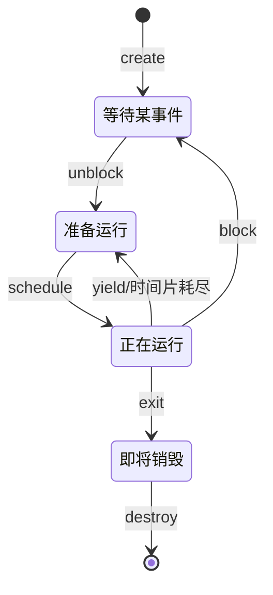
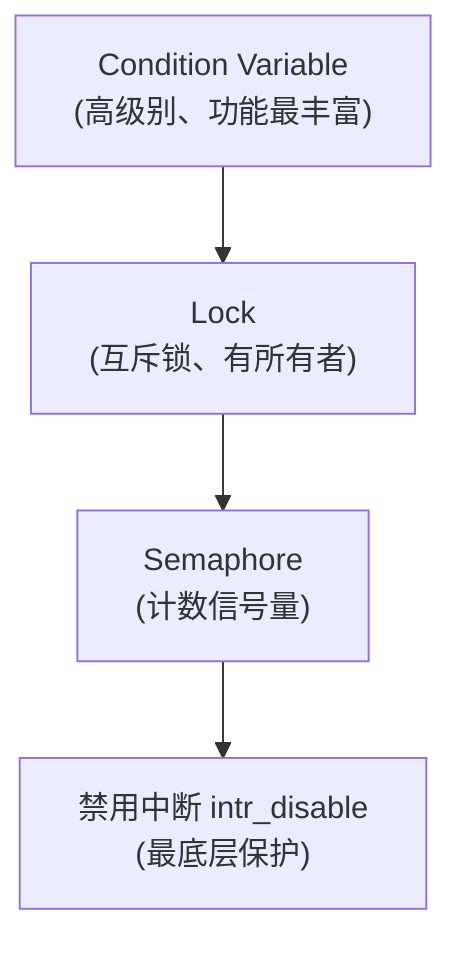

## 概述

这是一个针对 Pintos 操作系统线程子系统的详细分析文档系列。Pintos 的线程系统是整个操作系统的核心，它提供了：

- **线程抽象**：将执行流封装为可调度的单元
- **上下文切换**：在不同线程间切换 CPU
- **同步原语**：信号量、锁、条件变量
- **调度机制**：决定哪个线程运行

---

## Pintos 线程系统架构

```
┌─────────────────────────────────────────────────────────────────┐
│                        应用程序/测试                              │
├─────────────────────────────────────────────────────────────────┤
│                    线程 API (thread.h)                           │
│  thread_create() | thread_yield() | thread_exit() | ...        │
├─────────────────────────────────────────────────────────────────┤
│                    同步原语 (synch.h)                            │
│     Semaphore    |      Lock      |    Condition Variable       │
├─────────────────────────────────────────────────────────────────┤
│                    调度器 (thread.c)                             │
│    schedule()   |   ready_list   |   next_thread_to_run()       │
├─────────────────────────────────────────────────────────────────┤
│                  上下文切换 (switch.S)                           │
│              switch_threads()  |  switch_entry()                │
├─────────────────────────────────────────────────────────────────┤
│                    中断系统 (interrupt.c)                        │
│    intr_disable() | intr_enable() | intr_yield_on_return()      │
└─────────────────────────────────────────────────────────────────┘
```

---

## 文档列表

| 序号 | 主题 | 简介 |
|------|------|------|
| 1 | 线程结构 | struct thread 详解和内存布局 |
| 2 | 线程生命周期 | 线程状态转换和生命周期管理 |
| 3 | 线程创建 | thread_create() 详解 |
| 4 | 线程调度 | schedule() 和调度算法 |
| 5 | 上下文切换 | switch.S 汇编代码详解 |
| 6 | 阻塞与唤醒 | thread_block() 和 thread_unblock() |
| 7 | 信号量 | 计数信号量实现 |
| 8 | 锁 | 互斥锁实现 |
| 9 | 条件变量 | 条件变量实现 |
| 10 | 中断处理 | 中断系统与线程的关系 |
| 11 | 空闲线程 | idle 线程的实现和作用 |
| 12 | 优先级调度 | 优先级调度机制 |

---

## 核心概念预览

### 1. 线程是什么？

线程是 CPU 调度的基本单位。在 Pintos 中，每个线程包含：

- **执行上下文**：寄存器状态、栈指针
- **管理信息**：线程 ID、名称、状态、优先级
- **栈空间**：用于函数调用和局部变量

```
一个线程 = 执行状态 + 栈空间
```

### 2. Pintos 的线程内存模型

Pintos 采用独特的设计：每个线程占用一个 4KB 页。

```
        4 kB ┌─────────────────────────────┐
             │                             │
             │        Kernel Stack         │
             │             │               │
             │             │               │
             │             ▼               │
             │       grows downward        │
             │                             │
             │                             │
             │                             │
             │         (unused)            │
             │                             │
             │                             │
             ├─────────────────────────────┤
             │           magic             │  <- 用于检测栈溢出
             │           name              │
             │          status             │
             │           tid               │
        0 kB └─────────────────────────────┘  <- struct thread 起始
```

### 3. 线程状态



### 4. 同步原语层次



```
            ┌─────────────────────────────────┐
            │     禁用中断 (intr_disable)     │
            │       (最底层保护)              │
            └─────────────────────────────────┘
```

---

## 阅读顺序建议

### 入门路线（推荐新手）
1. **线程结构** → 2. **线程生命周期** → 3. **线程创建**

### 深入路线
4. **线程调度** → 5. **上下文切换** → 6. **阻塞与唤醒**

### 同步原语路线
7. **信号量** → 8. **锁** → 9. **条件变量**

### 高级话题
10. **中断处理** → 11. **空闲线程** → 12. **优先级调度**

---

## 每个文档的结构

每个文档都包含以下部分：

- **概述**：本部分内容的作用和意义
- **原始代码**：完整的源代码
- **前置知识**：理解代码所需的背景知识
- **逐行详解**：每一行代码的详细解释
- **图解/流程图**：可视化的执行过程
- **常见问题**：FAQ 解答常见疑惑
- **练习思考**：帮助加深理解的思考题

---

## 先决知识

### 必须掌握

#### C 语言基础
- 指针操作
- 结构体定义和使用
- 函数指针
- 宏定义

#### 数据结构
- 链表操作
- 栈的概念

### 有帮助的知识

#### x86 汇编
- 寄存器概念（EAX, ESP, EBP 等）
- 栈操作（push, pop）
- 函数调用约定

#### 操作系统概念
- 进程与线程
- 调度算法
- 并发与同步

---

## 术语表

| 术语 | 英文 | 解释 |
|------|------|------|
| 线程 | Thread | CPU 调度的基本单位 |
| 上下文 | Context | 线程的执行状态（寄存器、栈等）|
| 上下文切换 | Context Switch | 保存当前线程状态，恢复另一线程状态 |
| 调度器 | Scheduler | 决定哪个线程运行的组件 |
| 就绪队列 | Ready Queue | 等待 CPU 的线程队列 |
| 信号量 | Semaphore | 计数同步原语 |
| 锁 | Lock | 互斥同步原语 |
| 条件变量 | Condition Variable | 等待特定条件的同步原语 |
| 中断 | Interrupt | 打断当前执行的事件 |
| 抢占 | Preemption | 强制切换当前线程 |
| 时间片 | Time Slice | 线程运行的最大时间 |
| 优先级 | Priority | 线程的相对重要性 |
| 原子操作 | Atomic Operation | 不可分割的操作 |
| 临界区 | Critical Section | 需要互斥访问的代码段 |
| 死锁 | Deadlock | 多个线程互相等待的状态 |

---

## 相关源文件

| 文件 | 说明 |
|------|------|
| `threads/thread.c` | 线程核心实现 |
| `threads/thread.h` | 线程结构和接口 |
| `threads/switch.S` | 上下文切换汇编 |
| `threads/switch.h` | 切换相关定义 |
| `threads/synch.c` | 同步原语实现 |
| `threads/synch.h` | 同步原语接口 |
| `threads/interrupt.c` | 中断处理 |
| `threads/interrupt.h` | 中断接口 |
| `threads/palloc.c` | 页分配器 |
| `threads/init.c` | 内核初始化 |

---

## 学习建议

1. **边读边画**
   - 画出 struct thread 内存布局
   - 画出线程状态转换图
   - 画出栈的变化过程

2. **动手调试**
   - 使用 GDB 设置断点跟踪执行
   - 打印线程状态变化
   - 观察上下文切换

3. **做练习题**
   - 完成每节的思考题
   - 尝试实现优先级调度
   - 分析死锁场景

4. **阅读测试**
   - 查看 `tests/threads/` 下的测试
   - 理解测试的预期行为
   - 运行测试验证理解

---

## 参考资料

1. **Pintos 官方文档**
   - Stanford Pintos Guide

2. **操作系统教材**
   - Operating Systems: Three Easy Pieces (OSTEP)
   - Operating System Concepts (恐龙书)

3. **x86 参考**
   - Intel 64 and IA-32 Architectures Software Developer's Manual
