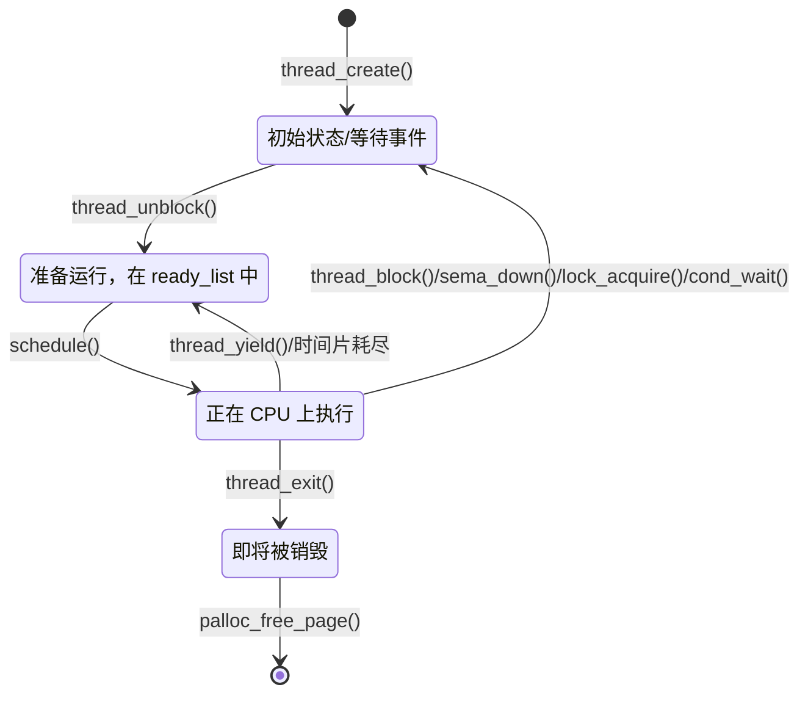

## 概述

本文档详细解析 Pintos 中线程的生命周期管理。一个线程从创建到销毁会经历多种状态，理解这些状态及其转换是理解调度和同步的基础。

---

## 线程状态定义

### 原始代码

```c
/** States in a thread's life cycle. */
enum thread_status
  {
    THREAD_RUNNING,     /**< Running thread. */
    THREAD_READY,       /**< Not running but ready to run. */
    THREAD_BLOCKED,     /**< Waiting for an event to trigger. */
    THREAD_DYING        /**< About to be destroyed. */
  };
```

---

## 前置知识

### 1. 为什么需要线程状态？

操作系统需要跟踪每个线程的当前情况：
- 哪个线程正在运行？
- 哪些线程可以运行但还没轮到？
- 哪些线程在等待某些事件？

### 2. 状态机概念

线程状态可以用有限状态机来描述：
- **状态**：线程当前的情况
- **转换**：从一个状态变到另一个状态
- **触发器**：引起转换的事件或操作

---

## 四种线程状态详解

### 1. THREAD_RUNNING（运行态）

```
状态：线程正在 CPU 上执行
特点：在单核系统中，任一时刻只有一个线程处于此状态
```

**进入此状态**：被调度器选中执行
**离开此状态**：主动让出 CPU 或被抢占

**相关操作**：
```c
// 在 schedule() 函数末尾，切换到新线程后
cur->status = THREAD_RUNNING;
```

### 2. THREAD_READY（就绪态）

```
状态：线程准备好运行，等待 CPU
位置：在 ready_list 队列中
```

**进入此状态**：
- 新创建的线程（`thread_create` → `thread_unblock`）
- 运行中的线程让出 CPU（`thread_yield`）
- 阻塞的线程被唤醒（`thread_unblock`）

**离开此状态**：被调度器选中执行

**相关操作**：
```c
// thread_unblock() - 将阻塞线程变为就绪
void
thread_unblock (struct thread *t) 
{
  ASSERT (t->status == THREAD_BLOCKED);
  list_push_back (&ready_list, &t->elem);  // 加入就绪队列
  t->status = THREAD_READY;                 // 设置状态
}

// thread_yield() - 当前线程主动让出 CPU
void
thread_yield (void) 
{
  struct thread *cur = thread_current ();
  if (cur != idle_thread) 
    list_push_back (&ready_list, &cur->elem);  // 加入就绪队列
  cur->status = THREAD_READY;                   // 设置状态
  schedule ();                                  // 调度其他线程
}
```

### 3. THREAD_BLOCKED（阻塞态）

```
状态：线程在等待某个事件
位置：在某个等待队列中（如信号量的 waiters 队列）
```

**进入此状态**：
- 等待信号量（`sema_down`）
- 等待锁（`lock_acquire`）
- 等待条件变量（`cond_wait`）
- 其他等待操作（`thread_block`）

**离开此状态**：等待的事件发生（`thread_unblock`）

**相关操作**：
```c
// thread_block() - 阻塞当前线程
void
thread_block (void) 
{
  ASSERT (intr_get_level () == INTR_OFF);  // 必须禁用中断
  thread_current ()->status = THREAD_BLOCKED;
  schedule ();  // 切换到其他线程
}
```

**重要**：调用 `thread_block()` 前，调用者必须：
1. 禁用中断
2. 将当前线程加入某个等待队列

### 4. THREAD_DYING（将死态）

```
状态：线程即将被销毁
特点：永远不会再运行
```

**进入此状态**：线程退出（`thread_exit`）

**相关操作**：
```c
void
thread_exit (void) 
{
  intr_disable ();
  list_remove (&thread_current()->allelem);  // 从 all_list 移除
  thread_current ()->status = THREAD_DYING;
  schedule ();  // 切换到其他线程
  NOT_REACHED ();  // 永远不会返回
}
```

**销毁时机**：在 `thread_schedule_tail()` 中，由下一个运行的线程来释放内存：

```c
void
thread_schedule_tail (struct thread *prev)
{
  // ... 其他代码 ...

  /* If the thread we switched from is dying, destroy its struct thread. */
  if (prev != NULL && prev->status == THREAD_DYING && prev != initial_thread) 
    {
      ASSERT (prev != cur);
      palloc_free_page (prev);  // 释放线程占用的页
    }
}
```

---

## 状态转换图

### 完整状态转换图



### 状态转换表

| 当前状态 | 触发事件 | 目标状态 | 函数 |
|----------|----------|----------|------|
| (不存在) | 创建 | BLOCKED | `thread_create()` |
| BLOCKED | 解除阻塞 | READY | `thread_unblock()` |
| READY | 被调度 | RUNNING | `schedule()` |
| RUNNING | 让出 CPU | READY | `thread_yield()` |
| RUNNING | 时间片耗尽 | READY | 定时器中断 |
| RUNNING | 等待事件 | BLOCKED | `thread_block()` |
| RUNNING | 退出 | DYING | `thread_exit()` |
| DYING | 内存释放 | (销毁) | `palloc_free_page()` |

---

## 状态转换详细分析

### 转换 1: 创建 → BLOCKED

```c
tid_t
thread_create (const char *name, int priority,
               thread_func *function, void *aux) 
{
  struct thread *t;
  
  t = palloc_get_page (PAL_ZERO);  // 分配页
  init_thread (t, name, priority);  // 初始化，状态设为 BLOCKED
  // ... 设置栈帧 ...
  thread_unblock (t);  // 转为 READY
  return tid;
}

static void
init_thread (struct thread *t, const char *name, int priority)
{
  t->status = THREAD_BLOCKED;  // 初始状态为 BLOCKED
  // ... 其他初始化 ...
}
```

**为什么初始状态是 BLOCKED？**

1. 线程创建时还没准备好运行（栈帧未设置完）
2. 通过 `thread_unblock()` 显式转为 READY 更清晰
3. 与其他阻塞→就绪的路径保持一致

### 转换 2: BLOCKED → READY

```c
void
thread_unblock (struct thread *t) 
{
  enum intr_level old_level;

  ASSERT (is_thread (t));

  old_level = intr_disable ();  // 禁用中断
  ASSERT (t->status == THREAD_BLOCKED);
  list_push_back (&ready_list, &t->elem);  // 加入就绪队列
  t->status = THREAD_READY;
  intr_set_level (old_level);  // 恢复中断
}
```

**关键点**：
- 必须禁用中断，保证原子性
- 先加入 ready_list，再改状态
- 不会立即调度（调用者可能还需要做其他事）

### 转换 3: READY → RUNNING

```c
static void
schedule (void) 
{
  struct thread *cur = running_thread ();
  struct thread *next = next_thread_to_run ();  // 从 ready_list 选择
  struct thread *prev = NULL;

  ASSERT (cur->status != THREAD_RUNNING);  // 当前线程已不是 RUNNING
  ASSERT (is_thread (next));

  if (cur != next)
    prev = switch_threads (cur, next);  // 执行上下文切换
  thread_schedule_tail (prev);
}

void
thread_schedule_tail (struct thread *prev)
{
  struct thread *cur = running_thread ();
  cur->status = THREAD_RUNNING;  // 设置为运行状态
  thread_ticks = 0;  // 重置时间片计数
  // ...
}
```

### 转换 4: RUNNING → READY

```c
void
thread_yield (void) 
{
  struct thread *cur = thread_current ();
  enum intr_level old_level;
  
  ASSERT (!intr_context ());  // 不能在中断处理中调用

  old_level = intr_disable ();
  if (cur != idle_thread) 
    list_push_back (&ready_list, &cur->elem);
  cur->status = THREAD_READY;
  schedule ();  // 调度其他线程
  intr_set_level (old_level);  // 返回后恢复中断
}
```

**两种触发方式**：

1. **主动让出**：调用 `thread_yield()`
2. **被动抢占**：时间片耗尽，定时器中断处理中设置标志

```c
// timer.c - 定时器中断处理
void
thread_tick (void) 
{
  struct thread *t = thread_current ();
  // ... 统计 ...
  
  if (++thread_ticks >= TIME_SLICE)  // 时间片耗尽
    intr_yield_on_return ();  // 设置标志，中断返回时 yield
}
```

### 转换 5: RUNNING → BLOCKED

```c
void
thread_block (void) 
{
  ASSERT (!intr_context ());  // 不能在中断处理中
  ASSERT (intr_get_level () == INTR_OFF);  // 中断必须已禁用

  thread_current ()->status = THREAD_BLOCKED;
  schedule ();  // 调度其他线程
}
```

**典型使用场景**（信号量的 down 操作）：

```c
void
sema_down (struct semaphore *sema) 
{
  enum intr_level old_level;

  old_level = intr_disable ();  // 禁用中断
  while (sema->value == 0)  // 资源不可用
    {
      list_push_back (&sema->waiters, &thread_current ()->elem);
      thread_block ();  // 阻塞
    }
  sema->value--;
  intr_set_level (old_level);
}
```

### 转换 6: RUNNING → DYING

```c
void
thread_exit (void) 
{
  ASSERT (!intr_context ());

#ifdef USERPROG
  process_exit ();  // 用户进程清理
#endif

  intr_disable ();  // 禁用中断
  list_remove (&thread_current()->allelem);  // 从 all_list 移除
  thread_current ()->status = THREAD_DYING;
  schedule ();  // 切换到其他线程
  NOT_REACHED ();  // 永远不会执行到这里
}
```

**为什么自己不能释放自己的内存？**

因为正在使用自己的栈！如果释放了，栈就没了，代码无法继续执行。

**解决方案**：让下一个运行的线程来清理：

```c
void
thread_schedule_tail (struct thread *prev)
{
  // ... 
  if (prev != NULL && prev->status == THREAD_DYING && prev != initial_thread) 
    {
      ASSERT (prev != cur);  // 不能是自己
      palloc_free_page (prev);  // 释放前一个线程的页
    }
}
```

---

## 时间片和抢占

### 时间片机制

```c
#define TIME_SLICE 4  // 时间片 = 4 个 tick

static unsigned thread_ticks;  // 当前线程已运行的 tick 数

void
thread_tick (void) 
{
  // ... 统计 ...
  
  if (++thread_ticks >= TIME_SLICE)
    intr_yield_on_return ();  // 时间片耗尽，请求调度
}
```

### 抢占式调度

```
时间轴 ──────────────────────────────────────────────►
        │                                │
        ▼                                ▼
    Thread A 开始运行               时间片耗尽
        │                                │
   ┌────┴────┐  tick  tick  tick  tick  ─┴──► 中断返回时 yield
   │         │   1     2     3     4
   │ Thread A 运行                       
   │         │
   └─────────┘
                                         Thread B 开始运行
                                             │
                                    ┌────────┴────────┐
                                    │                 │
                                    │  Thread B 运行  │
                                    │                 │
                                    └─────────────────┘
```

---

## 中断与线程状态

### 为什么状态转换需要禁用中断？

状态转换涉及多个步骤，必须原子执行：

```c
// 例如 thread_unblock
list_push_back (&ready_list, &t->elem);  // 步骤 1
t->status = THREAD_READY;                 // 步骤 2
```

如果在步骤 1 和 2 之间发生中断，可能导致：
- 线程在 ready_list 中但状态不是 READY
- 调度器可能做出错误决定

### 禁用中断的范围

```c
void
thread_unblock (struct thread *t) 
{
  enum intr_level old_level;

  old_level = intr_disable ();  // ← 禁用中断
  // --- 临界区开始 ---
  ASSERT (t->status == THREAD_BLOCKED);
  list_push_back (&ready_list, &t->elem);
  t->status = THREAD_READY;
  // --- 临界区结束 ---
  intr_set_level (old_level);  // ← 恢复之前的状态
}
```

---

## 线程状态与数据结构的对应

```
状态            所在位置               说明
───────────────────────────────────────────────────────
RUNNING        无（正在 CPU 上执行）   通过 thread_current() 获取
READY          ready_list            等待 CPU
BLOCKED        某等待队列             如 sema->waiters
DYING          无                    即将被回收
```

---

## 常见问题

### Q1: 为什么新创建的线程初始状态是 BLOCKED 而不是 READY？

**答**：这是一个设计选择：
1. `init_thread()` 只做基本初始化
2. 调用者通过 `thread_unblock()` 显式表示线程准备好了
3. 这样 `thread_unblock()` 有统一的语义：将线程加入就绪队列

### Q2: thread_yield() 和 thread_block() 有什么区别？

**答**：

| 方面 | thread_yield() | thread_block() |
|------|----------------|----------------|
| 目标状态 | READY | BLOCKED |
| 加入队列 | ready_list | 调用者指定的队列 |
| 何时返回 | 再次被调度时 | 被 unblock 后调度时 |
| 使用场景 | 主动让出 CPU | 等待某事件 |

### Q3: 为什么 DYING 状态的线程不能自己释放内存？

**答**：因为线程正在使用自己的栈：
- 释放内存后，栈空间就无效了
- 无法继续执行代码，甚至无法 return

解决方案是让下一个运行的线程来清理。

### Q4: 中断处理中能调用 thread_yield() 吗？

**答**：不能。`thread_yield()` 有断言：

```c
ASSERT (!intr_context ());  // 不能在中断上下文中
```

中断处理中应该使用 `intr_yield_on_return()`，它只是设置一个标志，在中断返回后才真正 yield。

### Q5: 如果 ready_list 为空会怎样？

**答**：会调度 `idle_thread`（空闲线程）：

```c
static struct thread *
next_thread_to_run (void) 
{
  if (list_empty (&ready_list))
    return idle_thread;  // 空闲线程总是存在
  else
    return list_entry (list_pop_front (&ready_list), struct thread, elem);
}
```

---

## 状态检查函数

### thread_current()

```c
struct thread *
thread_current (void) 
{
  struct thread *t = running_thread ();
  
  ASSERT (is_thread (t));
  ASSERT (t->status == THREAD_RUNNING);  // 必须是运行状态

  return t;
}
```

### is_thread()

```c
static bool
is_thread (struct thread *t)
{
  return t != NULL && t->magic == THREAD_MAGIC;
}
```

---

## 练习思考

1. **分析题**：画出以下场景的状态转换序列：
   - Thread A 创建 Thread B
   - Thread B 调用 sema_down 等待
   - Thread A 调用 sema_up 唤醒 Thread B

2. **设计题**：如果要添加一个 THREAD_SUSPENDED 状态（可以被其他线程挂起/恢复），需要哪些修改？

3. **调试题**：如果发现一个线程长时间处于 READY 状态但不被调度，可能是什么原因？

4. **思考题**：为什么 `thread_block()` 要求调用者先禁用中断，而不是自己禁用？

---

## 下一步

理解了线程生命周期后，下一篇文档将详细介绍 **thread_create()** 函数，看看一个线程是如何被创建出来的。
