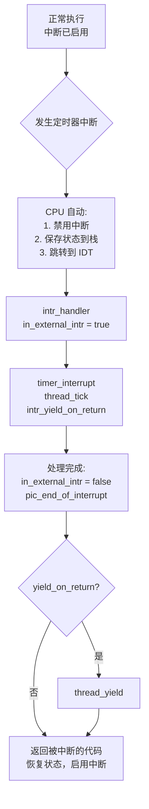

## 概述

本文档详细解析 Pintos 中**中断系统**与线程调度的关系。中断是操作系统的核心机制，它允许 CPU 响应外部事件（如定时器、键盘），并在此基础上实现抢占式调度。

---

## 原始代码

### interrupt.h 中的关键定义

```c
/** Interrupts on or off? */
enum intr_level 
  {
    INTR_OFF,             /**< Interrupts disabled. */
    INTR_ON               /**< Interrupts enabled. */
  };

enum intr_level intr_get_level (void);
enum intr_level intr_set_level (enum intr_level);
enum intr_level intr_enable (void);
enum intr_level intr_disable (void);

bool intr_context (void);
void intr_yield_on_return (void);
```

### interrupt.c 中的关键实现

```c
/** Returns the current interrupt status. */
enum intr_level
intr_get_level (void) 
{
  uint32_t flags;
  asm volatile ("pushfl; popl %0" : "=g" (flags));
  return flags & FLAG_IF ? INTR_ON : INTR_OFF;
}

/** Enables interrupts and returns the previous interrupt status. */
enum intr_level
intr_enable (void) 
{
  enum intr_level old_level = intr_get_level ();
  ASSERT (!intr_context ());
  asm volatile ("sti");
  return old_level;
}

/** Disables interrupts and returns the previous interrupt status. */
enum intr_level
intr_disable (void) 
{
  enum intr_level old_level = intr_get_level ();
  asm volatile ("cli" : : : "memory");
  return old_level;
}

/** Returns true during processing of an external interrupt
   and false at all other times. */
bool
intr_context (void) 
{
  return in_external_intr;
}

/** During processing of an external interrupt, directs the
   interrupt handler to yield to a new process just before
   returning from the interrupt. */
void
intr_yield_on_return (void) 
{
  ASSERT (intr_context ());
  yield_on_return = true;
}
```

### 中断处理主函数

```c
void
intr_handler (struct intr_frame *frame) 
{
  bool external;
  intr_handler_func *handler;

  external = frame->vec_no >= 0x20 && frame->vec_no < 0x30;
  if (external) 
    {
      ASSERT (intr_get_level () == INTR_OFF);
      ASSERT (!intr_context ());

      in_external_intr = true;
      yield_on_return = false;
    }

  handler = intr_handlers[frame->vec_no];
  if (handler != NULL)
    handler (frame);
  else if (frame->vec_no == 0x27 || frame->vec_no == 0x2f)
    {
      /* Spurious interrupt, ignore. */
    }
  else
    unexpected_interrupt (frame);

  if (external) 
    {
      ASSERT (intr_get_level () == INTR_OFF);
      ASSERT (intr_context ());

      in_external_intr = false;
      pic_end_of_interrupt (frame->vec_no); 

      if (yield_on_return) 
        thread_yield (); 
    }
}
```

---

## 前置知识

### 1. 什么是中断？

**中断**是 CPU 暂停当前执行，转去处理其他事件的机制。

```
正常执行:
指令1 → 指令2 → 指令3 → 指令4 → ...

发生中断:
指令1 → 指令2 → [中断!] → 中断处理 → 指令3 → ...
```

### 2. 中断的类型

| 类型 | 来源 | 示例 | 向量号 |
|------|------|------|--------|
| 异常（Exception） | CPU 内部 | 除零、页错误 | 0-31 |
| 外部中断（External） | 外部设备 | 定时器、键盘 | 32-47 |
| 软件中断（Software） | int 指令 | 系统调用 | 可配置 |

### 3. x86 中断机制

```
┌─────────────────────────────────────────────────────────────────┐
│                        CPU                                       │
│  ┌─────────┐                                                    │
│  │  EFLAGS │ ─── IF (Interrupt Flag) 位控制中断是否启用         │
│  └─────────┘                                                    │
│       │                                                          │
│       ▼                                                          │
│  IF=1 时，CPU 在每条指令后检查是否有待处理的中断                │
│       │                                                          │
│       ▼                                                          │
│  ┌─────────────────────────────────────────┐                    │
│  │         IDT (中断描述符表)               │                    │
│  │  0: 除零异常                             │                    │
│  │  ...                                     │                    │
│  │  32 (0x20): 定时器中断                   │                    │
│  │  33 (0x21): 键盘中断                     │                    │
│  │  ...                                     │                    │
│  └─────────────────────────────────────────┘                    │
└─────────────────────────────────────────────────────────────────┘
```

### 4. CLI 和 STI 指令

```plaintext
cli     ; Clear Interrupt flag - 禁用中断
sti     ; Set Interrupt flag - 启用中断
```

---

## 中断级别控制

### intr_disable() 和 intr_enable()

```c
enum intr_level
intr_disable (void) 
{
  enum intr_level old_level = intr_get_level ();
  asm volatile ("cli" : : : "memory");  // 禁用中断
  return old_level;
}

enum intr_level
intr_enable (void) 
{
  enum intr_level old_level = intr_get_level ();
  ASSERT (!intr_context ());  // 不能在中断处理中启用
  asm volatile ("sti");       // 启用中断
  return old_level;
}
```

### intr_set_level() - 设置到指定级别

```c
enum intr_level
intr_set_level (enum intr_level level) 
{
  return level == INTR_ON ? intr_enable () : intr_disable ();
}
```

### 典型使用模式

```c
void
some_critical_function (void)
{
  enum intr_level old_level;
  
  old_level = intr_disable ();  // 禁用中断
  // --- 临界区开始 ---
  
  do_something_critical ();
  
  // --- 临界区结束 ---
  intr_set_level (old_level);   // 恢复之前的状态
}
```

**为什么返回 old_level？**

支持嵌套调用：

```c
void outer (void) {
  enum intr_level l1 = intr_disable ();  // 禁用
  inner ();
  intr_set_level (l1);  // 恢复（仍禁用）
}

void inner (void) {
  enum intr_level l2 = intr_disable ();  // 已禁用，无操作
  // ...
  intr_set_level (l2);  // 恢复（仍禁用）
}
```

---

## 中断上下文

### intr_context() - 检查是否在中断处理中

```c
static bool in_external_intr;  // 是否在处理外部中断

bool
intr_context (void) 
{
  return in_external_intr;
}
```

### 为什么需要知道是否在中断上下文？

很多操作在中断上下文中是**不允许**的：

```c
void
thread_yield (void) 
{
  ASSERT (!intr_context ());  // 不能在中断处理中 yield
  // ...
}

void
thread_block (void) 
{
  ASSERT (!intr_context ());  // 不能在中断处理中阻塞
  // ...
}

enum intr_level
intr_enable (void) 
{
  ASSERT (!intr_context ());  // 不能在中断处理中启用中断
  // ...
}
```

**原因**：
- 中断处理必须快速完成
- 中断处理不应该被调度
- 嵌套中断可能导致复杂问题

---

## 中断与线程调度

### 定时器中断驱动调度

```c
// timer.c
void
timer_interrupt (struct intr_frame *args UNUSED)
{
  ticks++;
  thread_tick ();  // 通知线程系统
}

// thread.c
void
thread_tick (void) 
{
  struct thread *t = thread_current ();

  // 更新统计
  if (t == idle_thread)
    idle_ticks++;
  else if (t->pagedir != NULL)
    user_ticks++;
  else
    kernel_ticks++;

  // 检查时间片
  if (++thread_ticks >= TIME_SLICE)
    intr_yield_on_return ();  // 请求在中断返回时 yield
}
```

### intr_yield_on_return() - 延迟 yield

```c
static bool yield_on_return;  // 是否在中断返回时 yield

void
intr_yield_on_return (void) 
{
  ASSERT (intr_context ());  // 必须在中断上下文中
  yield_on_return = true;
}
```

**为什么不直接调用 thread_yield()？**

1. 中断处理中不能调用会阻塞的函数
2. 需要先完成中断处理
3. 在中断返回时再 yield 更安全

### 中断返回时的 yield

```c
void
intr_handler (struct intr_frame *frame) 
{
  // ... 处理中断 ...

  if (external) 
    {
      in_external_intr = false;
      pic_end_of_interrupt (frame->vec_no);  // 确认中断

      if (yield_on_return) 
        thread_yield ();  // 现在可以安全地 yield
    }
}
```

---

## 中断处理流程图



---

## 中断与同步原语

### 为什么同步原语要禁用中断？

```c
void
sema_down (struct semaphore *sema) 
{
  enum intr_level old_level;

  old_level = intr_disable ();  // 禁用中断
  while (sema->value == 0) 
    {
      list_push_back (&sema->waiters, &thread_current ()->elem);
      thread_block ();
    }
  sema->value--;
  intr_set_level (old_level);
}
```

**原因**：保证原子性

```
如果不禁用中断:

Thread A                    定时器中断
─────────                   ─────────
检查 value == 0
                            抢占！切换到 Thread B
                            Thread B: sema_up()
                            value = 1
                            unblock A（但 A 不在等待队列！）
加入等待队列
block()                     // A 永远阻塞
```

### 中断与锁的区别

| 方面 | 禁用中断 | 锁 |
|------|----------|-----|
| 粒度 | 全局 | 特定资源 |
| 阻塞 | 不阻塞 | 可能阻塞 |
| 时长 | 应该很短 | 可以较长 |
| 嵌套 | 支持 | Pintos 不支持 |
| 中断中使用 | 可以 | 不能 acquire |

**选择原则**：
- 非常短的临界区 → 禁用中断
- 较长的临界区 → 使用锁

---

## 中断帧（Interrupt Frame）

```c
struct intr_frame
  {
    /* 由 intr_entry 保存 */
    uint32_t edi, esi, ebp, esp_dummy;
    uint32_t ebx, edx, ecx, eax;
    uint16_t gs, fs, es, ds;

    /* 由 intrNN_stub 保存 */
    uint32_t vec_no;
    uint32_t error_code;
    void *frame_pointer;

    /* 由 CPU 保存 */
    void (*eip) (void);
    uint16_t cs;
    uint32_t eflags;
    void *esp;
    uint16_t ss;
  };
```

中断帧包含了被中断时的完整 CPU 状态。

---

## 常见问题

### Q1: 什么时候应该禁用中断？

**答**：
- 访问共享数据结构（如就绪队列）
- 需要原子操作的场景
- 非常短的临界区

### Q2: 中断处理程序能做什么？

**答**：
- ✓ 读写全局变量
- ✓ 调用 sema_up()
- ✓ 调用 thread_unblock()
- ✗ 调用 thread_yield()
- ✗ 调用 thread_block()
- ✗ 调用 lock_acquire()
- ✗ 调用 printf()（在 Pintos 中可以，但应避免）

### Q3: 为什么 intr_enable 不能在中断上下文中调用？

**答**：因为外部中断不能嵌套。如果在处理中断时启用中断，可能导致：
- 同一中断再次发生
- 状态不一致
- 栈溢出

### Q4: 抢占是如何实现的？

**答**：
1. 定时器每 tick 触发一次中断
2. `thread_tick()` 检查是否时间片耗尽
3. 如果耗尽，调用 `intr_yield_on_return()`
4. 中断返回时调用 `thread_yield()`
5. 调度器选择下一个线程运行

### Q5: 为什么禁用中断不会导致死锁？

**答**：禁用中断只是阻止 CPU 响应中断，不会阻止当前代码执行。只要确保禁用中断的时间很短，就不会有问题。

---

## 练习思考

1. **分析题**：如果长时间禁用中断会有什么后果？

2. **设计题**：如何实现一个可在中断上下文中调用的安全队列？

3. **调试题**：如何检测代码在中断上下文中做了不允许的操作？

4. **思考题**：为什么 Pintos 选择在中断返回时 yield，而不是立即 yield？

5. **扩展题**：研究 Linux 的中断处理机制（top half / bottom half），与 Pintos 对比。

---

## 下一步

理解了中断与线程的关系后，下一篇文档将介绍**空闲线程（Idle Thread）**的实现。
