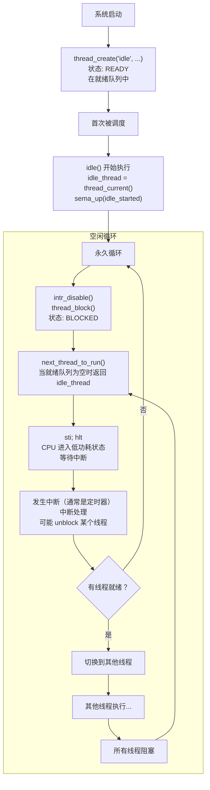

## 概述

本文档详细解析 Pintos 中**空闲线程（Idle Thread）**的实现。空闲线程是操作系统中特殊的系统线程，当没有其他线程可运行时，CPU 执行空闲线程来保持系统正常运行。

---

## 原始代码

### 空闲线程相关变量

```c
/** Idle thread. */
static struct thread *idle_thread;

/** Initial thread, the thread running init.c:main(). */
static struct thread *initial_thread;

/** Statistics. */
static long long idle_ticks;    /**< # of timer ticks spent idle. */
static long long kernel_ticks;  /**< # of timer ticks in kernel threads. */
static long long user_ticks;    /**< # of timer ticks in user programs. */
```

### 空闲线程创建

```c
/** Called by the timer interrupt handler at each timer tick.
   Thus, this function runs in an external interrupt context. */
void
thread_tick (void) 
{
  struct thread *t = thread_current ();

  /* Update statistics. */
  if (t == idle_thread)
    idle_ticks++;
#ifdef USERPROG
  else if (t->pagedir != NULL)
    user_ticks++;
#endif
  else
    kernel_ticks++;

  /* Enforce preemption. */
  if (++thread_ticks >= TIME_SLICE)
    intr_yield_on_return ();
}
```

### idle() 函数

```c
/** Idle thread.  Executes when no other thread is ready to run.

   The idle thread is initially put on the ready list by
   thread_start().  It will be scheduled once initially, at which
   point it initializes idle_thread, "up"s the semaphore passed
   to it to enable thread_start() to continue, and immediately
   blocks.  After that, the idle thread never appears in the
   ready list.  It is returned by next_thread_to_run() as a
   special case when the ready list is empty. */
static void
idle (void *idle_started_ UNUSED) 
{
  struct semaphore *idle_started = idle_started_;
  idle_thread = thread_current ();
  sema_up (idle_started);

  for (;;) 
    {
      /* Let someone else run. */
      intr_disable ();
      thread_block ();

      /* Re-enable interrupts and wait for the next one.

         The `sti' instruction disables interrupts until the
         completion of the next instruction, so these two
         instructions are executed atomically.  This atomicity is
         important; otherwise, an interrupt could be handled
         between re-enabling interrupts and waiting for the next
         one to occur, wasting as much as one clock tick worth of
         time.

         See [IA32-v2a] "HLT", [IA32-v2b] "STI", and [IA32-v3a]
         7.11.1 "HLT Instruction". */
      asm volatile ("sti; hlt" : : : "memory");
    }
}
```

### thread_start() 中创建空闲线程

```c
void
thread_start (void) 
{
  /* Create the idle thread. */
  struct semaphore idle_started;
  sema_init (&idle_started, 0);
  thread_create ("idle", PRI_MIN, idle, &idle_started);

  /* Start preemptive thread scheduling. */
  intr_enable ();

  /* Wait for the idle thread to initialize idle_thread. */
  sema_down (&idle_started);
}
```

### next_thread_to_run() 中的特殊处理

```c
static struct thread *
next_thread_to_run (void) 
{
  if (list_empty (&ready_list))
    return idle_thread;  // 没有就绪线程时返回空闲线程
  else
    return list_entry (list_pop_front (&ready_list), struct thread, elem);
}
```

---

## 前置知识

### 1. 为什么需要空闲线程？

**问题**：如果就绪队列为空，CPU 应该做什么？

```
场景：
- Thread A: 等待 I/O
- Thread B: 等待信号量
- 就绪队列: [空]

CPU: "我该运行什么？"
```

**解决方案**：空闲线程

```
有空闲线程:
- Thread A: 等待 I/O
- Thread B: 等待信号量
- 就绪队列: [空]

CPU: 运行空闲线程 (执行 HLT，节省电力)
```

### 2. HLT 指令

```plaintext
hlt     ; Halt - 暂停 CPU，直到发生中断
```

**效果**：
- CPU 进入低功耗状态
- 当中断发生时，CPU 恢复执行
- 节省电力和减少发热

### 3. STI; HLT 组合的原子性

```c
asm volatile ("sti; hlt" : : : "memory");
```

x86 保证：STI 指令执行后，CPU 会**在下一条指令完成后**才响应中断。

```
执行序列:
STI         ; 启用中断（但不立即响应）
HLT         ; 进入暂停状态
            ; 现在才响应中断
```

**为什么需要原子性？**

```
如果不是原子的:

STI                         ; 启用中断
--- 定时器中断发生 ---
   中断处理
   返回
HLT                         ; 进入暂停

问题：错过了中断触发的机会，可能等待下一个 tick
```

---

## 空闲线程的生命周期

### 阶段 1：创建

```c
void
thread_start (void) 
{
  struct semaphore idle_started;
  sema_init (&idle_started, 0);
  thread_create ("idle", PRI_MIN, idle, &idle_started);  // 创建
  // ...
}
```

此时：
- 空闲线程被创建
- 状态为 READY
- 在就绪队列中

### 阶段 2：首次调度

```c
static void
idle (void *idle_started_) 
{
  struct semaphore *idle_started = idle_started_;
  idle_thread = thread_current ();  // 记录自己
  sema_up (idle_started);           // 通知 thread_start 继续
  // ...
}
```

空闲线程首次运行时：
1. 设置全局 `idle_thread` 指针
2. 通过信号量通知主线程继续

### 阶段 3：永久阻塞

```c
for (;;) 
{
  intr_disable ();
  thread_block ();
  // ...
}
```

空闲线程立即阻塞自己：
- 状态变为 BLOCKED
- **不在就绪队列中**
- 但也不在任何等待队列中

### 阶段 4：特殊调度

```c
static struct thread *
next_thread_to_run (void) 
{
  if (list_empty (&ready_list))
    return idle_thread;  // 直接返回，不从队列取
  // ...
}
```

当没有其他线程时：
- 调度器特殊处理
- 直接返回 `idle_thread`
- 不通过就绪队列

---

## 空闲线程状态图



---

## 空闲线程的特殊性

### 1. 不在就绪队列中

```c
static void
idle (void *idle_started_) 
{
  // ...
  for (;;) 
    {
      intr_disable ();
      thread_block ();  // 阻塞，但不加入任何等待队列
      // ...
    }
}
```

普通线程阻塞前通常会加入某个等待队列：
```c
// 普通线程
list_push_back (&sema->waiters, &thread_current ()->elem);
thread_block ();
```

空闲线程直接阻塞，不加入任何队列。

### 2. 特殊的调度处理

```c
static struct thread *
next_thread_to_run (void) 
{
  if (list_empty (&ready_list))
    return idle_thread;  // 特殊处理
  else
    return list_entry (list_pop_front (&ready_list), struct thread, elem);
}
```

### 3. 最低优先级

```c
thread_create ("idle", PRI_MIN, idle, &idle_started);
                       ^^^^^^^
                       最低优先级
```

确保空闲线程只在没有其他线程时运行。

### 4. 统计分离

```c
void
thread_tick (void) 
{
  struct thread *t = thread_current ();

  if (t == idle_thread)
    idle_ticks++;     // 空闲时间单独统计
  else if (t->pagedir != NULL)
    user_ticks++;
  else
    kernel_ticks++;
  // ...
}
```

---

## 为什么使用 thread_block() 而不是 yield()？

```c
// idle() 中
for (;;) 
{
  intr_disable ();
  thread_block ();  // 使用 block
  asm volatile ("sti; hlt" : : : "memory");
}
```

**如果使用 yield()**：
```c
for (;;) 
{
  thread_yield ();  // 错误！
}
```

问题：
1. yield 会把线程放回就绪队列
2. 如果就绪队列只有空闲线程，又会调度到它
3. 无限循环，浪费 CPU

**使用 block() 的好处**：
1. 空闲线程不在就绪队列中
2. 由调度器特殊处理返回
3. 可以执行 HLT 节省电力

---

## 同步：信号量的使用

```c
void
thread_start (void) 
{
  struct semaphore idle_started;
  sema_init (&idle_started, 0);
  
  thread_create ("idle", PRI_MIN, idle, &idle_started);
  
  intr_enable ();
  
  sema_down (&idle_started);  // 等待空闲线程初始化完成
}

static void
idle (void *idle_started_) 
{
  struct semaphore *idle_started = idle_started_;
  idle_thread = thread_current ();
  sema_up (idle_started);  // 通知初始化完成
  // ...
}
```

**为什么需要同步？**

确保 `idle_thread` 变量被设置后，才能使用它：

```c
static struct thread *
next_thread_to_run (void) 
{
  if (list_empty (&ready_list))
    return idle_thread;  // 必须确保 idle_thread 已设置
  // ...
}
```

---

## 常见问题

### Q1: 为什么空闲线程是必须的？

**答**：
1. 调度器需要一个总是可运行的线程
2. 没有空闲线程，就绪队列为空时无法处理
3. 空闲线程可以执行 HLT 节省电力

### Q2: 空闲线程为什么用最低优先级？

**答**：确保只有在没有其他线程可运行时才运行空闲线程。如果优先级高，可能会抢占真正的工作线程。

### Q3: 为什么在循环开始禁用中断？

**答**：
```c
intr_disable ();
thread_block ();
```
确保 `thread_block()` 时不会被中断打断。如果在检查状态和 block 之间发生中断，可能导致问题。

### Q4: HLT 之后如何被唤醒？

**答**：任何中断（通常是定时器中断）都会唤醒 CPU。中断处理完成后，CPU 继续执行 HLT 后面的代码（循环回到 thread_block）。

### Q5: 空闲线程会被 unblock 吗？

**答**：不会！空闲线程从不被显式 unblock。它通过 `next_thread_to_run()` 的特殊处理被选中运行。

---

## CPU 利用率计算

```c
/** Prints thread statistics. */
void
thread_print_stats (void) 
{
  printf ("Thread: %lld idle ticks, %lld kernel ticks, %lld user ticks\n",
          idle_ticks, kernel_ticks, user_ticks);
}
```

**CPU 利用率** = (kernel_ticks + user_ticks) / (idle_ticks + kernel_ticks + user_ticks) × 100%

---

## 练习思考

1. **分析题**：如果删除空闲线程的代码，系统会发生什么？

2. **设计题**：如何实现一个空闲任务，在系统空闲时执行低优先级的后台工作？

3. **扩展题**：研究 Linux 的 CPU 空闲处理机制（cpuidle），与 Pintos 对比。

4. **调试题**：如何统计系统在不同电源状态下的时间分布？

5. **思考题**：在多核系统中，空闲线程应该如何处理？

---

## 下一步

理解了空闲线程的实现后，下一篇文档将介绍**优先级调度**的实现。
