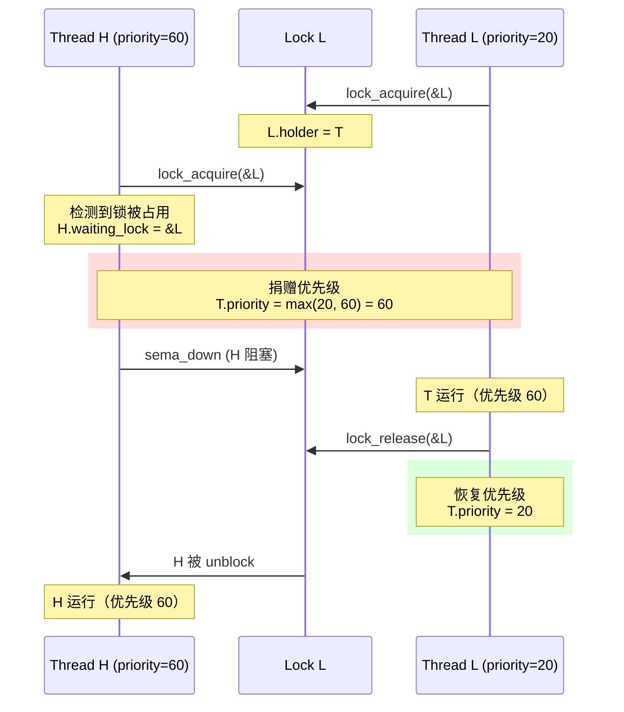
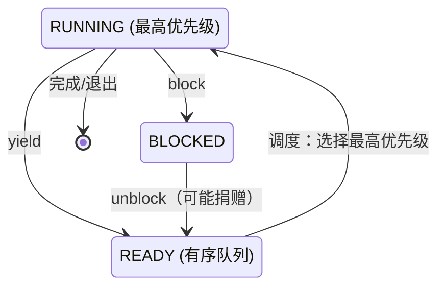

## 概述

本文档详细解析 Pintos 中**优先级调度**的实现。Pintos 默认使用简单的轮转（Round-Robin）调度，但 Project 1 要求实现基于优先级的调度，以及解决优先级反转问题的**优先级捐赠（Priority Donation）**机制。

---

## 原始代码

### 优先级相关定义（thread.h）

```c
/** Thread priorities. */
#define PRI_MIN 0                       /**< Lowest priority. */
#define PRI_DEFAULT 31                  /**< Default priority. */
#define PRI_MAX 63                      /**< Highest priority. */

struct thread
  {
    // ...
    int priority;                       /**< Priority. */
    struct list_elem allelem;           /**< List element for all threads list. */
    struct list_elem elem;              /**< List element. */
    // ...
  };
```

### 优先级相关函数声明

```c
void thread_set_priority (int);
int thread_get_priority (void);
```

### 默认实现（thread.c）

```c
/** Sets the current thread's priority to NEW_PRIORITY. */
void
thread_set_priority (int new_priority) 
{
  thread_current ()->priority = new_priority;
}

/** Returns the current thread's priority. */
int
thread_get_priority (void) 
{
  return thread_current ()->priority;
}
```

### 调度相关代码

```c
static struct thread *
next_thread_to_run (void) 
{
  if (list_empty (&ready_list))
    return idle_thread;
  else
    return list_entry (list_pop_front (&ready_list), struct thread, elem);
}
```

---

## 前置知识

### 1. 调度策略

| 策略 | 描述 | 优点 | 缺点 |
|------|------|------|------|
| FCFS | 先来先服务 | 简单，公平 | 平均等待时间长 |
| Round-Robin | 轮转调度 | 响应时间好 | 频繁切换开销 |
| Priority | 优先级调度 | 重要任务优先 | 可能饥饿 |
| MLFQ | 多级反馈队列 | 兼顾多种需求 | 复杂 |

### 2. 优先级调度的问题

**优先级反转（Priority Inversion）**：

```
场景：
- 高优先级线程 H (priority = 60)
- 中优先级线程 M (priority = 40)
- 低优先级线程 L (priority = 20)
- L 持有一个锁，H 需要这个锁

时间线:
t0: L 获取锁
t1: H 需要锁，阻塞等待
t2: M 就绪，开始运行（比 L 优先级高）
t3: M 运行很长时间...
    H 无法运行（因为 L 无法运行来释放锁）

结果：高优先级的 H 被中优先级的 M 间接阻塞！
```

### 3. 优先级捐赠（Priority Donation）

解决优先级反转的方法：

```
修正后:
t0: L 获取锁 (priority = 20)
t1: H 需要锁，阻塞
    H 将自己的优先级捐赠给 L
    L.priority 暂时提升到 60
t2: M 就绪，但 L 优先级更高
    L 继续运行
t3: L 释放锁
    L 恢复原优先级 20
    H 运行（获得锁）
```

---

## 默认实现分析

### 当前的 FIFO 实现

```c
static struct thread *
next_thread_to_run (void) 
{
  if (list_empty (&ready_list))
    return idle_thread;
  else
    return list_entry (list_pop_front (&ready_list), struct thread, elem);
}
```

问题：总是取队列前端，不考虑优先级。

### thread_unblock() 的实现

```c
void
thread_unblock (struct thread *t) 
{
  enum intr_level old_level;

  ASSERT (is_thread (t));

  old_level = intr_disable ();
  ASSERT (t->status == THREAD_BLOCKED);
  list_push_back (&ready_list, &t->elem);  // 简单加到末尾
  t->status = THREAD_READY;
  intr_set_level (old_level);
}
```

问题：不考虑优先级，直接加到队列末尾。

---

## 优先级调度实现方案

### 方案 1：修改 next_thread_to_run()

每次调度时找最高优先级的线程：

```c
static struct thread *
next_thread_to_run (void) 
{
  if (list_empty (&ready_list))
    return idle_thread;
  
  // 找最高优先级的线程
  struct list_elem *max_elem = list_max (&ready_list, 
                                          thread_priority_less, NULL);
  list_remove (max_elem);
  return list_entry (max_elem, struct thread, elem);
}

// 比较函数
bool
thread_priority_less (const struct list_elem *a,
                      const struct list_elem *b,
                      void *aux UNUSED)
{
  struct thread *ta = list_entry (a, struct thread, elem);
  struct thread *tb = list_entry (b, struct thread, elem);
  return ta->priority < tb->priority;
}
```

### 方案 2：维护有序队列

插入时保持队列有序：

```c
void
thread_unblock (struct thread *t) 
{
  // ...
  // 按优先级降序插入
  list_insert_ordered (&ready_list, &t->elem, 
                       thread_priority_greater, NULL);
  t->status = THREAD_READY;
  // ...
}
```

---

## 抢占式优先级调度

当高优先级线程就绪时，应该立即抢占：

### 修改 thread_unblock()

```c
void
thread_unblock (struct thread *t) 
{
  enum intr_level old_level;

  ASSERT (is_thread (t));

  old_level = intr_disable ();
  ASSERT (t->status == THREAD_BLOCKED);
  list_insert_ordered (&ready_list, &t->elem, 
                       thread_priority_greater, NULL);
  t->status = THREAD_READY;
  
  // 如果被 unblock 的线程优先级更高，需要 yield
  if (t->priority > thread_current ()->priority)
    {
      if (!intr_context ())
        thread_yield ();
      else
        intr_yield_on_return ();
    }
  
  intr_set_level (old_level);
}
```

### 修改 thread_set_priority()

```c
void
thread_set_priority (int new_priority) 
{
  struct thread *cur = thread_current ();
  int old_priority = cur->priority;
  cur->priority = new_priority;
  
  // 如果降低了优先级，可能需要 yield
  if (new_priority < old_priority)
    thread_yield ();
}
```

---

## 优先级捐赠实现

### 数据结构扩展

```c
struct thread
{
  // ...
  int priority;                    /* 有效优先级（可能被捐赠） */
  int base_priority;               /* 原始优先级 */
  struct lock *waiting_lock;       /* 正在等待的锁 */
  struct list donations;           /* 捐赠给我的线程列表 */
  struct list_elem donation_elem;  /* 用于捐赠列表 */
  // ...
};
```

### 优先级捐赠流程



### lock_acquire() 修改

```c
void
lock_acquire (struct lock *lock)
{
  ASSERT (lock != NULL);
  ASSERT (!intr_context ());
  ASSERT (!lock_held_by_current_thread (lock));

  struct thread *cur = thread_current ();
  
  if (lock->holder != NULL)
    {
      // 记录正在等待的锁
      cur->waiting_lock = lock;
      
      // 优先级捐赠
      donate_priority (lock->holder, cur->priority);
    }

  sema_down (&lock->semaphore);
  
  // 获得锁
  cur->waiting_lock = NULL;
  lock->holder = cur;
}

void
donate_priority (struct thread *t, int priority)
{
  if (t->priority < priority)
    {
      t->priority = priority;
      
      // 如果 t 也在等待锁，需要嵌套捐赠
      if (t->waiting_lock != NULL)
        donate_priority (t->waiting_lock->holder, priority);
    }
}
```

### lock_release() 修改

```c
void
lock_release (struct lock *lock) 
{
  ASSERT (lock != NULL);
  ASSERT (lock_held_by_current_thread (lock));

  struct thread *cur = thread_current ();
  
  // 移除此锁相关的捐赠
  remove_donations_for_lock (cur, lock);
  
  // 重新计算有效优先级
  update_priority (cur);
  
  lock->holder = NULL;
  sema_up (&lock->semaphore);
  
  // 可能需要 yield
  thread_yield ();
}

void
update_priority (struct thread *t)
{
  // 从 base_priority 和所有捐赠中选最高的
  int max_priority = t->base_priority;
  
  for (struct list_elem *e = list_begin (&t->donations);
       e != list_end (&t->donations);
       e = list_next (e))
    {
      struct thread *donor = list_entry (e, struct thread, donation_elem);
      if (donor->priority > max_priority)
        max_priority = donor->priority;
    }
  
  t->priority = max_priority;
}
```

---

## 嵌套捐赠

当优先级捐赠需要传递多层时：

```
场景：
- H (priority=60) 等待 Lock M
- M (priority=40) 持有 Lock M，等待 Lock L
- L (priority=20) 持有 Lock L

┌────────────────────────────────────────────────────────────────────┐
│                        嵌套捐赠                                    │
│                                                                    │
│   H(60) ──等待──► Lock M ──持有者──► M(40→60)                     │
│                                        │                           │
│                                      等待                          │
│                                        ▼                           │
│                    Lock L ──持有者──► L(20→60)                     │
│                                                                    │
│   捐赠链：H → M → L                                               │
│   所有持有者的优先级都提升到 60                                    │
└────────────────────────────────────────────────────────────────────┘
```

### 实现嵌套捐赠

```c
void
donate_priority (struct thread *t, int priority)
{
  int depth = 0;
  const int MAX_DEPTH = 8;  // 防止无限循环
  
  while (t != NULL && depth < MAX_DEPTH)
    {
      if (t->priority >= priority)
        break;
        
      t->priority = priority;
      
      if (t->waiting_lock == NULL)
        break;
        
      t = t->waiting_lock->holder;
      depth++;
    }
}
```

---

## 多重捐赠

一个线程可能收到多个捐赠：

```
场景：
- L 持有 Lock A 和 Lock B
- H1 (priority=60) 等待 Lock A
- H2 (priority=50) 等待 Lock B

L 的有效优先级 = max(base, H1, H2) = max(20, 60, 50) = 60

当 L 释放 Lock A：
L 的有效优先级 = max(base, H2) = max(20, 50) = 50
```

---

## 状态图



---

## 同步原语的优先级处理

### Semaphore

```c
void
sema_up (struct semaphore *sema) 
{
  enum intr_level old_level;

  old_level = intr_disable ();
  if (!list_empty (&sema->waiters)) 
    {
      // 唤醒最高优先级的等待者
      struct list_elem *max_elem = list_max (&sema->waiters,
                                              thread_priority_less, NULL);
      list_remove (max_elem);
      thread_unblock (list_entry (max_elem, struct thread, elem));
    }
  sema->value++;
  intr_set_level (old_level);
}
```

### Condition Variable

```c
void
cond_signal (struct condition *cond, struct lock *lock UNUSED) 
{
  if (!list_empty (&cond->waiters)) 
    {
      // 唤醒最高优先级等待者的信号量
      struct list_elem *max_elem = list_max (&cond->waiters,
                                              cond_waiter_priority_less, NULL);
      list_remove (max_elem);
      struct semaphore_elem *sema_elem = 
          list_entry (max_elem, struct semaphore_elem, elem);
      sema_up (&sema_elem->semaphore);
    }
}
```

---

## 常见问题

### Q1: 为什么需要区分 priority 和 base_priority？

**答**：
- `priority` 是有效优先级（考虑捐赠）
- `base_priority` 是原始优先级
- 释放锁时需要恢复到原始优先级或其他捐赠值

### Q2: 如何避免优先级捐赠中的死循环？

**答**：
1. 限制嵌套深度（如 MAX_DEPTH = 8）
2. 检测循环等待（死锁检测）
3. 只在优先级真正提高时才传递

### Q3: thread_set_priority() 如何与捐赠交互？

**答**：
```c
void
thread_set_priority (int new_priority) 
{
  struct thread *cur = thread_current ();
  cur->base_priority = new_priority;
  
  // 重新计算有效优先级
  update_priority (cur);
  
  // 如果有效优先级降低了，可能需要 yield
  thread_yield ();
}
```

### Q4: 为什么优先级捐赠只针对锁？

**答**：
- 信号量没有明确的"持有者"
- 条件变量的等待者不持有资源
- 只有锁有明确的持有-等待关系

### Q5: 时间片耗尽时如何处理相同优先级的线程？

**答**：使用 Round-Robin。相同优先级的线程轮流执行，每个线程运行一个时间片（TIME_SLICE = 4 ticks）。

---

## 测试用例思考

### 优先级调度测试

```c
void test_priority_scheduling (void)
{
  // 创建三个不同优先级的线程
  thread_create ("low", 20, func, NULL);
  thread_create ("medium", 40, func, NULL);
  thread_create ("high", 60, func, NULL);
  
  // 预期：high 先执行，然后 medium，最后 low
}
```

### 优先级捐赠测试

```c
void test_priority_donation (void)
{
  struct lock lock;
  lock_init (&lock);
  
  // low 先获取锁
  // 然后 high 尝试获取
  // high 应该捐赠优先级给 low
}
```

---

## 练习思考

1. **实现题**：完成 Pintos Project 1 的优先级调度部分。

2. **分析题**：比较优先级调度和 MLFQ 调度的优缺点。

3. **设计题**：如何实现优先级继承协议的变体——优先级天花板协议（Priority Ceiling Protocol）？

4. **扩展题**：研究 Linux 的实时调度策略（SCHED_FIFO, SCHED_RR），与 Pintos 对比。

5. **调试题**：如何检测优先级反转问题？设计一个监控工具。

---

## 总结

优先级调度是操作系统中重要的调度策略：

| 方面 | 实现要点 |
|------|----------|
| 基本调度 | 维护有序队列或每次选择最高优先级 |
| 抢占 | unblock 和 set_priority 时检查是否需要 yield |
| 优先级反转 | 使用优先级捐赠解决 |
| 嵌套捐赠 | 沿等待链传递优先级 |
| 多重捐赠 | 维护捐赠列表，取最大值 |

---

## 文档系列总结

本系列文档详细介绍了 Pintos 线程系统的各个方面：

1. [概述](./2026-01-26-pintos-thread-00-overview.md) - 线程系统架构总览
2. [线程结构](./2026-01-26-pintos-thread-01-structure.md) - struct thread 详解
3. [生命周期](./2026-01-26-pintos-thread-02-lifecycle.md) - 线程状态转换
4. [线程创建](./2026-01-26-pintos-thread-03-create.md) - thread_create() 实现
5. [调度](./2026-01-26-pintos-thread-04-schedule.md) - 调度机制
6. [上下文切换](./2026-01-26-pintos-thread-05-switch.md) - switch_threads() 实现
7. [阻塞与唤醒](./2026-01-26-pintos-thread-06-block-unblock.md) - thread_block/unblock
8. [信号量](./2026-01-26-pintos-thread-07-semaphore.md) - 信号量实现
9. [锁](./2026-01-26-pintos-thread-08-lock.md) - 锁实现
10. [条件变量](./2026-01-26-pintos-thread-09-condition.md) - 条件变量实现
11. [中断](./2026-01-26-pintos-thread-10-interrupt.md) - 中断与线程
12. [空闲线程](./2026-01-26-pintos-thread-11-idle.md) - 空闲线程实现
13. [优先级调度](./2026-01-26-pintos-thread-12-priority.md) - 优先级调度与捐赠

这些文档涵盖了理解和实现 Pintos Project 1 所需的核心知识。
